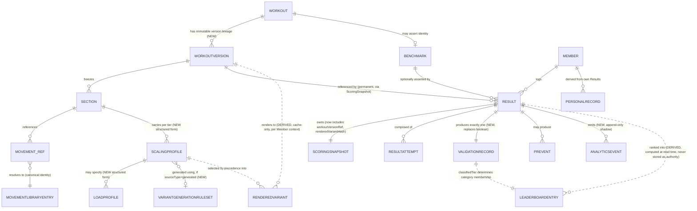

# Forge — Conceptual ERD

**Status:** Draft for review. Conceptual only — no column types, no keys beyond what is needed to show cardinality and ownership. Every entity below is either already frozen (Programming v1.1, Results v1.0), newly specified in this package (Programming v1.2, Results v1.1), or explicitly marked as a **derived view**, never a true persisted table, to avoid misleading a reviewer into thinking this package proposes storage for something Results v1.0 §11.1 explicitly forbids storing as authoritative.

---

## 1. Entity ownership legend

| Domain | Entities |
|---|---|
| **Programming** (frozen v1.1 shape + v1.2 additions) | Workout, WorkoutVersion*, Section, Movement, MovementLibraryEntry, LoadProfile*, ScalingProfile*, VariantGenerationRuleSet* |
| **Results** (frozen v1.0 shape + v1.1 additions) | Result, ResultAttempt, ScoringSnapshot, Benchmark, ScalingContext, PersonalRecord, PREvent, ValidationRecord*, AnalyticsEvent* |
| **Derived / computed, not persisted as authority** | RenderedVariant (cache-eligible only), LeaderboardEntry (cache-eligible only) |

\* = new in this package (v1.2 / v1.1 respectively)

---

## 2. Diagram

*(Solid lines `||--o{` denote true, persisted, owning relationships. Dashed lines `||..o{` denote derived/computed relationships — the "entity" on the derived side is never a row a write path inserts into as a source of truth.)*

---

## 3. Entity notes

- **Workout** — unchanged from Programming v1.1. Owns identity, gym, day, lifecycle state (Draft/Published). Its "current content" is a pointer to its latest non-withdrawn WorkoutVersion, not stored content of its own once WorkoutVersion exists.
- **WorkoutVersion** — new (`PROGRAMMING_DOMAIN_V1_2.md` §3). True entity, append-only, immutable. The freezing point for every downstream determinism guarantee in this package.
- **Section, Movement (reference), MovementLibraryEntry** — Section and the Movement-reference-within-a-Section are unchanged from v1.1 in role; MovementLibraryEntry is the canonical catalog entry Programming v1.2 §5's identity resolution resolves a reference *to* — MovementLibraryEntry itself may be a versioned static asset rather than a live table, per `FCKB_ARCHITECTURE_REVIEW.md` §13's hybrid recommendation, noted here as a storage-tier detail this ERD does not resolve (conceptual ERD, not a physical schema).
- **LoadProfile** — new (`PROGRAMMING_DOMAIN_V1_2.md` §6). Owned by a ScalingProfile's movement override entry (or by a Section's base prescription directly, for the Rx/base case), never a standalone top-level table with its own independent lifecycle.
- **ScalingProfile** — new structured form (`PROGRAMMING_DOMAIN_V1_2.md` §7) of what v1.1 already called a Scaling Variant. Frozen into its parent WorkoutVersion at creation.
- **VariantGenerationRuleSet** — new (`PROGRAMMING_DOMAIN_V1_2.md` §12). Gym-scoped configuration, itself versioned, referenced (not copied) by any ScalingProfile whose `sourceType` is `'generated'`.
- **Benchmark, ScalingContext** — unchanged from Results v1.0 in shape. ScalingContext still references Programming's one Scaling Level catalog (v1.0 §9.2, unmodified); it is not shown as a separate box above because it is a reference value on ScoringSnapshot, not an independently-owned entity with its own row lifecycle beyond the catalog it points into.
- **Result, ResultAttempt, ScoringSnapshot, PersonalRecord, PREvent** — unchanged in shape from Results v1.0 §4.1, with ScoringSnapshot's field addition noted in the legend.
- **ValidationRecord** — new (`RX_ENGINE_SPEC.md` §2). Exactly one per Result (a re-run per `RX_ENGINE_SPEC.md` §6 appends a new ValidationRecord rather than overwriting — modeled here as still "exactly one" in the sense of "exactly one *current* ValidationRecord," with prior ones retained as history, mirroring PREvent's own ledger discipline).
- **AnalyticsEvent** — new (`RESULTS_DOMAIN_V1_1.md` §6.2). True entity, append-only, emitted alongside every Result write.
- **RenderedVariant** — explicitly **not** a true persisted entity for authority purposes. Shown with a dashed relationship because it may be cached (`VARIANT_GENERATION_ENGINE.md` §3.2, §5) but is always reproducible from WorkoutVersion + ScalingProfile + Member context, and a cache miss or a cold cache produces the identical result to a cache hit — no data is lost if every cached RenderedVariant were deleted right now.
- **LeaderboardEntry** — explicitly **not** a true persisted entity for authority purposes, preserving Results v1.0 §11.1 without exception. Shown with a dashed relationship for the identical reason as RenderedVariant: a materialized cache of LeaderboardEntry rows may exist for performance (`LEADERBOARD_RULES.md`, `RISK_REVIEW.md` scaling section), but the Result + ValidationRecord data underneath it is always sufficient to reconstruct every LeaderboardEntry row from nothing, at any time — the defining property that keeps "cannot be accidentally corrupted" (this package's own stated design goal) true regardless of whether a cache exists.

## 4. What this ERD deliberately omits

Team/Relay Result's many-to-many Member relationship (`SCORING_DOMAIN_ARCHITECTURE_INVESTIGATION.md` §6.4, still an open question, not designed to completion — including it here would misrepresent an unresolved question as a decided entity). Format composition/nesting's own internal Section-to-Section structure (`PROGRAMMING_DOMAIN_V1_2.md` §Movement/Format concerns remain Programming's, and format composition remains a named prerequisite, not yet designed — see `RISK_REVIEW.md`). Member, Financial Domain entities — out of scope by mandate, referenced by identity only where shown (MEMBER box exists only to anchor Result/PersonalRecord ownership, not to model Member Domain's own internal structure).
