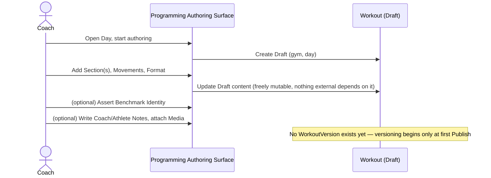
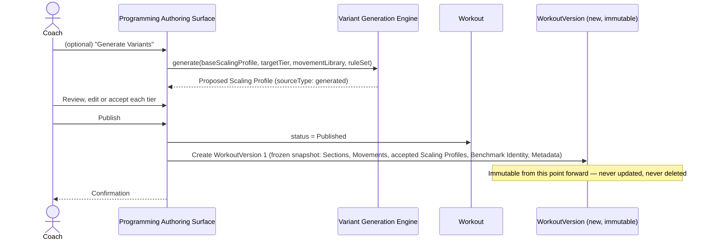
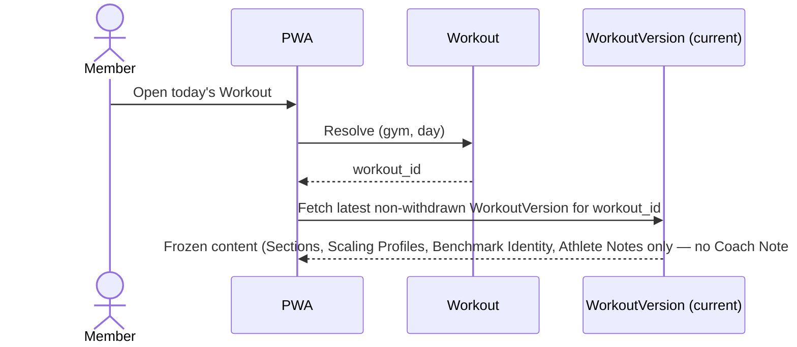
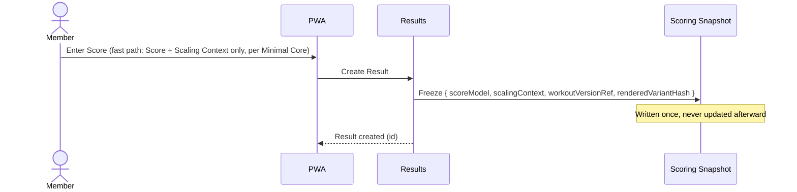
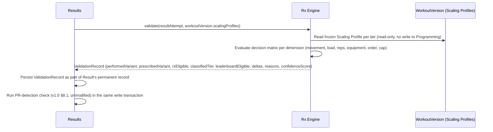
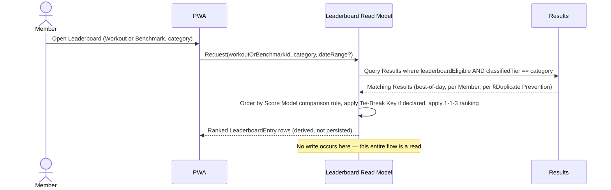
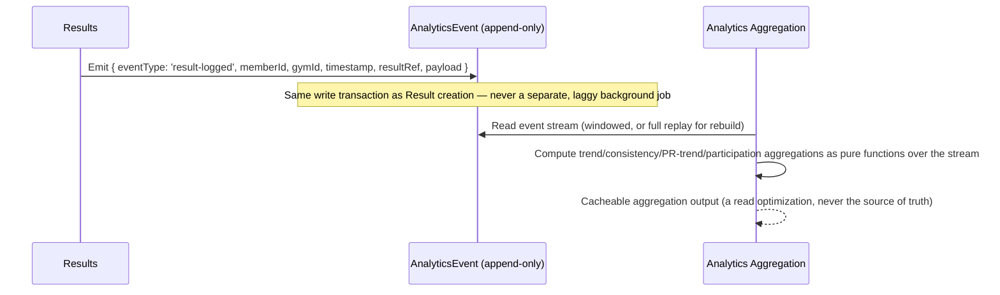
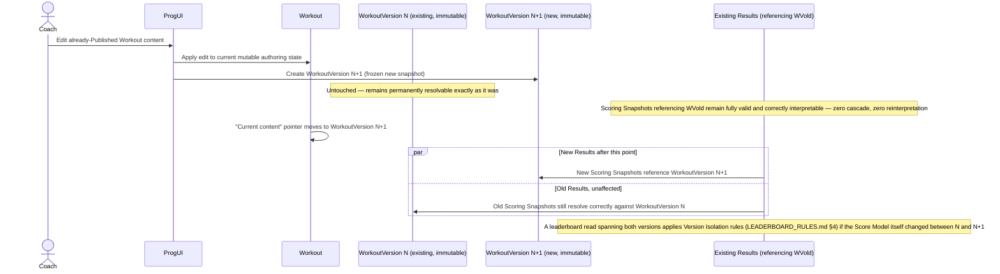

# Forge — Sequence Diagrams

**Status:** Draft for review. Every actor/system named below maps directly to an entity or engine defined in the rest of this package; no new actor is introduced here that is not already specified elsewhere.

---

## 1. Coach creates workout



## 2. Workout published



## 3. Member requests workout



## 4. Workout rendered

```mermaid
sequenceDiagram
    actor Member
    participant PWA
    participant RenderPipe as Rendering Pipeline
    participant WV as WorkoutVersion
    participant MemberProfile as Member (Scaling Context + unit pref)
    PWA->>MemberProfile: Read Scaling Context, unit preference
    PWA->>RenderPipe: render(workoutVersion, scalingContext, unitPreference, renderRuleSetVersion)
    RenderPipe->>WV: resolveByPrecedence(scalingLevelId)
    Note over RenderPipe: authored/generated-then-edited > generated > Rx-with-inline-scaling (view-time only)
    RenderPipe->>RenderPipe: Convert units, resolve any formula Load Profiles against Member's own attributes
    RenderPipe-->>PWA: RenderedVariant (deterministic; cache-eligible, content-addressed)
    PWA-->>Member: Display
```

## 5. Member submits score



## 6. Score validated



## 7. Leaderboard updated



## 8. Analytics generated



## 9. Workout edited after scores exist


