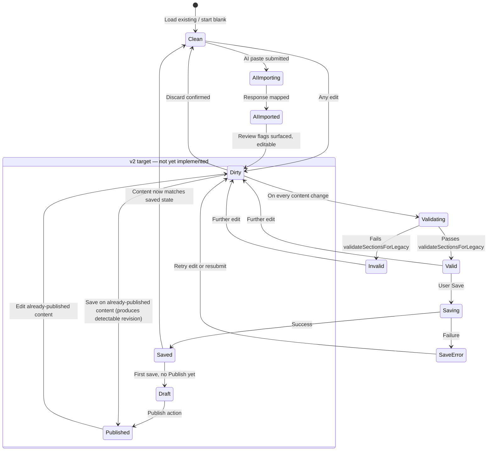

# Forge — Canonical Workout Builder Specification v2

**Status:** Draft — canonical product/architecture contract, prepared for freeze review
**Prepared:** 2026-08-08
**Grounding:** Every current-state claim in this document is sourced from the direct, line-cited codebase audit performed for `UNIFIED_WORKOUT_BUILDER_PLAN.md` (both the WOD-SIMPLE PWA builder and forge-admin-web's Programming module). This document does not re-derive that audit; it treats it as settled fact and builds the target contract on top of it.

---

## 1. Executive Summary

### 1.1 Why this specification exists

`UNIFIED_WORKOUT_BUILDER_PLAN.md` answered *how* to extract and converge two existing builders. It did not answer *what exact behavior* the converged result should exhibit — the extraction plan's milestones (M1–M8) describe engineering sequencing, not a product contract a designer, a QA engineer, or a third implementation could be held to. This document is that contract: the single, authoritative definition of what the Forge Workout Builder *is*, independent of which repository happens to render it. It exists to be written and agreed **before** shared-core extraction begins, so extraction has a fixed target rather than converging toward whichever implementation detail happened to land first in whichever repository.

### 1.2 Why replacement is the wrong strategy

Both prior investigations (`SCORING_DOMAIN_ARCHITECTURE_INVESTIGATION.md` for the domain question, `UNIFIED_WORKOUT_BUILDER_PLAN.md` for this specific one) reached the same shape of conclusion by the same discipline: verify before assuming, and where two things already share real, independently-earned strengths, converge rather than discard. The PWA and web builders are not a mature original and an inferior copy — they are two matured implementations of the same original port, each carrying capability the other genuinely lacks (movement autocomplete and AI paste-to-draft in the PWA; Duplicate/clone, an accessible modal, and an unsaved-changes guard on web). Replacing either with the other, in either direction, ships a regression on day one. Replacement is the wrong strategy not as a matter of process preference but because it is provably, specifically worse than the alternative on both sides.

### 1.3 Why capability convergence is the correct strategy

Convergence — each platform gains what it currently lacks, both platforms then exhibit one identical behavioral contract, extraction happens only once that contract is real on both sides — is the strategy this document formalizes. It is correct because it is the only strategy under which neither platform's users experience a regression at any point in the process, and because it produces, as a byproduct, the one thing actually required before a shared core can be extracted safely: two implementations that already agree on behavior, so the extraction step becomes a mechanical deduplication rather than a design negotiation performed under extraction pressure.

### 1.4 Relationship to Programming Domain

The Workout Builder is, and must remain, the authoring surface for Programming Domain entities (`PROGRAMMING_DOMAIN_ARCHITECTURE.md` v1.1, `PROGRAMMING_DOMAIN_V1_2.md`). Today, per the audit, neither builder actually writes to the domain's proposed v1.2 entities (WorkoutVersion, structured LoadProfile, structured ScalingProfile) — both write to the legacy `wods` table with a best-effort mirror into Workout Engine V2. This document does not pretend that gap is closed. It specifies the builder's canonical behavior in a way that keeps the door open to closing it later (§9, §10) without requiring the builder's user-facing contract to change shape when that migration eventually happens.

### 1.5 Relationship to future WorkoutVersion and Variant Generation work

`PROGRAMMING_DOMAIN_V1_2.md` proposes WorkoutVersion (an immutable, append-only snapshot lineage) and a Variant Generation Engine (coach-triggered, coach-reviewed automatic Scaling content). This specification does not design either — that authority belongs to `PROGRAMMING_DOMAIN_V1_2.md` and `VARIANT_GENERATION_ENGINE.md` respectively. What this document commits to is narrower and load-bearing: the canonical builder's state model (§5) and component architecture (§6) are shaped so that "publish creates a new WorkoutVersion" and "a coach reviews generated Scaling content in the same editor used for manual authoring" are both additive slots this contract already has room for, not structural surprises a future migration would need to force in.

---

## 2. Canonical Builder Principles

1. **One builder behavior across platforms.** A workflow that succeeds, fails, or looks a specific way on one platform succeeds, fails, or looks that same way on the other. Visual chrome may differ (§7); behavior may not.
2. **One validation model.** `validateSectionsForLegacy`'s rule (exactly one primary section, at most three non-primary) is canonical, expressed identically in meaning on both platforms, per `UNIFIED_WORKOUT_BUILDER_PLAN.md` §2.3's already-confirmed convergence.
3. **One serialization model.** `legacyPayloadFromSections` is the canonical payload-construction contract; both platforms produce byte-equivalent output for equivalent input.
4. **Programming Domain is authoritative.** The builder edits Programming Domain entities (§9); it does not invent parallel state Programming does not recognize, and it does not decide anything Results Domain owns (Rx eligibility, scoring, leaderboard placement) — that boundary, already established in `PROGRAMMING_DOMAIN_V1_2.md` §2.3, is unchanged and unchallenged by this document.
5. **Deterministic editing behavior.** Given the same sequence of user actions against the same starting state, the builder produces the same resulting state, on either platform, every time — no platform-specific hidden state (a debounce timer, an animation-dependent race) may change the *outcome* of an editing sequence, even if timing or visual feedback differs.
6. **Mobile-first but desktop-complete.** The PWA's mobile-editing speed (§3) is a floor, not a ceiling — desktop users (on either platform) receive full capability, including working mouse-driven interactions where today one platform's movement reordering does not (§3, known bug).
7. **Accessibility by default.** The stronger of the two platforms' current accessibility behavior (forge-admin-web's `Dialog.tsx` focus-trap/Escape/`aria-modal`/focus-restoration pattern) is the floor for both, not an aspiration for one.
8. **No duplicated workout logic.** Format catalog, validation, and serialization exist once in meaning, ported-not-diverged per platform (`UNIFIED_WORKOUT_BUILDER_PLAN.md` §3.1's disciplined-port constraint, unchanged here).
9. **Additive extensibility toward the Programming Domain's future entities.** Every canonical component and state defined in this document must have a clear, named extension point for WorkoutVersion, LoadProfile, and ScalingProfile (§10) — a component with no such point is a design defect in this specification, not an acceptable gap.
10. **Honesty about current state.** Where this document specifies "required in v2" behavior that exists in neither platform today (draft/publish state, undo/redo, coach/athlete notes), it says so plainly rather than implying the behavior already exists somewhere.

---

## 3. Functional Capability Matrix

**Legend — Priority:** P0 = blocking for v2 declaration (§11); P1 = required for v2, not blocking early convergence phases; P2 = desirable, explicitly deferrable past v2. **Architectural Owner:** which domain/layer is responsible for the capability's correctness (Builder = this spec's own UI/state layer; Programming = the domain entity being edited; Results = out of this builder's authority entirely, named only where relevant for a boundary check).

### 3.1 Workout formats (all 22, per the reconciled catalog, `UNIFIED_WORKOUT_BUILDER_PLAN.md` §3.2 step 1/§4.4 step 2)

| Format | Web | PWA | Required in v2 | Priority | Owner |
|---|---|---|---|---|---|
| AMRAP | Yes | Yes | Yes | P0 | Programming (format catalog) |
| Ascending AMRAP | Yes | Yes | Yes | P0 | Programming |
| For Time | Yes | Yes | Yes | P0 | Programming |
| RFT | Yes | Yes | Yes | P0 | Programming |
| Chipper | Yes | Yes | Yes | P0 | Programming |
| Ladder | Yes | Yes | Yes | P0 | Programming |
| Partner WOD | Yes | Yes | Yes | P0 | Programming |
| Death By | Yes | Yes | Yes | P0 | Programming |
| Death By Weight | Yes | Yes | Yes | P0 | Programming |
| EMOM | Yes | Yes | Yes | P0 | Programming |
| Tabata | Yes | Yes | Yes | P0 | Programming |
| Intervals | Yes | Yes | Yes | P0 | Programming |
| Weightlifting | Yes | Yes | Yes | P0 | Programming |
| Strength Sets | Yes | Yes | Yes | P0 | Programming |
| Build to Heavy/1RM | Yes | Yes | Yes | P0 | Programming |
| Complex | Yes | Yes | Yes | P0 | Programming |
| Superset | Yes | Yes | Yes | P0 | Programming |
| Buy-In/Cash-Out | Yes | Yes | Yes | P0 | Programming |
| AMRAP with Buy-In | Yes | Yes | Yes | P0 | Programming |
| Not For Time | Yes | Yes | Yes | P0 | Programming |
| Chained AMRAP | Yes | Yes | Yes | P0 | Programming |
| Max Effort | Yes | Yes | Yes | P0 | Programming |

All 22 already exist, identically in name and intent, on both platforms — this row group's "required in v2" work is reconciliation (already scoped in the extraction plan), not new capability.

### 3.2 Core editing capabilities

| Capability | Web | PWA | Required in v2 | Priority | Owner |
|---|---|---|---|---|---|
| Section add/remove | Yes | Yes | Yes | P0 | Builder |
| Section reorder — button-based (up/down) | Yes | Yes | Yes | P0 | Builder |
| Section reorder — drag-and-drop, desktop mouse | **No** (no drag library in either repo) | **No** | Yes | P1 | Builder |
| Section reorder — drag-and-drop, touch | No | No | Yes | P1 | Builder |
| Movement entry — free text | Yes | Yes | Yes | P0 | Builder |
| Movement entry — bulk paste | No (evidence not found) | Yes (`parseMiscareLinePasta`) | Yes | P1 | Builder |
| Movement reordering within a tier — button-based | Yes | No (touch-drag only) | Yes | P0 | Builder |
| Movement reordering within a tier — mouse drag, desktop | N/A (no drag exists) | **No — confirmed broken/absent** | Yes | **P0 (known bug fix)** | Builder |
| Movement reordering within a tier — touch drag | No | Yes | Yes | P1 | Builder |
| Format-specific config editor | Yes (`FormatConfigEditor.tsx`) | Yes (`FormatConfigEditor.jsx`) | Yes | P0 | Programming |
| Time cap field | Yes (per-format) | Yes (per-format) | Yes | P0 | Programming |

### 3.3 Movement intelligence

| Capability | Web | PWA | Required in v2 | Priority | Owner |
|---|---|---|---|---|---|
| Movement autocomplete (search-as-you-type) | **No** | Yes | Yes | P1 | Builder |
| Movement canonical resolution (`canonicalName`) | No (`null`) | No (`null`) | Deferred — see §10 | P2 | Programming |
| AI paste-to-draft | **No** | Yes | Yes | P1 | Builder + Edge Function |
| AI review-flag surfacing | **No** | Yes | Yes | P1 | Builder |

### 3.4 Data operations

| Capability | Web | PWA | Required in v2 | Priority | Owner |
|---|---|---|---|---|---|
| Duplicate to another date (single) | Yes | **No** | Yes | P0 | Builder |
| Duplicate — whole week copy | Yes | **No** | Yes | P1 | Builder |
| Duplicate — overwrite protection | Yes | N/A | Yes | P0 | Builder |
| Edit existing workout | Yes | Yes | Yes | P0 | Builder |
| Delete workout | Assumed yes (not directly audited) | Yes | Yes | P0 | Builder |

### 3.5 Lifecycle

| Capability | Web | PWA | Required in v2 | Priority | Owner |
|---|---|---|---|---|---|
| Save (direct to live) | Yes | Yes | Yes, as fallback under current schema | P0 | Builder |
| **Draft state** | **No** | **No** | **Required in v2 as a defined state (§5), not necessarily as a v2-ship-blocking schema change** | P1 | Builder + Programming (future) |
| **Publish action, distinct from Save** | **No** | **No** | **Required in v2 as a defined state (§5)** | P1 | Builder + Programming (future) |
| Discard/cancel with confirmation | Yes (`EditWorkoutDialog.tsx` dirty-check) | Not confirmed present | Yes | P0 | Builder |
| Unsaved-changes guard (navigation-away protection) | Yes | **No** | Yes | P0 | Builder |
| Undo/redo (within an editing session) | **No** | **No** | Required in v2 | P1 | Builder |
| Autosave | **No** | **No** | Deferred — see §5.7, §10 | P2 | Builder |

### 3.6 Validation, notes, media

| Capability | Web | PWA | Required in v2 | Priority | Owner |
|---|---|---|---|---|---|
| Structural validation (1 primary, ≤3 non-primary) | Yes | Yes | Yes | P0 | Builder |
| Format-specific field validation (hard-blocking) | No | No | Yes | P1 | Builder |
| Validation messaging — consistent wording/placement | Divergent today | Divergent today | Yes, unified | P0 | Builder |
| Notes — single field per scaling tier | Yes | Yes | Yes (as current baseline) | P0 | Builder |
| Notes — Coach Note / Athlete Note split | **No** | **No** | Deferred — see §10 | P2 | Programming (future) |
| Media attachment | **No** | **No** | Deferred — see §10 | P2 | Programming (future) |

### 3.7 Preview

| Capability | Web | PWA | Required in v2 | Priority | Owner |
|---|---|---|---|---|---|
| Composed/rendered preview of authored content | **No** | Yes (`ComposedWorkoutView.jsx`, admin-preview only) | Yes | P1 | Builder |

### 3.8 Scaling and future entities

| Capability | Web | PWA | Required in v2 | Priority | Owner |
|---|---|---|---|---|---|
| Scaling tier editing — 4-tier (Rx/Intermediate/Beginner/OnRamp) | Yes | Yes | Yes | P0 | Programming |
| Scaling tier — movement list per tier | Yes | Yes | Yes | P0 | Programming |
| Scaling tier — male/female weight text pair | Yes | Yes | Yes | P0 | Programming |
| Scaling tier — per-movement Load override (structured) | **No** | **No** | Deferred — future LoadProfile, see §10 | P2 | Programming (future) |
| Scaling tier — movement substitution mapping | **No** | **No** | Deferred — future ScalingProfile, see §10 | P2 | Programming (future) |
| Variant Generation Engine review UI (coach accepts/edits generated content) | **No** | **No** | Deferred — see §10 | P2 | Programming (future) |
| WorkoutVersion-aware editing (edit produces a new version, old versions remain resolvable) | **No** | **No** | Deferred — see §10 | P2 | Programming (future) |

### 3.9 Accessibility and input

| Capability | Web | PWA | Required in v2 | Priority | Owner |
|---|---|---|---|---|---|
| Modal focus-trap | Yes (`Dialog.tsx`) | Partial/ad hoc | Yes | P0 | Builder |
| Modal Escape-to-close | Yes | Not confirmed uniformly | Yes | P0 | Builder |
| `aria-modal`/`aria-labelledby` | Yes | Not confirmed uniformly | Yes | P0 | Builder |
| Focus restoration on close | Yes | Not confirmed | Yes | P0 | Builder |
| Enter-to-commit on list inputs | Not confirmed | Yes | Yes | P1 | Builder |
| Full keyboard navigation (no mouse/touch required for any action) | Not confirmed | Not confirmed | Yes | P1 | Builder |
| Desktop mouse support for every drag-capable interaction | Yes (buttons only, so trivially true) | **No (broken for movement reorder)** | Yes | **P0** | Builder |
| Touch support for every drag-capable interaction | No (buttons only) | Yes | Yes | P1 | Builder |

---

## 4. Canonical User Experience

Each workflow below is specified as the single behavior both platforms must exhibit. Where current behavior differs from the canonical target, the gap is named explicitly rather than smoothed over.

### 4.1 Create workout
User selects (or the builder defaults to) a Gym-local date. If content already exists for that date, the builder loads it for editing (this is today's behavior on both platforms and is retained). If not, the builder presents a blank workout seeded with the platform-neutral default section set (warmup + skill + primary/metcon, per `wodSections.js`'s existing default, adopted as canonical). The user may then author directly, or invoke AI paste-to-draft (§4.7).

### 4.2 Create section
User adds a non-primary section (up to the validation ceiling of three) via an explicit "Add Section" action. Exactly one primary section always exists and cannot be removed, matching current validation on both platforms. Section type selection (warmup/skill/skill2/etc.) is a required field at creation, not filled in after the fact.

### 4.3 Add movement
User types a movement name into a text field. As they type, an autocomplete dropdown (ported per §8 Phase 2) suggests matches from the canonical Movement catalog; the user may select a suggestion or continue typing free text — free text remains a fully legitimate, unblocked input on both platforms, consistent with Programming's own "Minimal Core, Progressive Complexity" principle. Bulk paste (one line per movement) is supported identically on both platforms.

### 4.4 Reorder
Section-level reordering: up/down buttons, identical on both platforms (already true today). Movement-level reordering within a scaling tier: up/down buttons available on every platform unconditionally (parity floor), **plus** drag-and-drop where the input device supports it — mouse-drag on desktop (currently broken on PWA, fixed per §8 Phase 1) and touch-drag on mobile (currently PWA-only, ported to web per §8 Phase 3). No platform may offer *only* a drag interaction with no button fallback — button reordering is the accessibility and input-device-independence floor.

### 4.5 Edit movement
Clicking/tapping an existing movement entry opens it for inline editing (not a separate modal) — matching both platforms' current pattern. Editing a movement's text does not affect its position in the list. If the movement is autocomplete-resolved to a canonical entry, editing the text clears that resolution (the user is now describing something new) rather than silently keeping a stale resolution attached to changed text.

### 4.6 Duplicate
From a workout's own view (not only from a list), the user invokes Duplicate, choosing either a single target date (multi-select calendar, matching web's current `DateMultiPicker.tsx`) or a whole-week copy (matching web's current "Copy this week"). Any target date that already has content is unselected by default, with an explicit "Overwrite" toggle required before it will be replaced — no silent overwrite, ever, on either platform. This is a full, unmodified adoption of web's existing behavior into the PWA (§8 Phase 2).

### 4.7 AI import
User pastes free-form workout text into a dedicated import surface. The builder calls the shared `analyze-workout` Edge Function, maps the response into the canonical section/movement/format shape, and populates the editor exactly as if the user had typed it manually — with review flags (non-blocking hints about low-confidence or ambiguous mappings) surfaced inline, never silently applied without the ability to see and correct them. This is a full, unmodified adoption of the PWA's existing behavior into web (§8 Phase 2).

### 4.8 Publish
**This is v2-required behavior that exists on neither platform today.** Canonical target: authoring produces a Draft (freely editable, nothing external depends on it, matching Programming v1.1's own existing Draft semantics for other content types); an explicit Publish action makes it visible/live; a subsequent edit to already-Published content is permitted and produces a detectable revision (per `PROGRAMMING_DOMAIN_ARCHITECTURE.md` v1.1's content-stability contract, already established for the domain generally, simply not yet wired into this specific builder's UI). Until the underlying schema supports a real Draft/Published distinction, the builder's Save action remains direct-to-live (§5.3) — this workflow is specified as the v2 target state, not claimed as already implemented.

### 4.9 Discard
Closing the builder with unsaved changes prompts an explicit "Discard changes?" confirmation (web's existing `EditWorkoutDialog.tsx` pattern, adopted as canonical and ported to the PWA). Confirming discards all in-session edits and returns to the pre-edit state; cancelling returns to editing with no data loss.

### 4.10 Recover unsaved work
**Not present on either platform today; specified here as a v2 target, not a current capability.** A canonical builder retains in-progress, unsaved edits across an accidental tab close or app backgrounding (browser `beforeunload`-guarded on web, matching current behavior, plus a session-recovery prompt on next open on both platforms) — this is named explicitly as new work, not an extension of an existing pattern, and is scoped as P1/P2 (§3.5, Autosave) rather than a blocking requirement for initial convergence.

---

## 5. Builder State Model

### 5.1 State enumeration

| State | Definition | Currently modeled on Web? | Currently modeled on PWA? |
|---|---|---|---|
| **Clean** | Loaded content matches last-saved/last-loaded state exactly | Yes (implicit — absence of dirty flag) | Not confirmed as an explicit state |
| **Dirty** | In-session edits exist, not yet saved | Yes (`isDirty`, JSON snapshot diff) | Not confirmed present |
| **Validating** | Structural validation is being (re-)evaluated against current content | Implicit, synchronous | Implicit, synchronous |
| **Valid** | Content passes `validateSectionsForLegacy` | Yes | Yes |
| **Invalid** | Content fails validation; Save is blocked | Yes | Yes |
| **Saving** | A save request is in flight | Not confirmed as a distinct UI state | Not confirmed as a distinct UI state |
| **Saved** | Save completed successfully | Implicit | Implicit |
| **SaveError** | Save request failed | Not confirmed | Not confirmed |
| **Draft** *(v2 target)* | Content exists, is not yet Published | Does not exist | Does not exist |
| **Published** *(v2 target)* | Content is live/visible per Programming's Draft→Published contract | Does not exist (everything is implicitly "published" on save) | Does not exist |
| **AIImporting** | An AI paste-to-draft request is in flight | N/A (capability absent) | Implicit, no named state confirmed |
| **AIImported** | AI response has been mapped into the editor, review flags present | N/A | Yes, informally |
| **UndoAvailable / RedoAvailable** *(v2 target)* | An undo/redo history stack has entries | Does not exist | Does not exist |
| **Autosaving** *(v2 target, deferred)* | A background save is in flight, not user-initiated | Does not exist | Does not exist |

### 5.2 Canonical state diagram



### 5.3 Transition rules (canonical, binding)

- **Dirty ⇄ Validating ⇄ Valid/Invalid** runs synchronously on every content change, on both platforms — no debounce that could let a user Save invalid content by racing the validator.
- **Saving** disables the Save action and any navigation-away action until it resolves — no double-submit, no silent abandonment mid-save.
- **SaveError** must present the specific validation or network failure, not a generic error, and must return the user to **Dirty** (not **Clean**) so no work is silently lost.
- **AIImported → Dirty** is deliberate: an AI-imported draft is, from the state model's perspective, indistinguishable from a manually-edited one — this directly enforces Programming's own "AI output lands in the exact same editable surface... never distinguished from it after save" principle at the state-machine level, not merely as a UI convention.
- **Draft/Published** (v2 target) does not yet have a schema to back it — this transition path is specified now so the *state machine* has the shape ready; wiring it to real persistence is Programming Domain, future-phase work (§10), not this specification's own scope to build.

### 5.4 Dirty state

Computed as a structural diff against the last-loaded/last-saved snapshot (web's existing JSON-snapshot approach, adopted as canonical). Any field change — including a note, a weight value, or a reorder with no content change — marks Dirty; reordering-to-the-same-order does not (a no-op reorder should not force a false-positive Dirty state).

### 5.5 Validation state

A pure function of current content against `validateSectionsForLegacy`'s canonical rule (§2.2). No asynchronous validation step exists in v2's structural validation — it is a synchronous, deterministic check (Principle 5, §2), consistent with both platforms' current implementation.

### 5.6 Undo state

**New in v2.** A bounded in-session history stack (size limit intentionally left as an implementation parameter, not fixed here) capturing content-changing actions (not transient UI state like which accordion is expanded). Undo/redo operates purely on in-memory session state — it is not a substitute for the discard/recover workflows (§4.9, §4.10), which operate at the level of the whole editing session, not individual actions.

### 5.7 Autosave state

**Named as a v2-target state, explicitly deferred (§3.5, P2).** Not designed to implementation depth here — flagged so a future phase does not have to retrofit a state the model didn't anticipate.

### 5.8 Error state

Distinguishes at minimum: validation error (blocking, shown inline near the offending content), save/network error (shown as a dismissible banner, does not destroy Dirty content), and AI-import error (shown inline in the import surface, does not clear any content already in the editor before the import was attempted).

---

## 6. Component Architecture

### 6.1 Canonical hierarchy

```
WorkoutBuilder                      [shared: state machine + orchestration]
├── WorkoutHeader                   [shared: date, title/day display]
├── ValidationBanner                [shared: structural + format validation messaging]
├── AIImportPanel                   [shared: paste UI + review-flag display]
├── SectionEditor (× N)             [shared: add/remove/reorder sections]
│   ├── SectionTypeSelector         [shared]
│   ├── FormatConfigEditor          [shared: format catalog-driven field dispatch]
│   ├── MovementEditor (× N)        [shared: single movement entry, inline edit]
│   │   └── MovementSearch          [shared: autocomplete dropdown]
│   └── ScalingPanel                [shared, primary section only]
│       └── VariantPanel (× 4)      [shared: one per Rx/Intermediate/Beginner/OnRamp]
│           ├── MovementEditor (× N)  [reused from above]
│           └── LoadWeightEditor    [shared, flat today — see §10 for future LoadProfile slot]
├── PreviewRenderer                 [shared: composed/rendered read-only view]
├── PublishDialog                   [shared UI, platform-specific persistence call — see §9]
└── DuplicateDialog                 [shared UI, platform-specific persistence call]

WorkoutBuilderWebShell              [platform wrapper — forge-admin-web]
├── Routing (React Router, useParams)
├── Dialog (accessible modal chrome, already canonical per §2 Principle 7)
└── realtime data hooks (useRealtimeSync)

WorkoutBuilderPWAShell              [platform wrapper — WOD-SIMPLE]
├── Screen-state navigation (screen === 'admin')
├── BottomSheet / Modal (accessible modal chrome, upgraded to Principle 7's floor)
└── effect-driven data fetch hooks

Infrastructure (neither builder-specific nor platform-specific)
├── Supabase client (platform-instantiated, shared query/mutation contract)
├── Edge Function client (analyze-workout)
└── Movement catalog data asset (shared, versioned)
```

### 6.2 Classification

| Component | Classification | Rationale |
|---|---|---|
| `WorkoutBuilder`, `SectionEditor`, `MovementEditor`, `MovementSearch`, `FormatConfigEditor`, `ScalingPanel`, `VariantPanel`, `LoadWeightEditor`, `ValidationBanner`, `AIImportPanel`, `PreviewRenderer` | **Shared** | Pure props-in, callbacks-out contract achievable on current evidence (`FormatConfigEditor` is already provably shareable in shape on both platforms today) |
| `PublishDialog`, `DuplicateDialog` | **Shared UI, platform-specific persistence** | The dialog's *content and interaction* is identical; the *mutation call* underneath differs only in which platform's Supabase client/mutation module it invokes — matching the disciplined-port pattern already used for `sectionEditing.ts`/`wodSections.js` |
| `WorkoutBuilderWebShell`, `WorkoutBuilderPWAShell` | **Platform wrapper** | Own routing, own modal chrome host, own data-fetching idiom — never shared, by design (§7) |
| Supabase client instantiation, Edge Function client, realtime subscription setup | **Infrastructure** | Platform-specific configuration of a shared *contract* (the same tables, the same Edge Function), not shared code itself |

---

## 7. Shared vs Platform-Specific Responsibilities

Per `UNIFIED_WORKOUT_BUILDER_PLAN.md` §3.1: Forge continues the existing disciplined-port architecture; no monorepo is adopted by this specification, and none is assumed as a precondition for anything below.

### 7.1 Shared (ported, kept in behavioral lockstep, one meaning expressed once per language)

- Builder state machine (§5) — the state names, transitions, and rules are canonical regardless of implementation language.
- Validation (`validateSectionsForLegacy` and any future format-specific field validation, §3.6).
- Workout serialization (`legacyPayloadFromSections`).
- Movement search logic (`miscareSugestii`/catalog matching) and the movement catalog data itself.
- Format catalog (all 22 formats, their config field declarations).
- Drag-and-drop *abstraction* — the interaction contract (what counts as a valid drop target, how reorder-by-drag maps to the same underlying reorder function buttons already call) is shared even though the concrete drag implementation is a platform-rendered detail; both platforms' drag interactions must call the identical underlying reorder function buttons use, never a parallel reorder code path.
- Preview rendering logic (the transform from authored sections to a composed, read-only view — `ComposedWorkoutView.jsx`'s logic, ported to web per §8 Phase 3).
- AI import parsing/mapping (`workoutIntelligence.js`'s pure functions).
- Duplicate/clone logic (`duplicateWorkout.ts`'s pure functions).

### 7.2 Platform-specific (never shared, by design)

- **Navigation and routing** — React Router on web, screen-state on the PWA; these are fundamentally different navigation architectures and unifying them is out of this specification's scope and not required for behavioral parity.
- **Authentication** — each platform's own session/auth wiring; the builder consumes an authenticated user context, it does not own how that context is established.
- **Offline persistence** — the PWA's offline-capable, service-worker-backed model has no equivalent requirement on the desktop-oriented web app; a future Autosave/recovery capability (§5.7, §10) may need platform-specific storage backends (IndexedDB on PWA, e.g. `sessionStorage` or a server-side draft on web) behind a shared interface, but the backend itself is not shared.
- **Local storage** — platform-specific persistence mechanism, not a shared concern.
- **Mobile gestures** — touch-drag, swipe-to-delete (if ever added), and any other touch-specific interaction pattern remain PWA-specific implementations of the shared drag-and-drop *abstraction* (§7.1); the gesture recognition code itself is not portable to a desktop web context in any meaningful sense.
- **Desktop shortcuts** — any keyboard shortcut beyond the shared Enter-to-commit pattern (§3.9) is a web-specific enhancement, not required on the PWA where keyboard-driven editing is a secondary interaction mode at best.
- **Installation behavior** — PWA manifest/install-prompt handling has no web-app equivalent and is not in scope for this specification at all.

---

## 8. Convergence Plan

### Phase 1 — Fix known gaps, unify messaging
**Goal:** Close the one confirmed bug and the two confirmed inconsistencies that block nothing else but should not wait for the larger convergence work.
- Fix PWA's `SortableList` desktop-mouse bug (§3.2, known bug) — add mouse-event handling or fall back to the button-based pattern already proven on web.
- Unify keyboard behavior — audit and align Enter-to-commit behavior across both platforms' movement/list inputs.
- Unify validation messaging — same wording, same placement, for the same validation failure, on both platforms.

**Regression risk:** Low. Each item is isolated, behavior-narrowing (fixing a bug, not adding a feature) or purely cosmetic (message text/placement).
**Acceptance criteria:** A user reordering movements by mouse on PWA-desktop succeeds identically to web; a given invalid-content scenario produces textually identical validation messaging on both platforms.

### Phase 2 — Bidirectional capability transfer
**Goal:** Each platform gains what it currently lacks, per `UNIFIED_WORKOUT_BUILDER_PLAN.md` §3.2 steps 3–4.
- **Into Web:** movement autocomplete (`movements.ts` port + `MovementSearch` component), AI paste-to-draft (`workoutIntelligence.ts` port + `AIImportPanel`).
- **Into PWA:** Duplicate/clone (`duplicateWorkout.js` port + `DuplicateDialog`), accessible modal behavior (adopt `Dialog.tsx`'s focus-trap/Escape/`aria-modal`/restoration pattern into the PWA's `Modal`/`BottomSheet`), unsaved-changes guard (`isDirty` + `beforeunload` + discard-confirmation, ported into the PWA's own save flow).

**Regression risk:** Medium. This is the largest phase — new capability on both platforms, touching already-tested existing components. Mitigated by the additive nature of each item (no existing behavior is removed) and by porting already-proven, already-tested pure logic rather than writing new logic from scratch.
**Acceptance criteria:** Every capability row marked "P1, currently missing on one platform" in §3 now reads "Yes" on both platforms, verified against the source platform's own existing test suite ported alongside the logic.

### Phase 3 — Visual, interaction, and accessibility parity
**Goal:** Beyond raw capability presence, the *experience* of using either platform's builder becomes indistinguishable in interaction pattern (though not necessarily pixel-identical in visual chrome, per §7's explicit platform-specific-styling allowance).
- Preview rendering ported to web (`ComposedWorkoutView.jsx`'s logic).
- Touch-drag reordering (currently PWA-only) evaluated for a web equivalent where the input device supports it (a touchscreen laptop, a tablet-mode web session) — not required to be pixel-identical, but must call the same shared reorder function (§7.1).
- Full accessibility audit against §2 Principle 7's floor, on both platforms, closing any gap the earlier phases did not already close as a side effect.

**Regression risk:** Low–Medium. Primarily additive/polish work; the interaction-parity item carries moderate risk since touch-on-web is a genuinely less-tested surface for forge-admin-web.
**Acceptance criteria:** §11's acceptance criteria for accessibility and interaction parity are met and independently verified (manual audit, since no automated cross-platform interaction-parity test harness exists today).

### Phase 4 — Shared core extraction
**Goal:** With both platforms now behaviorally converged (Phases 1–3 complete), extract the confirmed-identical logic into the disciplined-port shared core structure `UNIFIED_WORKOUT_BUILDER_PLAN.md` §2–§3 already designed, per that document's own M1–M8 milestone sequence.
**Regression risk:** Low, specifically *because* it is sequenced last — extraction of already-converged, already-parity-tested logic is mechanical deduplication, not new design work performed under extraction pressure.
**Acceptance criteria:** `UNIFIED_WORKOUT_BUILDER_PLAN.md`'s own milestone acceptance criteria (§7 of that document), unmodified.

---

## 9. Integration with Programming Domain

### 9.1 Current state (unchanged from `UNIFIED_WORKOUT_BUILDER_PLAN.md` §5.1, restated for this document's own completeness)

Both builders write to the legacy `wods` table today, with a best-effort, non-authoritative mirror into Workout Engine V2 (`workouts`/`workout_sections`). Neither builder edits WorkoutVersion, LoadProfile, or ScalingProfile as such, because those entities are proposed (`PROGRAMMING_DOMAIN_V1_2.md`), not yet built.

### 9.2 What the canonical builder must operate on, and how each maps today vs. tomorrow

| Programming Domain entity | Builder's current operation | Builder's v2-canonical operation | Future operation (post-WorkoutVersion) |
|---|---|---|---|
| **Workout** | Reads/writes `(gym_id, date)`-keyed `wods` row | Same — `WorkoutHeader` component owns this | Same identity concept; `WorkoutBuilder`'s top-level state gains a `workoutVersionId` field once available |
| **Section** | Reads/writes ordered section array within `wods` | Same — `SectionEditor` owns this | Frozen into a WorkoutVersion snapshot at Publish (§4.8); builder behavior unchanged, persistence layer changes underneath |
| **Movement** | Free-text string | Free-text string + optional autocomplete-resolved suggestion (not yet a hard canonical reference) | `canonicalName` populated once Movement Identity resolution (`PROGRAMMING_DOMAIN_V1_2.md` §5) ships — `MovementEditor`/`MovementSearch` already have the right shape to carry a resolved ID alongside display text once that exists |
| **Metadata** | Not modeled as a distinct concept in either builder today | Not modeled in v2 either — named as an explicit, disclosed gap, not silently assumed solved | Future scope, not designed here |
| **Scaling** | Flat 4-tier structure, `ScalingPanel`/`VariantPanel` | Same, unchanged shape | `LoadWeightEditor` is the named extraction point (§6.1) for future structured LoadProfile/ScalingProfile — this specification does not build that migration, it ensures the component exists in isolatable form so the migration has one thing to upgrade, not two |
| **future LoadProfile** | Does not exist | Not built in v2 | `LoadWeightEditor`'s prop contract is the intended seam |
| **future ScalingProfile** | Does not exist | Not built in v2 | `VariantPanel`'s prop contract is the intended seam |
| **future WorkoutVersion** | Does not exist | Not built in v2; the Draft/Published state (§4.8, §5) is specified now so its eventual backing entity is a persistence-layer change, not a UI redesign | `PublishDialog`'s persistence call is the intended seam — it already exists as a distinct component in this specification's architecture (§6.1) specifically so it can be redirected to a WorkoutVersion-creating mutation later without the dialog's own UI contract changing |

### 9.3 The builder becomes the canonical UI layer for the Programming Domain incrementally, not by declaration

This document does not assert that the builder already is the Programming Domain's canonical UI layer — the audit (§1, §9.1) shows it is not, today, for the entities that matter most (WorkoutVersion, structured LoadProfile/ScalingProfile). What this specification commits to is that every component in §6.1 has a named, specific seam (§9.2's rightmost column) where that future integration attaches, so "the builder becomes the canonical UI layer" is a true statement the day those Programming Domain entities ship, not a claim asserted prematurely today.

---

## 10. Future Compatibility

| Future capability | How this specification avoids blocking it |
|---|---|
| **WorkoutVersion** | Draft/Published state already modeled (§5.2, §4.8); `PublishDialog` is already an isolated component whose persistence call is the exact seam a future version-creating mutation attaches to (§9.2). |
| **Variant Generation Engine** | `VariantPanel` (§6.1) is already the coach-facing surface for tier content; a future generation engine's proposed content is reviewed and accepted through this same component, not a new one — consistent with Programming's own "generated content lands in the same editable surface" principle. |
| **Deterministic rendering** | `PreviewRenderer` (§6.1) is already a distinct, isolated component; a future switch from client-computed preview to a server-computed, deterministic RenderedVariant (`VARIANT_GENERATION_ENGINE.md`) changes what feeds this component, not the component's own contract. |
| **AI workout authoring** | `AIImportPanel` already exists as a canonical component (ported from the PWA in Phase 2, §8); a richer future AI-authoring flow (beyond paste-to-draft) extends this component rather than requiring a new one. |
| **AI scaling suggestions** | The Variant Generation Engine's review workflow (above) is the same seam a future AI-driven scaling *suggestion* (as opposed to a rule-based generation) would use — this specification does not distinguish "rule-generated" from "AI-generated" content at the UI layer, both are "generated, coach-reviewed" content flowing through `VariantPanel`. |
| **Benchmark workflows** | Not newly modeled by this document; both platforms already support Benchmark-adjacent identity assertion in their current forms (per this platform's own shipped Results Phase 2 Slice 1 work) — this specification's `WorkoutHeader`/`WorkoutMetadataPanel`-level components are the natural home for a Benchmark-assertion control if/when one is added, without requiring restructuring. |
| **Competition workouts** | Blocked upstream on format composition/nesting (`PROGRAMMING_DOMAIN_V1_2.md` §13, open question 2) — out of this specification's authority to resolve. Named here only to confirm `SectionEditor`'s existing per-section structure does not preclude a future multi-part composition layer being added above it. |
| **Multi-part workouts** | Same dependency as Competition workouts, above — not designed here, not blocked by anything in this specification. |
| **Load profiles** | `LoadWeightEditor` (§6.1, §9.2) is the named, isolated seam. |
| **Prescription expressions** (formula-based loads, e.g. bodyweight-relative, per `PROGRAMMING_DOMAIN_V1_2.md` §6.1) | Same seam as Load Profiles — `LoadWeightEditor`'s future contract is expected to carry a `prescriptionType: literal \| formula` discriminant; this specification does not build that field, it ensures the one component responsible for weight entry is already isolated enough to receive it without a wider refactor. |
| **Future structural workout model** | The single biggest risk this specification manages *for* future compatibility is the same one `UNIFIED_WORKOUT_BUILDER_PLAN.md` §6 already named: converging two implementations before any structural change is attempted means a future structural migration touches one behaviorally-agreed contract, not two independently-drifted ones. |

---

## 11. Acceptance Criteria

The builders are declared unified — this specification's convergence goal (§1.3) achieved — when **all** of the following hold, verified against both platforms directly:

1. **Identical serialized output.** For any equivalent sequence of authoring actions performed on both platforms, `legacyPayloadFromSections` (or its converged equivalent) produces byte-equivalent JSON.
2. **Identical validation behavior.** For any input, `validateSectionsForLegacy` (or its converged equivalent) returns the same pass/fail result and the same validation-failure messages, verbatim, on both platforms.
3. **Identical keyboard shortcuts.** Every keyboard interaction defined in §3.9/§4 behaves identically on both platforms for equivalent input focus states.
4. **Identical drag-and-drop behavior.** Where drag is available (§4.4), both platforms call the identical underlying reorder function on drop, and both offer the identical non-drag (button) fallback.
5. **Identical AI import results.** For the same pasted input text, both platforms produce the same mapped sections/movements/format and the same set of review flags.
6. **Identical publish workflow.** Once Draft/Published exists as real, backed state (§4.8), both platforms present the same states, the same transitions, and the same detectable-revision behavior on post-publish edit.
7. **Identical accessibility behavior.** Both platforms meet §2 Principle 7's floor (focus-trap, Escape, `aria-modal`, focus restoration) for every modal surface, and both support full keyboard-only operation of every core workflow in §4.
8. **Identical autosave behavior**, once autosave (§5.7) is built — named here as a forward-looking criterion, not claimed as currently achievable, since autosave itself is explicitly deferred (§3.5).
9. **Every P0 row in §3's Functional Capability Matrix reads "Yes" on both Web and PWA columns.** This is the single, mechanically-checkable summary criterion for "convergence is complete" — a reviewer can audit §3 directly against the shipped state of both repositories at any point to determine whether this specification's goal has been met.

---

## 12. Architectural Risks

| Risk | Severity | Likelihood | Mitigation |
|---|---|---|---|
| **Repository drift** — the two platforms' implementations, even after Phase 4 extraction, silently diverge again over time as each repo is edited independently without the other in mind. | High | Medium–High, given this platform's own documented history of exactly this (the original workoutFormats.js → formatCatalog.ts port already drifted enough that this specification's own audit found real differences to reconcile) | §8 Phase 4's extraction is necessary but not sufficient — a standing practice commitment (named here, not designed to process depth) that any change to shared-logic behavior in one repo is diffed against and ported to the other in the same work session, matching the discipline this session's own prior missions (rxEngine, benchmarkResolution) already modeled successfully. |
| **Shared-core drift** — once a shared core exists (Phase 4), the two ported copies of it diverge from each other even though neither diverges from "correct" individually (e.g., one gets a bug fix the other doesn't). | Medium | Medium | Mirrored test suites (already partially true today — both platforms have per-module test files) as the concrete detection mechanism; a test added to one platform's copy of shared logic should be manually cross-checked against the other's copy as a matter of review discipline. |
| **Feature divergence** — a new capability is added to one platform under time pressure without updating this specification or porting to the other platform, quietly reintroducing the exact "mature vs. weak" asymmetry this whole initiative exists to eliminate. | High | Medium | This specification (§3's capability matrix) is the concrete artifact that makes divergence *visible* — any PR adding a builder capability to one platform should be checked against §3 as part of review, and §3 updated if the new capability is accepted as canonical. |
| **Accessibility regression** — Phase 2's port of `Dialog.tsx`'s pattern into the PWA is implemented incompletely, leaving the PWA's modals accessible-in-appearance but not accessible-in-fact (e.g., focus-trap present but focus restoration missing). | Medium | Medium | §11 criterion 7 is independently, manually audited (screen-reader pass, keyboard-only pass) on both platforms as an explicit acceptance gate for Phase 2/3, not assumed satisfied merely because the code was ported. |
| **Mobile regression** — Phase 1's fix for PWA's desktop-mouse bug in `SortableList` is implemented in a way that degrades the existing, working touch-drag behavior. | Medium | Low–Medium | §8 Phase 1's acceptance criteria explicitly require both the new mouse behavior *and* unchanged existing touch behavior to pass before the fix is considered complete — not one at the expense of the other. |
| **Desktop regression** — Phase 3's touch-drag-on-web work introduces interaction ambiguity for mouse-only desktop users on the web app (e.g., a touch-drag library that also intercepts mouse events in an unintended way). | Medium | Medium | Explicit test coverage on a mouse-only, non-touch desktop environment as part of Phase 3 acceptance, given this is a genuinely less-tested surface for forge-admin-web per `UNIFIED_WORKOUT_BUILDER_PLAN.md`'s own audit finding that no drag library exists there today. |
| **Future WorkoutVersion integration risk** — the named seams (§9.2, §10) turn out to be insufficient once WorkoutVersion is actually implemented, requiring a real component redesign despite this specification's stated goal of avoiding one. | Medium | Low–Medium | `PublishDialog`'s isolation (§6.1) is a deliberate, testable design choice specifically to minimize this risk, but it is not a guarantee — named honestly as a residual risk rather than asserted away, since `PROGRAMMING_DOMAIN_V1_2.md` itself is still a draft and its own open questions (§13 of that document) could still shift WorkoutVersion's shape in ways this specification cannot fully anticipate. |
| **Future variant complexity risk** — LoadProfile/ScalingProfile, once designed to completion, require a materially richer `VariantPanel`/`LoadWeightEditor` contract than this specification's current flat model anticipates (e.g., genuine per-movement override UI, not just a seam for one). | Medium | Medium | Named explicitly as a scoping limitation of this document (§9.2, §10) rather than hidden — this specification isolates the *components* that will need to grow, it does not pre-design their eventual richer shape, which remains `PROGRAMMING_DOMAIN_V1_2.md`'s and a future `VARIANT_GENERATION_ENGINE.md` revision's authority to define. |
