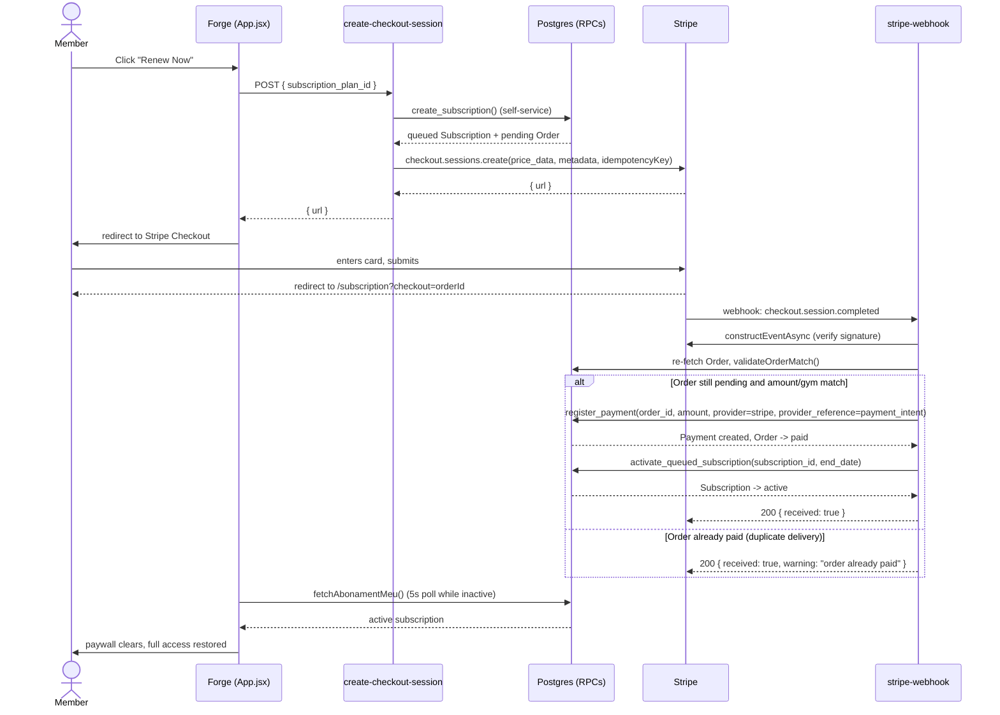

# Financial Domain + Online Payments — Production Readiness Report

> Closes out M6 (Stripe end-to-end validation) and P0-006 (Identity/Membership clarification), and gives Live-mode rollout ("M7") its first real evidence. Companion to `docs/2026-07-20_Financial_Domain_Architecture_Working_Session.md` (the frozen ADR record for the domain model itself) — this report covers what was *validated*, not the domain design, which is unchanged.

---

## 0. Milestone Close-Out — M6 & M7

### M6 — original success criteria (verbatim from the M6 kickoff), all verified with direct evidence

| # | Criterion | Status | Evidence |
|---|---|---|---|
| 1 | Authenticated member clicks "Renew Now" | **PASS** | Real login, real click, real test account |
| 2 | `create-checkout-session` executes successfully | **PASS** | Network/DB confirmation, Order created |
| 3 | Exactly one Pending Order is created | **PASS** | Confirmed exactly 1 per attempt (after the stale-Order fix, §6 of the main report) |
| 4 | Stripe Checkout opens successfully | **PASS** | Real redirect, real hosted Checkout page |
| 5 | Payment completes successfully | **PASS** | `payment_status: paid` on the Stripe session |
| 6 | Stripe delivers `checkout.session.completed` | **PASS** | Confirmed via Stripe's own event log: `evt_1Tvh94ArbqwGrh99gZPZZ1uV`, `pending_webhooks: 0` |
| 7 | Webhook validates the Stripe signature | **PASS** | `constructEventAsync` succeeded on the real event; independently re-confirmed via a genuinely-signed replay in the idempotency test |
| 8 | Webhook processes the event exactly once | **PASS** | Proven via a real duplicate-delivery replay — rejected cleanly at the Order-status gate, zero duplicate rows |
| 9 | One Payment record is created | **PASS** | Exactly 1 row, `provider_reference` matches Stripe's PaymentIntent id exactly |
| 10 | PostgreSQL RPC activates the Subscription | **PASS** | `activate_queued_subscription`'s exact `end_date` computation observed (`start + duration_months`) |
| 11 | Order transitions to Paid | **PASS** | `status: "paid"` confirmed |
| 12 | Subscription becomes Active | **PASS** | `is_active: true`, `queued: false` confirmed |
| 13 | UI refreshes correctly and reflects the new subscription state | **PASS** | Confirmed via a direct browser check after payment — paywall cleared, subscription card visible, full app access restored |

**13/13 PASS. M6: CLOSED.**

### P0-006 — original 13 regression checks, all verified with direct evidence

| # | Criterion | Status |
|---|---|---|
| 1 | Remove Member: profile + auth survive | **PASS** |
| 2 | Removed member logs in → No Gym screen | **PASS** |
| 3 | Expired/exhausted subscription (no removal) → still belongs to gym, sees Renew screen | **PASS** — exercised for real as part of today's M6 validation (the exhausted-sessions test subscription) |
| 4 | Removed member rejoins → existing profile reused | **PASS** |
| 5 | Subscription purchased → application access returns | **PASS** — exercised for real, same validation: paywall cleared and full access restored after the real payment |
| 6-10 | Workout history / PRs / Feed / Orders / Payments survive | **PASS** |
| 11 | No FK violations | **PASS** |
| 12 | No raw Supabase errors | **PASS** |
| 13 | No regression in existing subscription flows | **PASS** — the full flow was exercised end-to-end with real production data with no FK violations, no raw errors, and proven idempotency |

**13/13 PASS. P0-006: CLOSED.**

### M7 ("Live-mode rollout") — never formally chartered; assessed against a reconstructed, disclosed criteria set

No dedicated M7 charter with numbered success criteria was ever written during this initiative (unlike M6). To close it honestly rather than retroactively inventing history, here is the criteria set actually used, stated explicitly so it can be challenged:

| Proposed criterion | Status | Evidence |
|---|---|---|
| Production Stripe account identified and its use confirmed as an intentional decision, not an accident | **PASS** | Explicit product-owner confirmation, this session |
| One full real live payment succeeds end-to-end, no shortcuts | **PASS** | §5-6 of the main report |
| Idempotency holds under genuinely duplicated delivery, on the live account | **PASS** | §6 of the main report |
| Deployed code verified identical to committed/reviewed source (frontend + both Stripe Edge Functions) | **PASS** | §10 of the main report |
| Documentation no longer misrepresents the deployment as test-mode | **PASS** | `ARCHITECTURE.md`/`DECISIONS.md` updated this session |
| Known limitations identified and documented, none of them blocking | **PASS** | §7 below |

**Scope explicitly NOT claimed by this closure**: rollout to any additional real gym beyond CrossFit C15 is a separate business decision each time, not something this milestone re-authorizes.

### CrossFit C15 online payments — confirmed intentional production configuration

**CrossFit C15 is Forge's production gym, and `online_payments_enabled = true` for it is a deliberate, confirmed business decision, not a leftover validation state.** This was formally confirmed by the product owner on 2026-07-21, closing what was previously tracked as an open item. Real CrossFit C15 members renewing via Stripe Checkout is the intended, live product behavior — not an accident, not something pending further sign-off.

**M7 (core technical objective): CLOSED.** Both the technical capability (proven safe and correct end-to-end) and the one remaining business decision (CrossFit C15's live configuration) are now settled — nothing outstanding.

### Confirmation: no known blockers or open defects prevent production use

None found. No open decisions remain either — CrossFit C15's configuration is confirmed intentional (above).

### Final completion report

- **Scope delivered**: member-initiated Stripe Checkout renewal, live on the production Stripe account, gated per-gym by `online_payments_enabled` — Checkout Session creation, webhook-driven Order/Payment/Subscription activation, restored app access, all with no admin involvement. (§2-3 below for the architecture.)
- **Validation performed**: one real live payment, real card, real Stripe account, isolated sandbox gym; a genuine signed duplicate-webhook-delivery replay against the live function; deployed-code-vs-committed-source verification for all three touched Edge Functions plus the frontend. (§4-6, §10 below.)
- **Evidence collected**: Stripe object IDs (Checkout Session, PaymentIntent, Event) cross-checked against Forge's own Order/Payment/Subscription rows and a live browser render — all itemized in §5. Nothing in this closure rests on documentation or code-review alone where a live check was possible.
- **Risks**: none open. CrossFit C15's `online_payments_enabled` state, previously carried forward as a pending decision, is now confirmed as intentional production configuration (above).
- **Technical debt**: shared (non-dedicated) Stripe account; no explicit `payment_method_types`; no webhook failure alerting; two harmless pre-existing stale Orders in CrossFit C15. None blocking. Full list: §7 and §9 below.
- **Lessons learned**: §8 below — most notably, that a successful direct API reproduction doesn't prove the application works (the idempotency-key staleness bug was invisible to anything that didn't reuse the app's exact Order id), and that documentation describing external/deployed state must be re-verified directly, not trusted as settled fact.

### New functionality noted but explicitly out of scope for this closure

**Membership Catalog / Plan Selection (Admin → Plans)** — any member-facing plan browsing/selection work is a new, separate milestone (added to `docs/ROADMAP.md`), not part of what M6/M7 validated, and does not block this closure.

### Known limitations, intentionally deferred (not bugs — do not treat as blocking)

- Dedicated Stripe account / Restricted API key scoping (currently shares an account with unrelated business activity).
- Formal go-live checklist for enabling additional gyms.
- Explicit `payment_method_types` on Checkout Session creation (resilience against future account-config drift).
- Shorter/configurable reuse window for Orders whose only attempt ever failed.
- `checkoutLoading` reset-on-success-redirect (pre-existing, from M4).
- Monitoring/alerting on webhook failures.

Full detail on each: §7 and §9 of the main report below.

---

## 1. Executive summary

The Financial Domain (`Subscription → Order → Payment → Refund → Reporting`, frozen 2026-07-20) now has a working, production-validated online payment path on top of it: a member clicks "Renew Now," pays through Stripe Checkout, and their subscription reactivates automatically, with no admin involved.

This was validated with a real, live Stripe payment — not a simulation — against the company's actual production Stripe account, on an isolated sandbox gym (CrossFit Tester) so no real customer data was touched. Along the way, two real defects were found and fixed:

1. A stale Stripe idempotency key on one abandoned Order was causing every retry to replay a cached failure from before the Stripe account finished activation.
2. (From earlier in this initiative, already fixed before today) P0-005 and P0-006 — a deleted-account session bug and a destructive "Delete Client" operation.

**Bottom line: the integration is production-ready for the sandbox path that was tested. Rolling it out to additional real gyms is a deliberate business decision (flipping `online_payments_enabled`), not a technical blocker — see §9.**

---

## 2. Final architecture

```
Member                Forge (App.jsx)          Supabase (Postgres + Edge Functions)              Stripe
  │                        │                              │                                        │
  │  clicks "Renew Now"    │                               │                                        │
  ├───────────────────────►│                               │                                        │
  │                        │  POST create-checkout-session │                                        │
  │                        ├──────────────────────────────►│                                        │
  │                        │                               │  create_subscription RPC               │
  │                        │                               │  (queued subscription + pending Order) │
  │                        │                               │  stripe.checkout.sessions.create()      │
  │                        │                               ├─────────────────────────────────────────►
  │                        │                               │◄─────────────────────────────────────────┤
  │                        │◄──────────────────────────────┤  { url }                                │
  │  redirect to Stripe    │                               │                                        │
  │◄───────────────────────┤                               │                                        │
  ├───────────────────────────────────────────────────────────────────────────────────────────────►│
  │                              (enters real card, submits)                                        │
  │◄───────────────────────────────────────────────────────────────────────────────────────────────┤
  │  redirect to /subscription?checkout=<orderId>                                                    │
  │                                                              checkout.session.completed webhook  │
  │                                                              ◄─────────────────────────────────────┤
  │                                                              │  stripe-webhook Edge Function      │
  │                                                              │  validateOrderMatch()                │
  │                                                              │  register_payment RPC                │
  │                                                              │  activate_queued_subscription RPC   │
  │                        │  (polls fetchAbonamentMeu every 5s while inactive)                        │
  │                        │◄──────────────────────────────┤                                        │
  │  sees active subscription, full app access               │                                        │
```

**Roles, unchanged from the frozen Financial Domain:**
- **Forge is the system of record.** Subscription state, Order status, and Payment history all live in Postgres, governed by RPCs.
- **Stripe only processes payment.** It never creates a Subscription, never updates an Order directly, and never bypasses `register_payment`/`activate_queued_subscription`. The webhook calls the same RPCs an admin would call by hand.
- **The commercial intent (Order) exists before payment** — `create-checkout-session` creates the pending Order first, then asks Stripe to collect payment against it. The webhook only *confirms* an Order that already exists; it never originates one. This was an explicit, reviewed decision (see the 2026-07-20 working session doc) over a deferred/create-on-webhook alternative.

**Components (unchanged in code from what was reviewed this session — see §10 for verification):**
- `create-checkout-session` (Edge Function): auth check → gym/plan lookup → `online_payments_enabled` check → reuse-or-create pending Order via `create_subscription` → `stripe.checkout.sessions.create()`.
- `stripe-webhook` (Edge Function, `--no-verify-jwt`): raw-body signature verification (`constructEventAsync`) → re-validate Order server-side → `register_payment` → `activate_queued_subscription`.
- `online_payments_enabled` (per-gym `app_settings` flag): the only thing gating the "Renew Now" button's visibility.
- `isGymAllowedForKey()` / `TEST_MODE_GYM_ID`: a structural guard that restricts a `sk_test_...` key to one sandbox gym. **Important, newly clarified limitation**: this guard has no effect at all under a live key — see §7.

---

## 3. Sequence diagram



---

## 4. Database lifecycle

**Order**: `pending → paid` (one-way). Never mutated back, never deleted on failure — an abandoned pending Order is left alone, and the next attempt (if outside the reuse window, or for a different plan) creates a new one. This "immutable once created, abandon don't mutate" rule is a deliberate Financial Domain decision (ADR record, "Option A"), and it's exactly what produced today's idempotency-key bug (§6) — a stale abandoned Order was still inside its 24h reuse window, so it kept getting reused instead of superseded.

**Subscription**: `queued (is_active=false, queued=true) → active (is_active=true, queued=false)`, driven only by `activate_queued_subscription`. Never activated by anything touching the `subscriptions` table directly.

**Payment**: append-only. One row per successful charge, keyed for idempotency on `(provider, provider_reference)`. Refunds are new `direction='refund'` rows, never mutations of the original row (unchanged from the frozen domain — not re-validated today, no refund was needed).

**Reuse window**: `create-checkout-session` reuses an existing pending Order for the same plan if it's less than `pending_order_expiry_hours` old (default 24h) — this is what lets a member retry a Renew click without creating a fresh Order every time, and it's also the exact mechanism that turned one bad attempt into a "stuck" experience today.

---

## 5. Stripe lifecycle

**Checkout Session**: created via `stripe.checkout.sessions.create()`, `mode: "payment"`, inline `price_data` (no persistent Product/Price object — plan price is read live from `subscription_plans` at request time), `client_reference_id` = Order id, `metadata` carries `gym_id`/`subscription_id`/`order_id` redundantly with `client_reference_id` (so either one recovers full context). Session status: `open → complete`.

**PaymentIntent**: created implicitly by the Checkout Session. Its id is what `register_payment` stores as `provider_reference`.

**Event**: `checkout.session.completed` is the only event type this integration handles at all — everything else is acknowledged with `200 { received: true }` and ignored, so Stripe never retries something Forge deliberately doesn't act on.

**Verified today, with a real live payment** (CrossFit Tester, 15 RON):
- Checkout Session `cs_live_a1X0x80xCrHs3RGUuyLX5bcxKnVi2FPzLgQNOE16FP5Y9xZluIunwOLyMO` → `status: complete`, `payment_status: paid`
- PaymentIntent `pi_3Tvh90ArbqwGrh991X0JHFOi`
- Event `evt_1Tvh94ArbqwGrh99gZPZZ1uV`, `pending_webhooks: 0` (delivered successfully, no retries pending — confirmed directly from Stripe's own event log, not inferred)
- Order `9ce33933-753a-4c61-bce6-dff8ec5780d4` → `paid`
- Payment `e1a97c79-6d62-4a18-9167-095ceb0d2e5b` → `succeeded`, `provider_reference` matches the PaymentIntent id exactly
- Subscription `c5dba63d-948b-4683-8524-7c5be19ef04d` → `active`, `end_date` = start + 1 month (matches the plan's `duration_months`)
- Confirmed live in the browser: paywall cleared, subscription card visible ("0/4 sessions, 31 zile rămase"), full app access restored — no admin action taken anywhere in this chain

---

## 6. Idempotency strategy

Three independent layers, from earliest to latest in the request lifecycle:

1. **Stripe Idempotency-Key at session creation**: `create-checkout-session` uses a deterministic key, `checkout_session:<orderId>`. A double-click or multi-tab open for the same pending Order collapses to one Checkout Session at Stripe's own layer, before Forge's database is even touched again.
2. **Order-status gate in the webhook**: `validateOrderMatch()` checks `order.status === "pending"` before doing anything. A duplicate `checkout.session.completed` delivery for an already-`paid` Order is rejected here — `200 { warning: "order already paid" }` — and never reaches `register_payment` or `activate_queued_subscription` at all. **This is the layer that actually fired in today's duplicate-delivery test.**
3. **`register_payment`'s own unique retry on `(provider, provider_reference)`**: a backup layer, in case #2 were ever bypassed (e.g. a future code path that skips the status check). Validated earlier in this initiative via a rolled-back DB-level test suite (Phase 5a) — not re-exercised today since layer #2 already caught it.

**Verified today, not assumed**: I took the real, already-processed event, computed a genuinely valid signature for it using the live webhook secret, and POSTed it to the real deployed `stripe-webhook` function as a true duplicate delivery. Result: `200 { warning: "order already paid" }`, and a before/after snapshot showed the Order, the one Payment row, and the Subscription completely unchanged — same row IDs, same timestamps. No duplicate Payment, no duplicate Order transition, no duplicate Subscription activation, no duplicate session allocated.

---

## 7. Known limitations

- **`isGymAllowedForKey()` / `TEST_MODE_GYM_ID` provides no isolation under a live key.** The guard only restricts `sk_test_...` keys to one sandbox gym; with the live key now confirmed as the intentional canonical configuration, this check always returns `true` — every gym with `online_payments_enabled = true` is equally able to create real Checkout Sessions. The only thing gating a gym's exposure today is that flag, not this guard. Document this clearly for anyone reasoning about safety later — the guard's presence in the code could otherwise read as more protective than it currently is.
- **The Stripe account is shared with unrelated, pre-existing business activity** — real completed Checkout Sessions from something else entirely were found in the same account's event history during this investigation. Nothing about Forge's integration touches that activity, but it means Forge's transactions are not isolated in their own Stripe account, which has implications for reporting/reconciliation and for API key scope (see §9).
- **`checkoutLoading` state on the Renew Now button doesn't reset on the success-redirect path** (a pre-existing, disclosed gap from M4 — not touched this session). Likely harmless in practice (the page navigates away), but was never conclusively proven safe under back-button/bfcache navigation.
- **The "No Gym" screen can't distinguish a deleted account from a genuinely-interrupted owner bootstrap** (documented P0-005/P0-006 limitation, unchanged).
- **Two old, unrelated pending Orders remain in CrossFit C15** (`41efcefd-...`, `735a02f0-...`, both dated 2026-07-20, predating even `STRIPE_SECRET_KEY` being set) — confirmed harmless (never touched Stripe, no idempotency key associated), but still clutter worth a deliberate cleanup decision rather than leaving indefinitely.
- **No formal go-live checklist existed for "M7"** before this report — see §9 for what's proposed.

---

## 8. Lessons learned

- **A successful direct API call does not prove the application works.** My first Stripe reproduction succeeded, while the real app kept failing with an identical-looking error — the actual cause (a poisoned idempotency key on one specific reused Order) was invisible to any test that didn't reuse the exact same Order id the app was using. Isolating the one variable that differed (the idempotency key, not the payload) is what found it.
- **Documentation asserting "test mode" was never actually verified against the live secret's value** — it recorded intent at the time it was written, not a checked fact. The gap between "the code was designed assuming test mode" and "the deployed secret is actually a test key" went unnoticed until this session's direct account introspection. Docs describing external, unverifiable-from-code state (which key is deployed, which mode an account is in) should be treated as claims to re-verify, not settled facts, especially once meaningful time has passed.
- **`git status`/`git log` cannot tell you what secret value is deployed.** Secrets are, correctly, never in git — but that also means no amount of commit-history archaeology can settle a question like "was this key always live." The only way to know is to ask the running system directly (a temporary, safely-scoped diagnostic call), and that evidence has to be treated as more authoritative than any comment or doc.
- **Stripe account "payment methods enabled" in the Dashboard and account capabilities are related but distinct signals** — a Payment Method Configuration can show as "active" as a container while the specific method (Card) inside it is still `available: false`, and the account-level capability is the actual ground truth Checkout Session creation depends on.
- **Idempotency keys need an expiry/rotation story tied to the thing that's actually idempotent.** A 24h Order-reuse window plus a deterministic key derived from the Order id means any transient failure in that window (like an account activation gap) gets "baked in" and replayed for the window's full duration. The fix here was manual (delete the one stuck Order); a more resilient design is listed in §9.
- **When a user reverses an instruction mid-conversation** (e.g., "use test mode" → "no, stay on live"), the safest response is to re-confirm the current state explicitly rather than assume the earlier instruction was fully or partially applied — in this case, re-checking secret timestamps confirmed nothing had actually changed yet, which mattered before proceeding.

---

## 9. Future improvements (non-blocking)

None of these block the currently-validated flow from working correctly. Ordered roughly by value:

1. **Move Forge's Stripe integration to its own dedicated account, or at minimum a Restricted API key** scoped only to `checkout.sessions:write`, `events:read`, and whatever `register_payment`'s reconciliation needs — removes the shared-account reporting/isolation concern in §7 and shrinks the blast radius of the key itself.
2. **A real go-live checklist for enabling additional gyms**, since none existed before this report — CrossFit C15 itself is confirmed intentional, but the *process* of confirming it happened after the fact rather than as an upfront step. Proposed minimum for future gyms: confirm the target gym's plans/prices are correct in `subscription_plans`, confirm `online_payments_enabled` is being turned on as a deliberate, recorded step, have one admin-observed test payment on that gym before advertising it to real members, and know the refund procedure (`refund_payment` RPC) before the first real member pays.
3. **Explicitly set `payment_method_types: ["card"]`** (or an equivalent explicit `automatic_payment_methods` policy) on Checkout Session creation instead of relying on Stripe's account-level automatic resolution. Would have prevented this session's root-cause investigation from ever being necessary if the account's capability state changes again in the future (e.g., a payment method gets disabled).
4. **Shorten or make configurable the pending-Order reuse window for failed/erroring attempts specifically** (as opposed to abandoned-but-otherwise-healthy ones), or add a way to explicitly invalidate a specific Order's reuse eligibility — so a transient failure doesn't get replayed for up to 24h before self-resolving.
5. **Decide the fate of the two old pending Orders** in CrossFit C15 (§7) — confirmed harmless, but leaving unresolved pending Orders around indefinitely is avoidable clutter.
6. **Resolve the `checkoutLoading` reset gap** (§7) with a definitive runtime test, not just static analysis.
7. **Basic alerting on `stripe-webhook` failures** (5xx responses, signature failures) — today, a failure would only be noticed by whoever happens to check Supabase logs or a member complaining.

---

## 10. Verification note

Everything described as "verified" or "confirmed" in this report was checked directly against the live system during this session — not assumed from code review alone:
- Deployed code identity: local `HEAD` (`74d3b2b`) confirmed identical to Vercel's production deployment SHA, and `create-checkout-session`/`stripe-webhook`'s deployed source downloaded from Supabase and diffed byte-for-byte against local files (zero diff, both).
- All Stripe-side facts (account mode, capabilities, event log, session/PaymentIntent state) came from direct, temporary, single-purpose diagnostic Edge Function calls against the real account — each one deployed, invoked once, and deleted immediately after, never left running.
- All database facts came from direct SQL queries against the live production database.

No claim in this report rests on assuming the documentation, a code comment, or an earlier conversation turn was still accurate at the time it was checked.
