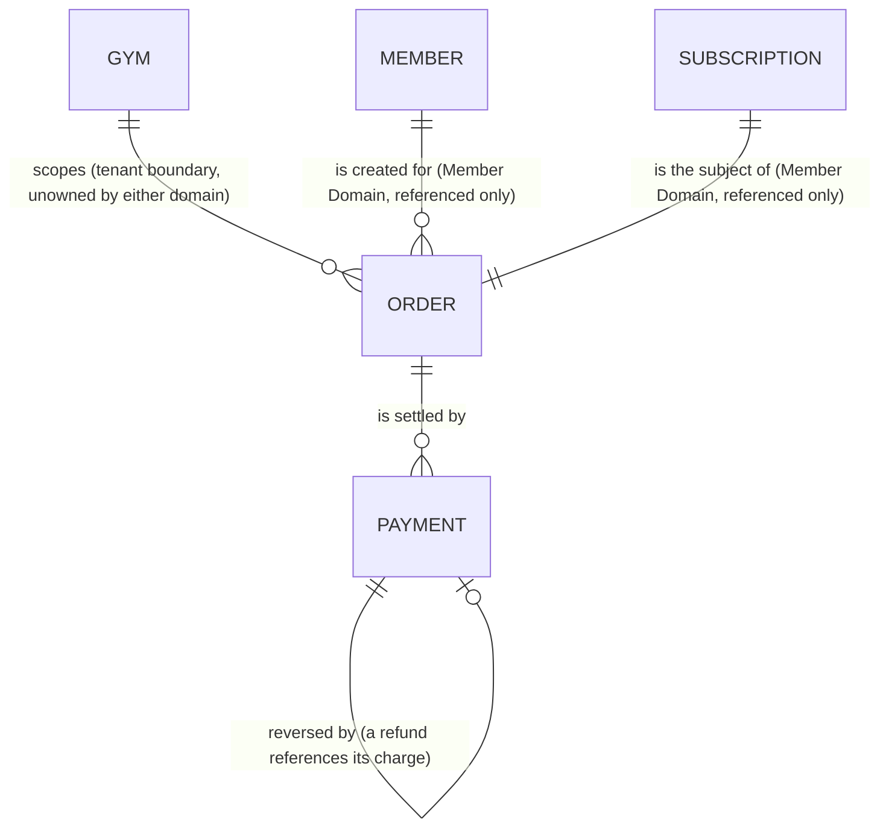
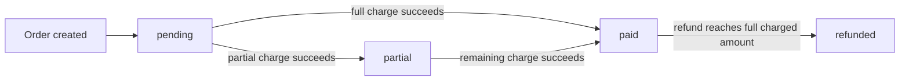
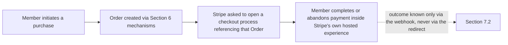
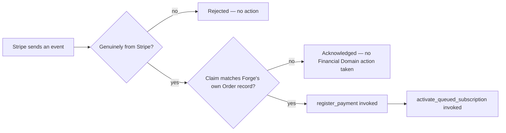

# Forge Financial Domain Architecture

This document is the canonical architecture specification for the Financial Domain.

It documents an already-implemented, production-validated system. Unlike a forward-designed specification, this document does not define intended behaviour — it describes actual, implemented behaviour, and treats that implementation as the sole source of truth. Where a decision was deliberately deferred rather than implemented, this document records the deferral; it does not resolve it, and it does not speculate about how it might eventually be resolved.

Implementation defines architecture, not the reverse. Where this document would otherwise appear to conflict with a future intention recorded elsewhere (a working-session note, an ADR's own "future reconsideration" trigger, a roadmap item), the implemented behaviour described here governs. Not-yet-built behaviour is out of scope by definition, not by omission.

This document defines the domain model — responsibilities, invariants, lifecycles, and boundaries — not the data model. Table, column, and function names are referenced only where an architectural rule has no other unambiguous description (for example, an invariant enforced by a specific constraint or trigger); this document is not a schema reference, and no SQL is reproduced here beyond what a rule's description requires.

This document must remain permanently consistent with `MEMBER_DOMAIN_ARCHITECTURE.md`. The two together define Forge's complete commercial and entitlement architecture. Neither document may claim ownership of an entity the other already owns; both were written to share one boundary line, stated identically in both places (Section 2).

---

# 1. Purpose

"What a Member is entitled to" and "what actually happened financially" are two fundamentally different kinds of fact. A Subscription's existence and state describe access. Money moving — or not moving, possibly more than once, possibly reversed — describes commerce. A platform that lets one of these stand in for the other, even as a convenience, loses the ability to answer either question correctly: a Member can be fully entitled with no money ever having moved (a comp), and money can move against one Subscription in more than one distinct event (a deposit and a balance; a charge and a Refund). Neither shape is representable if financial fact is inferred from entitlement state, or stored inside it.

**The Financial Domain is the canonical source of truth for every financial event recorded by Forge.** No other domain may create, infer, modify, or reconstruct financial history outside the mechanisms this domain defines. This is a foundational architectural principle, not a consequence of any other decision in this document — every entity, invariant, and boundary that follows exists to make it true and keep it true.

Forge's own history illustrates the failure mode this principle exists to prevent: revenue was once reconstructed at report time by regex-parsing free text embedded in a Subscription's `notes` field (for example, extracting `379` from the string `"Plătit: 379 RON"`) — a structured fact encoded into a string and parsed back out, rather than stored as what it actually was. This is historical context for *why* the principle above is treated as non-negotiable, not the foundation the principle rests on; the principle holds independently of this or any other specific incident.

The purpose of the Financial Domain is to make every financial fact — what was agreed, what was actually charged, what was actually paid, what was refunded — an explicit, structured, append-only record, independent of and never inferred from entitlement state, and never reconstructed from text meant for humans to read.

Concretely, this document answers:

- What is an Order, and what does it represent?
- What is a Payment, and how does it differ from an Order?
- How is a Refund represented, and why is it not a separate entity?
- What must be immutable, what must be append-only, and what must never be inferred?
- How is revenue calculated, and from what, exclusively?
- How does Stripe participate in this domain, and what is it never permitted to do?
- Where exactly is the boundary between this domain and the Member Domain?
- What is explicitly not part of this domain today, and why that is a documented deferral rather than a gap?

---

# 2. Scope

### In scope — owned by the Financial Domain

- **Order** — the record of what was agreed and on what commercial terms, and the single stable point Payment ever attaches to.
- **Payment** — the append-only record of money actually moving, in either direction.
- **Refund** — a Financial Domain concept represented by a Payment in the reversing direction. Refund is intentionally not modelled as a separate entity; it is documented and reasoned about explicitly wherever it matters (Sections 4, 5), never treated as an afterthought of Payment.
- **The financial lifecycle** — how an Order's settlement state is derived, and how a Payment's own lifecycle behaves.
- **Financial invariants** — immutability, append-only history, balance validation, and the guarantee that these hold regardless of which code path performed the write.
- **Stripe orchestration** — Checkout Session creation and webhook-driven confirmation, exclusively as the mechanism by which a real-world charge becomes a Payment. Stripe's own objects (Checkout Session, PaymentIntent, Event) are integration detail, not domain entities.
- **Revenue reporting's data source** — revenue is derived exclusively from Payments. Orders, Subscriptions, and all other entities are never treated as financial history.

### External Dependencies

The Financial Domain references entities it does not own. Per `MEMBER_DOMAIN_ARCHITECTURE.md`, the following remain under the exclusive ownership of the Member Domain, and are referenced here only through well-defined boundaries, never redefined:

- **Member**
- **Membership**
- **Subscription**
- **Membership Plan**
- **Plan Version**

The single point of reference is structural, not incidental: an Order references exactly one Subscription. The Financial Domain never defines Subscription's lifecycle, eligibility rules, or state machine, and never reads or writes Membership or Member directly. This boundary is symmetric and permanent: `MEMBER_DOMAIN_ARCHITECTURE.md` in turn lists Order, Payment, and Refund as its own external dependencies, owned here and never redefined there. Neither document is authoritative for the other's entities.

### Non-Goals

The following are deliberate architectural boundaries of the Financial Domain, not omissions to be completed later:

- **Tax handling is outside the scope of the Financial Domain.** No tax representation or inclusivity convention is defined; introducing one is a distinct architectural decision, not an extension of an existing rule.
- **Multi-currency operation is outside the scope of the current Financial Domain.** A currency is recorded per Order and per Payment, but the domain defines no rule for how amounts in different currencies relate to one another.
- **A dedicated financial audit log is outside the scope of the Financial Domain.** The domain's only recorded provenance is `created_by`/`created_at` on each entity; a separate audit mechanism is a distinct architectural capability, not part of this one.
- **Purchasable resource types other than Subscription are outside the scope of the current Financial Domain.** An Order's reference to what was purchased is exclusive to Subscription, not general. Supporting a second purchasable type is an extension of this domain's boundary, not a use of it.
- **Multi-item checkout is outside the scope of the current Financial Domain.** An Order represents commercial terms for exactly one purchased thing, never a composed set of several.
- **A Refund user interface is outside the scope of the Financial Domain.** Refund is a domain capability, exposed exclusively through the mechanisms this document defines (Section 4 onward). Whether, and how, a client surfaces that capability is a client concern the Financial Domain does not govern.

The scope defined in this section is intentional. Any expansion of Financial Domain responsibilities beyond these boundaries requires an explicit architectural decision and must preserve the domain invariants defined throughout this document.

---

# 3. Architectural Principles

These principles govern every decision in this document. Where a later section appears to contradict one of these principles, that section must be interpreted, or corrected, to remain consistent with the principle.

### 3.1 Financial history is a ledger, never a record you edit

Once a financial fact is recorded, it is never rewritten and never deleted. A correction, a refund, or a reversal is always a new record referencing what it corrects — never a mutation of the original. This holds for every role, not merely for typical application code: no update or delete path exists for a Payment, for any caller, at any privilege level. An Order does not delete when abandoned; it is simply never referenced again. The system must always be able to answer, exactly, what was recorded at any point in the past — a guarantee only possible if nothing recorded is ever silently changed.

### 3.2 A movement's sign is carried by its direction, never by its magnitude

An amount is always recorded as a non-negative quantity. Whether it represents money coming in or money going back out is carried entirely by an explicit direction, never by making the number itself negative. This keeps every aggregate operation — a sum, a balance, a total — meaningful without a sign-convention footnote, and makes a movement's nature, charge or Refund, a fact anyone reading one field can determine, not an inference from arithmetic.

### 3.3 Settlement status is derived, never trusted as stored fact

Whether an Order is pending, partially paid, paid, or refunded must be a pure function of its actual Payments, not a value any caller sets directly. A stored status field is permitted only as a read-optimization of that derivation, recomputed automatically whenever the underlying Payments change — never written as an independent, competing fact. The Financial Domain enforces its own instance of this discipline at the data layer itself, rather than trusting any calling code to keep a status field honest.

### 3.4 An invariant must hold regardless of which path performed the write

Every business rule this domain depends on — a Refund may never exceed its Order's remaining balance, a Refund must reference a real prior charge, a status must reflect the true sum of Payments — is enforced at the layer closest to the data, independent of whichever caller, role, or future code path attempted the write. A check performed only inside one write path protects callers of that path and nothing else; a constraint or trigger protects the invariant itself. Where both exist, the write-path check is a convenience — a faster, friendlier failure — and the data-layer mechanism is the actual guarantee.

### 3.5 Financial operations require attestation authority, not merely a valid caller

Not every financial write carries the same risk, even when performed by an otherwise-authorized caller. An operation whose amount is always derived from an already-fixed catalog price carries no attestation risk, and may safely be opened to the party the record concerns. An operation whose amount is a claim that real money changed hands may only be initiated by an actor authorized to attest that the event actually occurred — the party trusted to assert a financial fact, not merely a party with access to the record. This distinction, independent of any particular role model, determines which operations may ever be opened to the party a record concerns, and which must remain restricted to an attesting authority, permanently.

### 3.6 A financial movement has exactly one, permanent point of attachment

A Payment always references the commercial record it settles, and never the thing that record was for. This attachment point does not change shape as the catalog of purchasable things grows, and does not vary by which payment channel or provider ultimately moved the money. Whatever is bought, and however it is paid for, a Payment's relationship to the rest of this domain remains identical.

### 3.7 The Financial Domain owns financial business logic; no client owns any of it

No client — whether it presents to a Member, an administrator, or any future surface — may decide whether a charge is valid, what a Refund's remaining balance is, or what revenue is. Every such decision is made by this domain's own mechanisms, and every client, regardless of what it displays or which role uses it, observes the same answer.

### 3.8 Evolution is additive by default; redesign requires explicit architectural governance

Every capability this domain does not yet have is added as an extension of what already exists, when it is actually needed — never speculatively pre-built. This is the default path, not a permanent prohibition on change: a new payment channel is a new value, not a new mechanism; a new purchasable type is a new reference, not a rebuilt one. Changing what an existing entity means, rather than extending it, remains possible — but only as the outcome of an explicit architectural decision that intentionally supersedes this document, never as an incidental consequence of implementing a new feature.

---

# 4. Domain Model

The Financial Domain models exactly two entities. **Order owns the commercial agreement. Payment owns the financial movement.** Refund is not a third entity — per Section 3.2, it is a Payment recorded in the reversing direction. Two entities are sufficient for everything this domain is responsible for (Section 2): every further distinction the business cares about — charge versus refund, succeeded versus failed, cash versus card, one provider versus another — is a *property* of one of these two entities, never a reason to introduce a third.

### 4.1 Order

**Purpose.** Order owns the commercial agreement — what was agreed, for how much, in what currency, for which single Member Domain purchase — independent of whether any money has yet moved against it, or ever will.

**What it owns:**
- The agreed total amount and currency for one commercial transaction, fixed at the moment the Order is created.
- Its own settlement status, as a *derived* fact recomputed from its Payments (Section 3.3) — never authored directly by any caller.
- The association between the client the Order was created for, the Gym it belongs to, and the one Subscription it represents.
- Its own point-in-time creation record.

**What it deliberately does not own:**
- **Money itself.** Order never records that money moved; that is Payment's exclusive responsibility (Section 3.6). Order owns the agreement, not the settlement.
- **Entitlement.** Order does not decide, and has no mechanism to decide, whether a Member currently has access to anything. That decision belongs entirely to the Member Domain (Section 4.4).
- **Its own status as an authored fact.** Status is computed, never set (Section 3.3).

**Lifecycle.** An Order is created once, at most once per Subscription, and its commercial terms — amount, currency, the Subscription it represents — never change afterward. From that point, its only activity is its status being recomputed automatically as Payments are recorded against it, moving through a defined settlement vocabulary as the sum of its Payments changes. The full state-by-state treatment of that vocabulary, including every value it defines, is given in Section 5.

**Invariants:**
- The agreed total amount is never negative.
- At most one Order exists per Subscription, enforced structurally, not by convention.
- Status is always one of the defined vocabulary values, and is always derived, never authored.
- The Gym an Order belongs to is fixed at creation and cannot be changed afterward.

**Relationships to other Financial Domain entities.** Order is the sole, permanent point of attachment for Payment (Section 3.6). One Order relates to zero, one, or many Payments over its lifetime. An Order never relates to another Order.

### 4.2 Payment

**Purpose.** Payment owns the financial movement — money that actually moved, or an attempted movement whose outcome is already known, in one direction, at one point in time.

**What it owns:**
- Its amount, always non-negative (Section 3.2), and the direction — charge or reversing refund — that gives that amount meaning.
- Its own outcome, method, and provider information, where known.
- For a refund specifically, an explicit reference to the exact prior charge it reverses.
- Its own point-in-time creation record.

**What it deliberately does not own:**
- **Its Order's terms.** Payment references its Order; it never restates or duplicates that Order's amount or currency.
- **What was purchased.** Payment has no direct relationship to any Member Domain entity. Its only relationship within the Financial Domain is to its Order (Section 3.6). This is deliberate and load-bearing: it is what keeps Payment's shape identical no matter what future purchasable types this domain's boundary (Section 2) ever extends to.
- **Any correction to itself.** Once created, a Payment is never edited or deleted, by any actor, for any reason (Section 3.1). A mistaken charge is corrected by a new refund Payment, never by altering the original row.

**Lifecycle.** Unlike Order, a Payment does not have a multi-step lifecycle after creation — it is written once, with its outcome already known, and never revisited afterward. The domain defines a small vocabulary of possible outcomes for a Payment at the moment it is created; the full treatment of each, and how they relate to Order's own derived status, is given in Section 5.

**Invariants:**
- The amount is never negative; direction, never sign, carries polarity (Section 3.2).
- A refund must reference a real, prior *charge* Payment — never another refund, and never a nonexistent Payment.
- The sum of a Payment's Order's refunds may never exceed the sum of that Order's succeeded charges, checked and enforced atomically, independent of which write path attempted it (Section 3.4).
- Once created, a Payment is never updated and never deleted.
- Where a Payment records an external provider's own reference to the same movement, that reference is unique — the same real-world event can never produce two Payment rows.

**Relationships to other Financial Domain entities.** Every Payment references exactly one Order (Section 3.6) and nothing else in this domain. A refund Payment additionally references exactly one prior Payment — the charge it reverses — through that same kind of reference, not a distinct relationship type.

### 4.3 Entities Referenced, Not Owned

The Financial Domain holds direct references to exactly two Member Domain concepts — not one, and not all five named in Section 2:

- **Order → Subscription.** The commercial transaction's single purchasable reference (Section 2). The Financial Domain reads the fact of a Subscription's existence, and, once, at the moment an Order is created, whatever price the Member Domain's catalog attached to it at that instant. It never re-reads that price afterward, and never reads any other fact about the Subscription. Subscription's lifecycle, eligibility rules, and state machine remain exclusively defined by the Member Domain.
- **Order → Member.** The party an Order was created for. The Financial Domain holds a stable identifier to route an Order to the correct party and never reads or writes anything else about that Member. Member's identity, profile, and lifecycle remain exclusively defined by the Member Domain.

**Membership, Membership Plan, and Plan Version are never referenced directly by any Financial Domain entity.** They are reachable, if at all, only by first following the reference into the Member Domain's own Subscription — never through a foreign key or lookup this domain owns.

A third reference, to Gym, exists on both Order and Payment. Gym is a shared platform boundary used for tenant isolation across the whole system — every tenant-scoped table in Forge carries this same reference, in every domain. It is not a concept owned by either the Financial Domain or the Member Domain; referencing it here scopes every Order and Payment to the correct tenant, and is a tenant-isolation mechanism, not a domain relationship in the sense described above.

### 4.4 Three Independent Business Facts

Three genuinely different business facts underlie the Financial Domain and the Member Domain together. Each is owned by exactly one place, and none is ever derived from another:

- **Entitlement** — whether a Member can currently access something. Owned exclusively by the Member Domain, through its own Subscription state and Entitlement derivation. The Financial Domain has no entity that represents this fact, and makes no decision about it, anywhere.
- **Commercial agreement** — what was agreed, and on what terms. Owned exclusively by Order. An agreement can exist in full with no money ever having moved — a complimentary Subscription still produces an Order.
- **Financial movement** — what money actually moved, and in which direction. Owned exclusively by Payment. A movement always references an agreement, but is never itself an agreement, and is never itself a grant of access.

An Order reaching `paid` status is a financial fact only; whether, or how, that fact becomes a Member Domain entitlement change is a decision the Member Domain's own mechanisms make, not something this domain performs or assumes on its behalf (Section 7 describes the one place both domains' mechanisms are invoked together, each still only through its own defined operations).

### 4.5 Relationships, in Full

- **Subscription → Order is one-to-one, and at most, never enforced as mandatory.** A Subscription may have zero Orders or exactly one; it can never have two. Full treatment of when an Order comes into existence relative to its Subscription is in Sections 5 and 7.
- **Order → Payment is one-to-many, and at any instant, zero-to-many.** An Order accumulates a full financial history over its life — no charge yet, one succeeded charge, or a succeeded charge plus one or more refunds.
- **Payment → Payment is self-referential, and exactly one level deep.** A refund references the one charge it reverses; nothing ever references a refund in turn (Section 4.2, above, states this as a formal invariant).

---

# 5. Financial Lifecycle & State Transitions

Section 4 established what Order and Payment own and why. This section gives the complete, formal account of how each one actually moves through the states its ownership makes possible — every defined value, every transition, and, where it matters, which values the current implementation reaches versus merely defines room for.

### 5.1 Order: existence is not guaranteed by a Subscription's existence

Before an Order's status can be discussed, a more basic fact governs it: an Order does not necessarily exist just because a Subscription does. Order has no independent creation trigger of its own — it comes into existence only as the direct consequence of a specific RPC's own logic, at whatever moment that RPC decides it should (Section 6 gives the full, RPC-by-RPC account; Section 7 gives the Stripe-initiated case specifically). What Section 4.5 already established as a structural fact — a Subscription has zero Orders or exactly one, never two — is the invariant this section's lifecycle discussion assumes throughout.

### 5.2 Order Settlement Lifecycle

Once an Order exists, its status is never authored — it is recomputed, automatically, every time a Payment is recorded against it (Section 3.3). The rule is a pure function of that Order's own Payments, expressed here as architecture, not as the mechanism that happens to enforce it:

1. If the Order has any succeeded refunds, and their sum meets or exceeds the sum of its succeeded charges, its status is **refunded**.
2. Otherwise, if the sum of its succeeded charges meets or exceeds its agreed total amount, its status is **paid**.
3. Otherwise, if the sum of its succeeded charges is greater than zero, its status is **partial**.
4. Otherwise, its status is **pending**.

This ordering matters and is not arbitrary: a fully refunded Order is reported as `refunded`, never as `paid`, even though it was `paid` at some point in its history — the *current* derivation always wins over what was true a moment ago (Section 3.3), and a reader asking "is this Order settled" gets one unambiguous answer, never two simultaneously true ones.

**State table:**

| State | Meaning | Entered from | Exits to |
|---|---|---|---|
| `pending` | No succeeded charge has been recorded yet | Order creation | `partial`, `paid` |
| `partial` | Some, but not all, of the agreed total has been successfully charged | `pending` | `paid` |
| `paid` | The agreed total has been fully charged | `pending`, `partial` | `refunded` |
| `refunded` | Succeeded refunds meet or exceed succeeded charges | `paid` | terminal |
| `cancelled` | Defined by the settlement vocabulary; no code path in the implementation studied for this document transitions an Order into it. Currently unreachable through any implemented workflow, reserved, and not part of the active lifecycle. This document does not speculate about its intended future use. | — | — |

An Order's status can move directly from `pending` to `paid` (a single charge covering the full amount) or pass through `partial` first (a deposit, then a balance) — both are the same derivation rule producing a different intermediate reading, not two different mechanisms.

### 5.3 Payment Outcome Lifecycle

A Payment does not have a lifecycle in the sense Order does. It is written once, with its outcome already known, and is never revisited afterward (Section 3.1) — there is no transition *into* a Payment's status; there is only the value it was created with, permanently.

**Outcome vocabulary:**

| Outcome | Meaning | Reachable today |
|---|---|---|
| `succeeded` | The movement completed | Yes — the only outcome produced by any implemented workflow studied for this document. |
| `pending` | The movement was initiated but its outcome was not yet known at the moment of recording | Defined by the domain's own contract (the schema permits it, and the recording mechanism accepts it as a parameter); not currently produced by any implemented workflow. |
| `failed` | The movement was attempted and did not succeed | Same as `pending` — contractually reachable, not currently produced. |

**Direction vocabulary:**

| Direction | Meaning | Constraint |
|---|---|---|
| `charge` | Money moving toward the Gym | May exist with or without a prior Payment on the same Order. |
| `refund` | Money moving back, reversing a specific prior movement | Must reference exactly one prior Payment, which must itself be a succeeded `charge` (Section 4.2's invariants). |

Neither table above describes a state *machine* — both describe a fixed vocabulary a Payment is assigned exactly once, at the moment it is written.

### 5.4 How Order and Payment States Interact

Order's entire settlement history is legible from its Payments alone, with no other input. A short sequence makes the derivation in Section 5.2 concrete for an Order with an agreed total of 100. The specific charge a refund references below is illustrative only — Section 4.2's invariant requires a refund to reference *some* real, prior succeeded charge Payment on the same Order; it does not require, or even distinguish, which one:

| Event | Order's succeeded charges | Order's succeeded refunds | Order status after |
|---|---|---|---|
| Order created | 0 | 0 | `pending` |
| Payment: charge 60, succeeded | 60 | 0 | `partial` |
| Payment: charge 40, succeeded | 100 | 0 | `paid` |
| Payment: refund 100, succeeded, referencing one of the two succeeded charges above | 100 | 100 | `refunded` |

Nothing in this sequence involves an Order being told its own status. Every row is the same rule (Section 5.2) re-evaluated against a growing set of immutable facts (Section 3.1) — which is the concrete demonstration of Section 3.3's principle: the stored status is a read-optimization of this derivation, never a competing authority.

---

# 6. RPC Responsibilities

Every write to Order or Payment happens through exactly one of a small, fixed set of RPCs (Section 3.7) — no client, of any kind, ever inserts, updates, or deletes either table directly. This section describes what each RPC is responsible for, architecturally: its purpose, what it creates or validates, what it deliberately does not do, and which invariants it exists to preserve. It does not describe who is authorized to call each one — that is the Security Model's exclusive concern (Section 8) — nor how failures and retries are handled (Section 9).

### 6.1 The Financial Domain's own RPCs

Three RPCs belong to the Financial Domain directly, each solely and exclusively responsible for one kind of write.

**`create_order_for_subscription`**
- **Purpose.** Bring an Order into existence for a Subscription.
- **Architectural responsibility.** The sole mechanism by which an Order is created.
- **Creates / validates.** Exactly one Order per Subscription, with its agreed total, currency, Gym, and Member all resolved from the Subscription itself. If an Order already exists for that Subscription, returns the existing one rather than creating a second.
- **Does not do.** Never accepts Gym or Member as a caller-supplied value. Never creates a Payment. Never produces a second Order for a Subscription that already has one.
- **Invariants preserved.** At most one Order per Subscription (Section 4.1). An Order's terms are fixed at creation and never re-derived afterward (Section 4.3).

**`register_payment`**
- **Purpose.** Record that a charge occurred.
- **Architectural responsibility.** The sole mechanism by which a charge Payment is created.
- **Creates / validates.** Exactly one Payment with `direction = charge`, referencing the given Order. Enforces that a complimentary Payment (`method = comp`) carries an amount of zero.
- **Does not do.** Never writes a refund. Never updates or deletes an existing Payment. Never alters the Order it references.
- **Invariants preserved.** Amount is always non-negative; direction, not sign, carries polarity (Section 3.2). Once created, a Payment is never revisited (Section 3.1).

**`refund_payment`**
- **Purpose.** Record that a refund occurred.
- **Architectural responsibility.** The sole mechanism by which a refund Payment is created.
- **Creates / validates.** Exactly one Payment with `direction = refund`, resolving its Order from the original charge Payment it reverses — never from a caller-supplied Order reference.
- **Does not do.** Never writes a charge. Never accepts an Order reference directly. Never permits a refund to reference anything other than a succeeded charge Payment.
- **Invariants preserved.** A refund must reference a real, prior charge (Section 4.2). The sum of an Order's refunds may never exceed its succeeded charges (Section 3.4).

### 6.2 Financial Domain responsibilities carried inside Member Domain lifecycle RPCs

Four further RPCs — `create_subscription`, `activate_queued_subscription`, `delete_queued_subscription`, and `end_subscription` — belong primarily to the Member Domain: they create, activate, remove, and end Subscriptions, and that responsibility is defined there, not here (Section 2). None of the four write to Order or Payment independently. Each one, where its Financial Domain surface applies, orchestrates a call into one of the three RPCs in Section 6.1 — which remain the sole mechanisms for those writes regardless of which caller invokes them. What follows describes each RPC's Financial Domain surface: under what condition it triggers that orchestration, not an independent write path.

**`create_subscription`**
- **Purpose.** Decide, at Subscription-creation time, whether to invoke `create_order_for_subscription` and, where an amount is supplied, `register_payment`.
- **Architectural responsibility.** Trigger Order creation for a Subscription created in an immediately-active state, and for a queued Subscription that represents a real, self-initiated purchase.
- **Creates / validates.** Invokes `create_order_for_subscription` in both of those cases; invokes `register_payment` alongside, where an amount was supplied.
- **Does not do.** Does not invoke `create_order_for_subscription` for a queued Subscription created as an administrative placeholder — that Subscription has zero Orders until `activate_queued_subscription` later guarantees one exists. Never performs the Order or Payment write itself, outside of invoking those two RPCs.
- **Invariants preserved.** A Subscription may exist with zero Orders (Section 4.5). An Order's terms are fixed at the moment it is created (Section 4.3). The one documented exception to Order creation is covered in Section 9.

**`activate_queued_subscription`**
- **Purpose.** Guarantee that a queued Subscription has an Order by the time it becomes active, regardless of whether `create_subscription` already created one.
- **Architectural responsibility.** Invoke `create_order_for_subscription` as a backstop for any queued Subscription that reaches activation without an Order — never a second, independent mechanism for creating one.
- **Creates / validates.** Invokes `create_order_for_subscription` for the Subscription being activated; if one already exists, Section 6.1's own idempotent-return behaviour applies, so this is never a duplicate. Invokes `register_payment` only when the activation also carries a previously recorded amount to reconcile.
- **Does not do.** Never activates a Subscription without also guaranteeing its Order exists. Never performs the Order or Payment write itself, outside of invoking those two RPCs.
- **Invariants preserved.** Every active Subscription has an Order (the one documented exception is covered in Section 9). At most one Order per Subscription (Section 4.1).

**`delete_queued_subscription`**
- **Purpose.** Remove a queued Subscription that was never given an Order.
- **Architectural responsibility.** None within the Financial Domain — it does not orchestrate any Section 6.1 RPC.
- **Creates / validates.** Nothing Financial Domain–related.
- **Does not do.** Never touches an Order or Payment — it is reachable only for a Subscription that has none.
- **Invariants preserved.** A Subscription may exist with zero Orders (Section 4.5); removing one that was never given an Order requires no Financial Domain reconciliation.

**`end_subscription`**
- **Purpose.** End a Subscription's entitlement.
- **Architectural responsibility.** None within the Financial Domain — it does not orchestrate any Section 6.1 RPC.
- **Creates / validates.** Nothing Financial Domain–related.
- **Does not do.** Never creates, modifies, or reacts to a Payment. Ending a Subscription's entitlement is never itself a financial event; a refund, where warranted, remains a separate, explicit action through `refund_payment`.
- **Invariants preserved.** Entitlement and financial movement remain independent facts (Section 4.4).

---

# 7. Stripe Integration

Stripe is a payment processor Forge integrates with — never a party this domain treats as authoritative for anything. Forge's own Order and Payment records are the sole source of truth for what was agreed and what money moved (Section 1). Stripe's own records of the same interaction — a Checkout Session, a PaymentIntent, an Event — exist for Stripe's own purposes and are useful to this domain only for correlation and for verifying that a message genuinely originated from Stripe. They are never treated as the authoritative source for financial decisions. Concretely: a commercial agreement (an Order) always exists before Stripe is ever asked to collect anything against it, never the reverse — Stripe never originates an Order's terms, it only collects money against one Forge already recorded through its own mechanisms (Section 6).

### 7.1 Checkout Flow

A Member-initiated purchase begins entirely within the Financial Domain's own mechanisms, before Stripe is contacted at all: an Order (and, where one does not already exist, its Subscription) is created first, through the same RPCs described in Section 6. Only once that Order exists is Stripe asked to open a checkout process referencing it. The Member then completes or abandons payment inside Stripe's own hosted experience — a process this domain does not observe directly and has no visibility into while it is underway.

A Member being redirected back from Stripe carries no financial meaning on its own — it is not treated as proof that payment succeeded, and no Financial Domain write is ever triggered by it. The only authoritative answer to "did this succeed" is the Order's own derived status (Section 5.2), read fresh, which by construction can only have changed through the webhook (Section 7.2) actually recording a Payment. This is Section 1's principle applied at its most exposed boundary: the moment a Member is looking directly at a page that says "payment complete" is exactly the moment it would be easiest, and wrong, to let a client's own belief substitute for this domain's own derivation.

Where a Member already has a pending Order representing the same commercial terms, within a bounded, Gym-configurable recency window, that Order is reused rather than a second one being created. This is not a special case bolted onto the flow — it is a direct consequence of two invariants already established: a Subscription may never have more than one Order (Section 4.1), and an abandoned Order is never deleted or mutated, only ever left behind (Section 3.1). Resuming an incomplete purchase can only ever mean continuing with the Order that already exists.

### 7.2 Webhook Responsibilities

The webhook is the sole mechanism by which a Stripe outcome ever reaches Forge's own records. Its responsibility is narrow and sequential:

1. Verify that the incoming message genuinely originated from Stripe, unaltered, before treating any of its content as evidence of anything.
2. Re-derive the relevant Order from Forge's own database — never from the incoming message's own claims about which Order, which Gym, or which amount is involved.
3. Confirm the incoming claim actually matches what Forge itself already agreed to (Section 7.1's Order) before proceeding any further.
4. Only once satisfied, invoke the same Financial Domain and Member Domain mechanisms any other authorized caller would invoke (Section 6): `register_payment`, then `activate_queued_subscription`.

The webhook handles exactly one kind of event — the notification that a checkout was completed. Every other event type Stripe might ever send is acknowledged and otherwise ignored, so that Stripe never retries something this domain deliberately does not act on. The webhook never writes to Order or Payment itself, under any circumstance; it is authorized to invoke the same sole mechanisms Section 6 already defines, and nothing more. Because of that, every invariant those mechanisms already guarantee — a refund can never exceed its Order's balance, a Payment is never revisited once created, an Order's status is always derived (Section 3.4) — holds for a Stripe-triggered write exactly as it holds for any other, without the webhook needing any invariant of its own.

### 7.3 Source of Truth

Everything above serves one architectural rule: Forge's own Order and Payment records are authoritative for every fact this domain governs, and Stripe's own objects are never a competing account of the same facts. Two concrete consequences follow directly, and neither is optional:

- A commercial agreement always exists on Forge's side before Stripe is asked to collect against it — never the other way around (Section 7.1).
- An Order's settlement status is always Forge's own derivation (Section 5.2) from Forge's own Payment records, never a mirror of whatever Stripe's own dashboard happens to show at a given moment.

If Forge's records and Stripe's records ever appear to disagree, Forge's own records are correct by definition (Section 1) — the disagreement is a data-quality question to investigate, never a cue to prefer Stripe's account of events. Section 9 covers what happens when an incoming claim does not match what Forge expects.

---

# 8. Security Model

Section 6 described what each RPC is responsible for and deliberately deferred one question for every one of them: who may actually invoke it. This section answers that question, and shows that the answer is never arbitrary — it follows directly from Section 3.5's principle: authorization is drawn by who can attest to money moving, not merely by role.

Every authorization described below is enforced by the RPC itself, at the moment it is called — never by a client screen, a workflow, or any mechanism upstream deciding what to permit before the call arrives. Whatever path a call travels through — a Member's own client calling directly, or an intermediary forwarding that same Member's own session unchanged — the RPC evaluates the identity that is actually calling it, every time. This is Section 3.4's principle — an invariant must hold regardless of which path performed the write — applied to authorization itself: it is self-contained in the RPC, not a property of any particular route to reach it.

### 8.1 Three kinds of caller

Every RPC's authorization check evaluates one of three identities:

- **A Member** — the party a Subscription, Order, or Payment concerns, acting only on their own record.
- **An administrator** — authorized to act broadly within their own Gym's data, never across Gyms.
- **A verified internal caller** — today, exclusively the webhook (Section 7.2), and only after it has already, independently, confirmed a message genuinely came from Stripe before ever invoking an RPC. This is not a fourth kind of trust granted casually; it is the same standard Section 7.2 already requires before any Financial Domain mechanism is invoked at all.

None of these three ever decides business logic (Section 3.7). Each is simply the identity an RPC's own check evaluates before performing the one operation it is responsible for.

### 8.2 Read access

A Member may read their own Orders and Payments. An administrator may read every Order and Payment within their own Gym. No one else may read either table at all — not even an administrator of a different Gym. This holds independent of any RPC: reading requires no orchestration to be correct, so it is enforced as a direct property of the tables themselves, not as a responsibility any RPC carries.

### 8.3 Write access, per operation

Section 3.5's distinction — server-derived amount versus caller-attested amount — is what actually separates these operations, not a role list applied uniformly:

- **`create_order_for_subscription`** is open to a Member acting on their own Subscription, to an administrator, and to a verified internal caller. Its amount is always derived from the Subscription's already-fixed catalog price (Section 4.3) — never a caller's claim about money. Opening it carries no attestation risk: no caller can cause anything to be recorded that was not already true.
- **`register_payment`** is restricted to an administrator and to a verified internal caller. A Member is never permitted to invoke it on their own behalf, regardless of which Order or Payment it concerns. Its amount is a claim that real money changed hands — exactly the case Section 3.5 draws the line at. Opening it to the party a Payment concerns would let that party assert their own financial history by declaration alone.
- **`refund_payment`** is restricted the same way, for the identical reason: its amount is likewise a claim, this time about money moving back out.
- **`create_subscription`** and **`activate_queued_subscription`**, within their Financial Domain surface (Section 6.2), inherit this same distinction rather than introducing a separate one. The portion of each that only ever triggers `create_order_for_subscription` is open to a Member acting on their own Subscription, exactly as that RPC is. The portion of each that could trigger `register_payment` — recording a specific attested amount — remains restricted to an administrator, exactly as that RPC is.
- **`delete_queued_subscription`** and **`end_subscription`** carry no Financial Domain authorization surface at all (Section 6.2); who may invoke them is governed entirely by the Member Domain.

### 8.4 Append-only enforcement, independent of any RPC

No caller — not a Member, not an administrator, not a verified internal caller — is ever granted the ability to update or delete a Payment, through any RPC or through any other path. This is Section 3.1 made concrete at the access-control layer itself: rather than relying on every RPC to correctly omit an update path forever, the underlying permission for that kind of change does not exist for anyone, at any privilege level, independent of RPC logic entirely. The same holds for which Gym an Order or Payment belongs to: once set, no caller, at any privilege level, may change it — tenant isolation enforced the same way immutability is, as a standing property of the data itself, not a rule any RPC has to remember to enforce.

### 8.5 A permanent constraint, not a current setting

Section 3.5 is a principle, not a description of today's convenience. Any future proposal to open `register_payment` or `refund_payment` to the party a Payment concerns must be evaluated against the same attestation-authority question this section already answers — never against a changed role model or an easier user experience. The distinction drawn here is durable in the same sense Section 3's principles are: it survives any future reorganization of who the callers happen to be.

---

# 9. Failure Handling & Idempotency

What happens when something goes wrong and what happens when the same event arrives more than once are treated together in this section, because a delivery failure and its retry are, from this domain's perspective, usually the same event happening twice — not two separate concerns.

### 9.1 Duplicate delivery is expected, not exceptional

Stripe's own delivery model can send the same event more than once. This domain is designed around that as a starting premise, not treated as a rare defect to guard against after the fact. Three independent layers apply, from earliest to latest in a request's life:

1. A duplicate attempt to open the same checkout is collapsed before Forge's database is ever touched a second time.
2. The Order's own status gate (Section 7.2) recognizes a duplicate delivery for an already-settled Order and takes no further action — it never reaches `register_payment` or `activate_queued_subscription` at all.
3. `register_payment`'s own uniqueness guarantee for a verified internal caller (Section 4.2) is a backup layer, independent of the second: if the status gate were ever bypassed, this layer alone still prevents a duplicate Payment.

Each layer is independent of the others. This is Section 3.4's principle applied to repetition rather than to concurrency: idempotency here does not rely on any single mechanism remembering to check correctly forever. This guarantee applies specifically to the Stripe-originated path; a Payment recorded manually by an administrator has no equivalent automatic deduplication, and preventing an administrator from recording the same charge twice by mistake is not a guarantee this domain makes structurally.

### 9.2 A claim that does not match Forge's own record is never trusted, and never retried automatically

Where an incoming message fails to verify as genuinely from Stripe, it is rejected outright, before anything in it is treated as evidence of anything (Section 7.2). Where a message verifies but its claim — amount, Gym — does not match what Forge's own Order already records (Section 7.2), it is acknowledged but not acted upon. Neither case is retried automatically: a claim that does not match Forge's own record will not become correct by being attempted again, so the correct response is to record the discrepancy as a data-quality question to investigate (Section 7.3), never to keep re-attempting the same mismatched claim.

### 9.3 The one documented gap: an Order requires a resolvable Member

An Order's reference to the Member it concerns (Section 4.3) must resolve to a real record at the moment the Order is created — this is what keeps that reference permanent and meaningful, not a guarantee that every possible scenario is covered. Where a Subscription's associated Member has no matching Member record at the moment an Order would otherwise be created, no Order — and therefore no Payment — is created for that one instance. Subscription creation or activation itself is not blocked by this absence (Section 6.2); blocking it would introduce a new failure mode of its own, in exchange for closing one that is already narrow.

This is a documented, narrow, residual gap, not a silently accepted one. This document describes only what is implemented (Section 1): there is no mechanism described here, or anywhere in this domain, that later creates an Order for a Subscription once a matching Member record eventually appears. If that reconciliation is ever needed, it is a new capability, not a description of existing behaviour.

### 9.4 What these guarantees compose into

Nothing in this section introduces a new invariant. Its entire purpose is to show that under retry, partial failure, or a mismatched claim, every invariant already established in Sections 3–4 continues to hold exactly as if the event had only ever happened once — or, where a claim cannot be trusted, as if it had not happened at all.

---

# 10. Extension Rules

Section 3.8 established the general principle: evolution is additive by default, and redesign requires explicit architectural governance. This section names the specific points at which this domain already anticipates extension — not speculative future features, but points the architecture was deliberately shaped to extend, each with its own already-recorded condition for when extending it is actually warranted.

### 10.1 Extensions that require no shape change — only a new value

- Payment's method vocabulary has room for a new payment channel, but adding one is never silent: a new value requires the same explicit architectural review that established the current vocabulary, not an unreviewed addition. That review requirement is itself part of the architecture, not a process preference layered on top of it.
- Payment's provider and provider_reference fields already exist and are already reserved for exactly this purpose — correlating a Payment with a specific external provider's own reference to it — without requiring any schema change when a second provider is ever integrated.
- The settlement and outcome vocabularies already defined for Order and Payment (Section 5) have room already provisioned for values no implemented workflow reaches yet. Reaching one of them requires building the workflow that produces it, not extending the model itself.

### 10.2 Extensions that require a shape change, gated by an explicit trigger

- Order's reference to what it represents is a plain, exclusive reference to Subscription today (Section 4.3), not a general one. The recorded condition for generalizing it: a second purchasable type is actually being built, not merely proposed. Until that condition is met, this reference remains exclusive to Subscription.
- An Order representing more than one purchased thing at once is not representable today (Section 2). The recorded condition for introducing that capability: a real, concrete multi-item checkout requirement, not a hypothetical one.

### 10.3 Extensions explicitly deferred, each with its own recorded trigger

Section 2 named these as non-goals of the current architecture. Each carries its own condition for when it should be revisited, not an open invitation to build ahead of it:

- Tax handling — revisit no later than the introduction of a tax engine.
- Multi-currency operation — revisit before any multi-currency operation begins.
- A dedicated financial audit log — revisit if a formal audit or compliance requirement emerges.

### 10.4 What extension is not

None of the above is an invitation to build ahead of an actual need. Every extension point named in this section exists because a real requirement was already anticipated when this domain was designed, not because building it now would be convenient. An extension is warranted only once its own recorded trigger condition is actually met — never earlier, and never as a byproduct of an unrelated feature.

---
