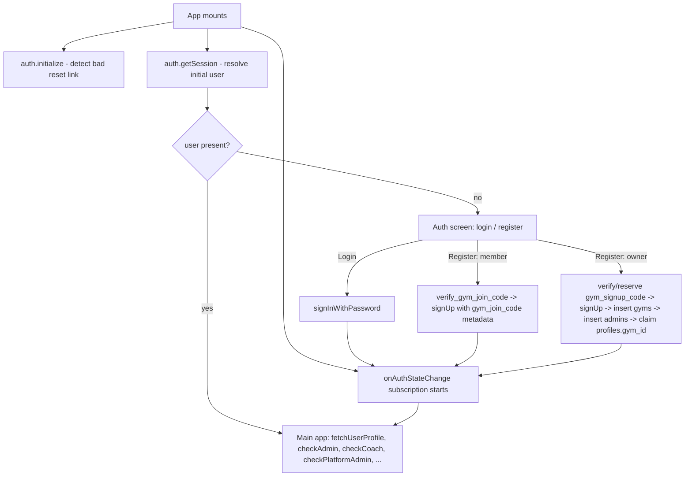

# M10.1 — Owner Authentication: Implementation Strategy

This is the implementation strategy for M10.1 only. It does not redesign, challenge, or add to any decision recorded in `MEMBER_DOMAIN_ARCHITECTURE.md`, `FINANCIAL_DOMAIN_ARCHITECTURE.md`, `OWNER_ACTIVATION_ARCHITECTURE.md`, `OWNER_LIFECYCLE_STATE_MACHINE.md`, `OWNER_DOMAIN_IMPLEMENTATION_ARCHITECTURE.md`, or `M10_IMPLEMENTATION_PLAN.md`. It is strategy, not implementation: no code is written here, no migration is written here.

Before writing a word of this document, the current production code was re-read directly — not recalled from memory or from the architecture documents' own descriptions of what "should" exist. Section 1 records exactly what was found, because two of those findings materially change how M10.1 must be built relative to how `OWNER_DOMAIN_IMPLEMENTATION_ARCHITECTURE.md` Section 6.1 described it in the abstract.

**Status: proposed for freeze — see Section 8 for self-review and final verdict.**

---

# 1. What Already Exists — Verified Against Current Production Code

### 1.1 An Owner-equivalent signup flow already exists in production, today

`src/App.jsx`'s `handleRegister()` already implements a "start a new gym" path (`registerMode === 'owner'`), live now. This is not a blank slate — M10.1 extends and corrects an existing, real, already-battle-tested flow, not a greenfield build. Its actual sequence, traced from the code:

1. Client-side validation (gym name present, a **`gym_signup_code` present and verified** via `verify_gym_signup_code` RPC).
2. `supabase.auth.signUp({ email, password })` — no `gym_id` in metadata (deliberately; see 1.2).
3. `reserve_gym_signup_code` RPC, then a client-side `insert` into `gyms` (id generated client-side, `owner_id = auth.uid()`), gated by RLS policy `gyms_bootstrap_insert` (`with check (owner_id = auth.uid())`).
4. `consume_my_reserved_gym_signup_code` RPC.
5. Client-side `insert` into `admins` (`id = ownerId, gym_id = newGymId`), gated by RLS policy `admins_bootstrap_own_gym`.
6. Client-side `update` of `profiles.gym_id` from `null` to the new Gym's id — the **one and only permitted transition**, enforced by the `prevent_gym_id_change()` trigger, which raises on any change once a non-null value is already set.
7. A fresh `profiles` read and `setUserProfile`/`setIsAdmin(true)`, deliberately bypassing any stale in-flight React closure.

A dedicated `ownerBootstrapping` boolean keeps the user on the registration screen for the entire multi-step sequence above, specifically so a user never falls into the main app mid-bootstrap, gym-less, with the error already gone from view. This is the exact "feels atomic to the user even though it isn't one database transaction" pattern M10.1 needs for its own two new inserts (Section 3).

### 1.2 Why the sequence is multi-step, not one transaction — a real, already-fixed production incident

A prior version tried to pass the new Gym's id in `signUp()`'s metadata so `handle_new_user()` could set `profiles.gym_id` in one shot, exactly the shape `OWNER_DOMAIN_IMPLEMENTATION_ARCHITECTURE.md` Section 6.1 describes in the abstract ("creates ... atomically, in one transaction"). It failed in production with a generic 500 (`AuthRetryableFetchError`): the Gym row cannot exist before `auth.uid()` exists (`gyms_bootstrap_insert` requires it), so `handle_new_user()`'s insert violated the `profiles.gym_id → gyms(id)` foreign key. The fix, live today: `profiles.gym_id` is nullable, `handle_new_user()` leaves it null when no `gym_id` is in metadata, and the Owner flow claims it explicitly, once, after the Gym genuinely exists (step 6 above).

**This is a real, load-bearing correction to how M10.1 must read `OWNER_DOMAIN_IMPLEMENTATION_ARCHITECTURE.md` Section 6.1's `register_owner` description.** "Atomic" there describes the *user-facing guarantee* (no half-created Owner is ever left stranded) — it is not a literal mandate for a single SQL transaction, and a literal reading would reintroduce the exact bug this project already found and fixed. M10.1 implements that guarantee the way it is already proven to work: a short, ordered, retry-safe client sequence gated by RLS at each step, not a new atomic trigger.

### 1.3 Admin identity is a separate table, not a `profiles` role column

`OWNER_DOMAIN_IMPLEMENTATION_ARCHITECTURE.md` Section 4 described Owner as reusing "the existing `auth.users` + `profiles` (Admin-role) identity." The actual mechanism, confirmed by reading `checkAdmin()`, is a separate `admins` table (`id` = the auth user id, `email`, `gym_id`), checked by simple row existence — not a role field on `profiles` at all. `coaches` is the identical shape for the Coach role, and `is_platform_admin()` is a separate RPC for platform-staff access. `profiles` itself carries only `gym_id`, `waiver_accepted`, `waiver_accepted_at` — Member-Domain-adjacent bridge fields, not a role/permission surface (Member identity itself now lives in `members`, per the Member Domain's own M1.5.2 migration).

**Correction carried forward into this strategy:** every reference in the frozen implementation architecture to "Owner reuses the Admin-role identity" means, concretely, "Owner's `owner_admin_id` reference resolves to a row in the existing `admins` table" — not a new column anywhere on `profiles`. This is the same reuse the architecture document intended; it is simply more precise about which existing table it is.

### 1.4 Session lifecycle — single mechanism, already correct, to be reused verbatim

All of this lives in one `useEffect([])` in the root `App` component:
- `supabase.auth.initialize()` is awaited once (memoized internally by the SDK; this call only reads the already-in-flight result) specifically to detect an invalid/expired password-recovery link arriving in the URL (Supabase redirects with `#error=access_denied&error_code=otp_expired` rather than a fake token) — the resulting code is checked against `RESET_LINK_ERROR_CODES` (`otp_expired`, `flow_state_not_found`, `flow_state_expired`) and routes to a dedicated reset-error screen.
- `supabase.auth.getSession()` resolves the initial `user` state.
- `supabase.auth.onAuthStateChange()` keeps `user` current for the rest of the session, and has one special case: a `PASSWORD_RECOVERY` event routes to the reset screen.
- The app has **no router and no "Protected Route" component.** There is one global `user` value; every screen is a conditional render off `user` (and, downstream, `isAdmin`/`isCoach`/`isPlatformAdmin`/`gymBlocked`). "Protected routes," as a distinct pattern, do not exist here and do not need to be invented for M10.1 — the existing conditional-gate shape is what every other role already uses, and Owner is not a special case that warrants a different one.
- Session persistence, refresh, and cross-tab synchronization are **entirely the Supabase JS SDK's own default behavior** (`createClient(url, key)` with no overrides — `persistSession`/`autoRefreshToken` at their defaults). No custom multi-tab code exists anywhere in this codebase, and none should be added for M10.1 — the SDK's own `localStorage` + `storage`-event-based session sync is already what every existing role relies on.
- "Remember me" is **not** a session-duration control. It only pre-fills the email field on next visit (`forge_remember_email` in `localStorage`); actual session lifetime is governed entirely by `jwt_expiry` (3600s) and refresh-token rotation (config.toml, Section 1.6) — the same for every user regardless of this checkbox.
- Sign-out has two call sites: a plain `supabase.auth.signOut()` (full sign-out) and one `supabase.auth.signOut({ scope: 'local' })` (this tab's session only, without invalidating the token globally) — used specifically for the live-eviction/session-end handling this codebase already had to get right once (per this project's own prior P0 fixes around cross-account data leaking through un-reset component state). M10.1 introduces no new sign-out path; Owner sign-out is the existing, single `handleLogout()` already used by every role.

### 1.5 Password reset — already complete, to be reused verbatim

`resetPasswordForEmail()` triggers the email; `supabase.auth.initialize()`'s error inspection (1.4) plus the `PASSWORD_RECOVERY` auth event together drive a dedicated reset UI state (`resetMode`, `resetLinkError`), with `authErrorMessage()` in `utils.js` mapping known GoTrue error codes (`over_email_send_rate_limit`, `weak_password`, `same_password`, `session_expired`, `session_not_found`, `refresh_token_not_found`, `email_address_invalid`) to localized copy. This entire mechanism is role-agnostic already — it needs zero changes for Owner.

### 1.6 Auth configuration — one setting requires careful, explicit handling; everything else needs verification against the live project, not this file alone

`supabase/config.toml`, `[auth.email]`: `enable_confirmations = false` — today, **no** email/password signup on the public client (`supabase.auth.signUp()`) requires confirmation before use, for any role. This directly matters for M10.1, and is analyzed fully in Section 4.1.

**Explicit caveat, not an assumption:** this project has already had one real production incident this session caused by `config.toml` silently diverging from the live deployed Supabase project's actual settings (the entrypoint/import_map misconfiguration). `enable_confirmations`, `jwt_expiry`, and every other auth setting referenced in this document must be independently confirmed against the live project (via the Management API or dashboard) before M10.1 ships — this file is a starting point for the strategy, not the source of truth for what is actually deployed.

### 1.7 RLS — two real, already-fixed historical gaps directly relevant to this milestone's own risk profile

- `gyms` had **no RLS enabled at all** until the same migration that introduced the Owner bootstrap flow — a real gap, found late, not part of the original plan when the table was first created.
- Separately, `anon` was missing the base `GRANT SELECT` on `gyms` even after the RLS policy existed — a policy has no effect without the underlying grant, and the resulting silent failure (an unchecked `{ data }` destructure with no `error` check) meant gym search simply returned zero results with no diagnostic, for every new member, until it was caught and fixed.

Both are cited here, specifically, because `OWNER_DOMAIN_IMPLEMENTATION_ARCHITECTURE.md` Section 16 already named "verify every new RLS policy against this project's own defect history" as a required gate — this section is that gate being exercised concretely, against this milestone's own new tables, not asserted abstractly.

### 1.8 Not verified — an explicit, named gap in this investigation, not a silent assumption

`forge-admin-web` (the separate Admin Web repository) was only accessible in this session at `src/features/members` — its own authentication stack, if it has one independent of this app, was **not** inspected. If Admin Web has its own separate login/signup code path (as opposed to sharing the same Supabase Auth project and simply rendering a different UI), it must be independently audited against every finding in this section — most importantly Section 4.1's `enable_confirmations` interaction — before M10.1 ships. This is named here so it is not discovered as a surprise later.

---

# 2. Current Authentication Flow — As It Actually Works Today

Three distinct paths currently call `supabase.auth.signUp()` on the public client: Owner registration, Member self-join-by-code registration, and (separately, via a service-role Edge Function, not this diagram) M9 invitation Final Commit's `admin.createUser()`. All three are relevant to Section 4.1.

---

# 3. Required Changes for M10.1

**Governing constraint, restated from the mission:** the Owner is not a new identity type, and none of Section 1's mechanisms are duplicated. Every change below is either an *extension* of an existing, live code path, or a net *removal* of a step that no longer belongs — never a parallel stack.

### 3.1 Extend, not replace, the existing Owner bootstrap sequence

The two new rows this milestone introduces — Gym Activation State and Gym Commercial State (`OWNER_DOMAIN_IMPLEMENTATION_ARCHITECTURE.md` Section 5.1) — are created at the **same point** the existing sequence (Section 1.1) already creates `gyms` and `admins`: after the Gym genuinely exists and `owner_admin_id` (= the just-created `admins.id`) is known, and before the `profiles.gym_id` claim. This preserves the exact invariant the architecture document intended ("never null once the row exists") using the mechanism already proven safe, rather than inventing a new one:

1. *(unchanged)* `signUp()`.
2. *(unchanged)* insert `gyms`.
3. *(unchanged)* insert `admins`.
4. **(new)** insert Gym Activation State (`activation_state = unverified`) and Gym Commercial State (`commercial_state = null` — no trial yet; email is not verified at this point, consistent with `on_owner_email_verified` being the sole trigger for starting one, per `OWNER_LIFECYCLE_STATE_MACHINE.md` Section 6). Both rows reference the Gym just created in step 2 and the `admins.id` just created in step 3.
5. *(unchanged)* claim `profiles.gym_id`.

`ownerBootstrapping`'s existing job — keep the user on this screen until every step above has either fully succeeded or been safely, idempotently retried — extends to the new step 4 with no new mechanism: the same reasoning that already makes steps 2-3 safe to retry (a fresh attempt after a partial failure, using the already-created `gyms`/`admins` rows rather than re-inserting) applies identically to step 4's two new inserts.

### 3.2 Remove the mandatory `gym_signup_code` gate for this flow

`OWNER_ACTIVATION_ARCHITECTURE.md` Section 6 requires a primary "Start Free Trial" CTA with no human gate; Section 13 requires no card and no other precondition; nowhere in any frozen document does a pre-issued signup code appear. The current production flow's `gym_signup_code` requirement (verify → reserve → consume, Section 1.1 steps 1, 3, 4) is a real, currently-live gate that directly contradicts the frozen self-serve model, and removing it is therefore **in scope for M10.1**, not an oversight to silently work around.

**What this does and does not mean:** the `gym_signup_codes` table, its RPCs, and its RLS are not deleted — they simply stop being called from the self-serve Owner registration path. If Forge later wants a separate, sales-assisted provisioning path (the enterprise/franchise motion `OWNER_ACTIVATION_ARCHITECTURE.md` Section 18 and `OWNER_DOMAIN_IMPLEMENTATION_ARCHITECTURE.md` Section 2 both already name as a deliberately out-of-scope, future, different journey), this exact mechanism is still there to reuse for it — consistent with this whole domain's own "reuse a proven mechanism" discipline, just no longer wired into the self-serve path this milestone builds.

### 3.3 Email verification — an application-level gate, deliberately not Supabase's global toggle alone

`OWNER_ACTIVATION_ARCHITECTURE.md` Principle 3.11 requires Owner email verification before anything consequential; `M9.1` (frozen, already shipped) deliberately *removed* the equivalent requirement for Members, for a documented, principled reason (an M9 invitee's identity is vouched for by the inviting Admin; an Owner has no such vouching party). Both are correct, and Section 9 of `OWNER_ACTIVATION_ARCHITECTURE.md` already states they are not in tension.

**The mechanism that makes both true simultaneously, verified directly in `invitation-final-commit`'s own source:** Supabase's project-level `enable_confirmations` setting governs the *public* `signUp()`/unqualified `admin.createUser()` path only. M9's Final Commit already creates its Member identities via `admin.auth.admin.createUser({ email_confirm: true, ... })` — an explicit, per-call override, already independent of the global toggle, already justified in that code's own comment ("Forge's own email challenge already verified control moments ago"). Turning the project's `enable_confirmations` setting **on** therefore does not touch M9 at all.

**What it does touch, and must be deliberately, explicitly decided rather than discovered as a side effect:** the *other* existing path that calls public `signUp()` — Member self-join-by-registration-code (Section 2's `registerMode !== 'owner'` branch, `verify_gym_join_code` → `signUp({ options: { data: { gym_join_code }}})`). This path has no inviting Admin vouching for the joining person at all (it is discoverable-gym-name-plus-a-code, not a targeted invitation) — if anything, it has *less* identity assurance than an M9 invitee, not more, so requiring confirmation here is consistent with, not a violation of, the same principle that already justified M9.1's opposite conclusion for invitees specifically.

**Required pre-flight check, named explicitly rather than assumed:** confirm these are genuinely the only two public-`signUp()` call sites in this codebase (Owner registration and Member self-join) before flipping the global setting — Section 1.8's forge-admin-web gap must also be closed first, since a third, unaudited call site would be silently affected by the same toggle.

### 3.4 New UI, minimal, reusing every existing pattern

- The registration screen's `registerMode === 'owner'` branch loses its `gymSignupCodeInput` field (Section 3.2) and gains nothing else structurally — it already collects exactly what `OWNER_ACTIVATION_ARCHITECTURE.md` Section 10 requires (email, password, Gym name, one screen).
- A post-signup "verify your email" state, structurally identical to the pattern this app already uses for the password-reset-error screen (Section 1.5) — a dedicated conditional state off the same `user`/session signal, not a new routing concept.
- Everything downstream of email verification (Activation Dashboard, trial state, etc.) is explicitly **out of scope for M10.1** — this milestone is Authentication only, per `M10_IMPLEMENTATION_PLAN.md`'s own M10.1/M10.2 split; this document does not re-scope that boundary.

---

# 4. Authentication & Authorization Boundaries

**Authentication boundary (who is this).** Unchanged, platform-wide: `auth.users` + Supabase's own session/JWT mechanism, exactly as already used by every Member, Admin, and Coach. No new identity type, no new token format, no new session store.

**Authorization boundary (what can this identity do).** Unchanged shape, one new fact: `admins` continues to mean "this identity may operate this Gym"; Gym Activation/Commercial State's `owner_admin_id` adds the one new, narrower fact — "this specific Admin is *also* the Gym's billing-responsible party" (`OWNER_DOMAIN_IMPLEMENTATION_ARCHITECTURE.md` Section 4) — resolved once, at bootstrap step 4 (Section 3.1), never reassigned. M10.1 does not yet build anything that *acts* on this distinction (that is M10.5+'s Owner-only billing gate) — M10.1's job is only to make sure the fact is correctly and permanently recorded at the moment it is first known.

---

# 5. Session Lifecycle, Failure Modes, and Recovery

All inherited verbatim from Section 1.4-1.5; nothing here is new for Owner. Stated explicitly per the mission's checklist, to confirm each was actually considered rather than merely inherited by assumption:

| Concern | Existing mechanism | M10.1 change |
|---|---|---|
| Email verification | `enable_confirmations` (global) + per-call override (Section 3.3) | Flip the global setting; verify M9/self-join interaction first |
| Password reset | `resetPasswordForEmail` + `initialize()` error inspection + `PASSWORD_RECOVERY` event | None |
| Remember me | `localStorage` email prefill only | None |
| Multiple tabs | Supabase SDK default (`storage` event sync) | None |
| Expired sessions | `jwt_expiry` + refresh-token rotation, SDK-managed | None |
| Sign-out | `signOut()` / `signOut({ scope: 'local' })`, existing `handleLogout()` | None |
| Failed bootstrap mid-sequence | `ownerBootstrapping` + idempotent step retry (Section 1.1, extended in 3.1) | Extended to cover the two new inserts |
| Duplicate account (same email, retried signup) | `signUp()`'s own "already registered" response, already handled (`if (!ownerId) { ... }`) | None — same guard already covers the extended sequence |
| Email uniqueness | `auth.users.email`'s own native uniqueness (Supabase-enforced) | None |

---

# 6. Security Verification

- **RLS.** Two new tables (Gym Activation State, Gym Commercial State) require new policies: read for any Admin of the Gym, write for no client role at any privilege level (per `OWNER_DOMAIN_IMPLEMENTATION_ARCHITECTURE.md` Section 10 — every write in M10.1 is the bootstrap sequence's own privileged step, not an open client write path). Both must be checked, individually, against Section 1.7's real defect history before ship, not assumed safe by resemblance to `gyms`'/`admins`' already-audited policies.
- **JWT.** Unchanged — Owner tokens are ordinary Supabase Auth JWTs, identical in shape and issuance to every existing role's.
- **Admin role.** Unchanged mechanism (`admins` table row, Section 1.3); this milestone adds no new way to become an Admin beyond the existing bootstrap insert, gated exactly as it already is by `admins_bootstrap_own_gym`.
- **Gym isolation / cross-tenant protection.** The two new tables are 1:1 with `gyms` and inherit the same tenant-scoping discipline `gym_id` already enforces platform-wide; no cross-Gym read or write path is introduced.
- **Session hijacking risk.** Unchanged — no new token issuance path, no new storage mechanism.
- **Replay risk.** The Gym-signup-code removal (Section 3.2) *reduces* attack surface (one fewer reusable-if-mishandled secret in the flow) rather than introducing any new replay concern.
- **Duplicate account risk.** Covered by `auth.users.email` uniqueness (platform-wide, unchanged) plus the existing "already registered" retry guard (Section 5).
- **Email uniqueness.** Enforced by Supabase Auth itself, unchanged, platform-wide.

---

# 7. What Must Never Be Duplicated

Restated as an explicit checklist, because the mission specifically asked for it:

- **No second `auth.users`-equivalent table or identity store.** Owner is a row in the same `auth.users`/`admins` tables every other Admin already is.
- **No second session-management mechanism.** The single `useEffect([])` in `App.jsx` (Section 1.4) is extended in scope (it already handles every role), never forked.
- **No second sign-out path.** The existing `handleLogout()` is reused as-is.
- **No second password-reset flow.** Section 1.5's mechanism is reused as-is.
- **No second "who is an Admin" check.** `admins` table + `checkAdmin()` is reused as-is; Gym Activation/Commercial State's `owner_admin_id` references it, never replaces or shadows it.
- **No second RLS model.** The same `is_admin(gym_id)`-style, `gym_id`-scoped pattern every existing tenant-scoped table already uses is reused for the two new tables, not a novel authorization shape.

---

# 8. Self-Review — Attempting to Break This Strategy

**Duplicate authentication, checked:** none introduced — verified explicitly in Section 7, not merely asserted.

**Multiple identity models, checked:** Owner remains a fact layered onto the existing `admins`/`auth.users` identity (Section 1.3/4), never a parallel model. The one place this could have gone wrong — treating "Owner" as deserving its own role table alongside `admins`/`coaches` — was deliberately rejected in favor of the single-reference (`owner_admin_id`) approach the frozen implementation architecture already specified.

**Broken session restore, checked:** M10.1 adds no code to the session-restore path (`initialize`/`getSession`/`onAuthStateChange`) at all — the new Gym Activation/Commercial State rows are read later, by M10.2's Activation Dashboard, not during session restoration itself. Session restore for an Owner is therefore identical in every respect to session restore for any existing role, and cannot be broken by a change this milestone doesn't make to it.

**Race conditions, found and addressed:** a genuinely new one exists that the original architecture document's "atomic" framing had implicitly assumed away — between bootstrap step 3 (admins insert) and step 4 (the new lifecycle-state insert), a user who force-closes the tab is left with a Gym and an Admin row but no lifecycle-state rows yet. This is not a new class of problem — it is exactly the same "partial bootstrap, safely resumable" situation steps 2-3 already handle today — and it is resolved the same way: `ownerBootstrapping`'s retry logic (Section 3.1) checks for and reuses already-created rows at every step, including the two new ones, rather than assuming a clean slate on retry.

**Security gaps, checked:** the one substantive new decision in this document — flipping `enable_confirmations` globally — was traced against every known call site of public `signUp()`/unqualified `createUser()` in this codebase (Section 3.3), with the one path this repo could not fully audit (`forge-admin-web`) named explicitly as a required pre-flight check, not silently assumed clear.

**Hidden coupling, checked:** the new Gym Activation/Commercial State inserts (step 4) depend on step 3's `admins` row only for its id — they do not read or depend on anything else about `admins`, `gyms`, or `profiles`, and nothing outside the bootstrap sequence itself writes to either new table in this milestone (Section 6's RLS: no client write path exists at all, by design).

**Anything violating frozen architecture, checked:** the two corrections this document makes to `OWNER_DOMAIN_IMPLEMENTATION_ARCHITECTURE.md`'s Section 6.1 description (multi-step sequence instead of one transaction; `admins` table instead of a `profiles` role column) are both implementation-precision corrections that preserve every invariant that document actually requires (never-null-once-set `owner_admin_id`; no second identity mechanism) — neither changes what the architecture document is actually accountable for, and both are recorded here explicitly rather than silently reconciled, consistent with this whole project's own documentation discipline.

---

**READY TO IMPLEMENT M10.1**
