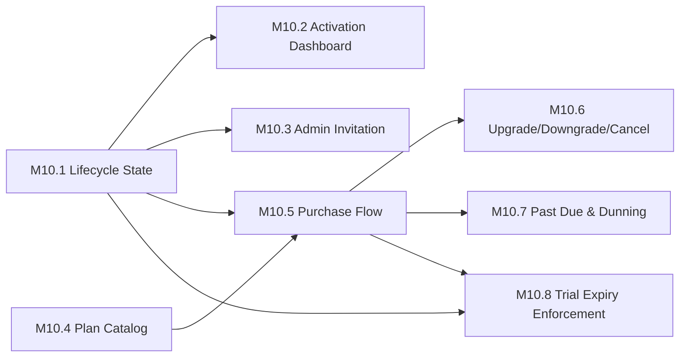

# M10 — Owner Domain Implementation Plan

This is the execution blueprint for M10. It does not redesign, challenge, or add to any decision recorded in `MEMBER_DOMAIN_ARCHITECTURE.md`, `FINANCIAL_DOMAIN_ARCHITECTURE.md`, `OWNER_ACTIVATION_ARCHITECTURE.md`, `OWNER_LIFECYCLE_STATE_MACHINE.md`, or `OWNER_DOMAIN_IMPLEMENTATION_ARCHITECTURE.md` — all five were re-read in full before this plan was drafted, not recalled from memory, specifically to verify this plan's every dependency claim below against their actual current text rather than a remembered approximation.

This document refines `OWNER_DOMAIN_IMPLEMENTATION_ARCHITECTURE.md` Section 15's six broad phases into **eight** smaller, risk-ordered milestones. The split is not cosmetic: Section 16 explains, concretely, which two of the original six phases were found — during this plan's own self-review — to carry a real production risk if shipped as originally grouped, and how re-grouping them removes it.

**Engineering Manager framing, stated once, governing every decision below:** the objective is not implementation speed. It is minimizing the probability and blast radius of a production incident. Every milestone below is sized, ordered, and given a rollback strategy with that objective as the only tiebreaker.

---

# 1. Milestone Overview

| # | Milestone | Business capability added | Depends on |
|---|---|---|---|
| M10.1 | Gym Lifecycle State Foundation | *(none, user-facing)* — the substrate every later milestone reads/writes | — |
| M10.2 | Activation Dashboard | A new Owner is guided to First Value | M10.1 |
| M10.3 | Admin Invitation | An Owner can add staff (co-admin/coach) | M10.1 |
| M10.4 | Platform Plan Catalog & Pricing Page | Prospects and Owners can see what Forge costs | *(none)* |
| M10.5 | Platform Purchase Flow | An Owner can actually pay Forge | M10.1, M10.4 |
| M10.6 | Plan Upgrade / Downgrade / Cancel | A paying Owner can change or end their plan | M10.5 |
| M10.7 | Past Due, Dunning & Reactivation | A failed renewal charge is handled gracefully | M10.5 |
| M10.8 | Trial Expiry Enforcement | A non-converting trial actually ends | M10.1, M10.5 |

**Parallelizable, different teams, zero shared work:** M10.4 has no dependency on any other milestone and can start immediately, in parallel with M10.1. Once M10.1 lands, M10.2 and M10.3 have no dependency on each other and can proceed in parallel on two different teams. M10.6 and M10.7 both depend only on M10.5 and have no dependency on each other — parallel once M10.5 lands.

**Strictly sequential:** M10.1 → M10.2; M10.1 & M10.4 → M10.5 → M10.8.

---

# 2. M10.1 — Gym Lifecycle State Foundation

**Purpose.** Bring `OWNER_LIFECYCLE_STATE_MACHINE.md`'s two-axis FSM into existence as real data, silently, before anything reads it.

**Business capability added.** None, observably. This is a deliberate dark launch — the substrate every subsequent milestone depends on.

**Why it exists.** Every later milestone (Checklist, Purchase, Enforcement) needs a place to read and write Gym Activation State and Gym Commercial State. Building it first, alone, and inert, means every later milestone is additive UI/logic on top of already-proven data — never a combined schema-plus-feature deploy.

**Dependencies.** None.

**Production impact.** None observable to any user. New signups begin accumulating real lifecycle state that nothing yet reads.

**Database impact.**
- **Tables (new):** `gym_activation_state`, `gym_commercial_state` (`OWNER_DOMAIN_IMPLEMENTATION_ARCHITECTURE.md` Section 5.1/10) — both purely additive, no existing table altered.
- **Triggers (new):** `register_owner` extended to insert both rows atomically at Gym creation; `on_owner_email_verified`; `evaluate_first_value`; `evaluate_activation` — all reactive, none modifying an existing Member Domain write path (Section 6.2).
- **Backfill migration (new, one-time):** every existing Gym gets a Gym Activation State row (`activated`) and Gym Commercial State row (`paying`, no `platform_subscription_id` — legitimately null, since no Platform Subscription exists yet for any Gym as of this milestone) — a data-only migration, no schema risk.
- **Views:** none required.

**Edge Function impact.** None — every piece of this milestone is SQL-layer (Section 7 of the implementation architecture already places all four mechanisms here).

**Frontend impact.** None.

**Security impact.** New attack surface is limited to two new tables with no client write path at all (Section 11: writable only by internal triggers).

**RLS impact.** Read policies for `gym_activation_state`/`gym_commercial_state` (Admin-of-gym), no write policies for any client role. **Gate, not optional:** before this milestone is considered done, both new RLS policies must be individually checked against this project's own previously-discovered defect list (SECURITY DEFINER recursion, `WITH CHECK` seeing the pre-update row, UPDATE requiring a matching SELECT policy, upsert-plus-NOT-NULL interaction) — named explicitly in `OWNER_DOMAIN_IMPLEMENTATION_ARCHITECTURE.md` Section 16 as a required verification, not assumed safe by analogy to any existing policy.

**Backward compatibility.** Full. No existing table, RPC, or RLS policy is altered.

**Rollback strategy.** Drop the two new tables and their triggers. Since nothing reads them yet, this is a zero-user-impact rollback — the only loss is the accumulated (unread) lifecycle history for Gyms created during the window this milestone was live, which is acceptable because nothing outside this milestone depended on it existing yet.

**Acceptance criteria.**
- A new signup produces exactly one Gym Activation State row and one Gym Commercial State row, atomically, with `owner_admin_id` resolved and never null.
- Email verification transitions both axes' entry states in the same instant.
- A qualifying M9 Final Commit (for a genuinely distinct, non-Owner Member) transitions Activation State to `first_value_reached`, and the Owner's own test-invitation-to-self does not.
- Every existing Gym has exactly one row in each new table, correctly backfilled.

**Completion definition.** Both tables exist, are correctly populated for 100% of existing and new Gyms, RLS gate passed, and zero UI or RPC outside this milestone's own triggers references either table.

**Tests.**
- *Unit:* FSM transition-legality check (given current state + attempted target, is it in `OWNER_LIFECYCLE_STATE_MACHINE.md`'s table?).
- *Integration:* `register_owner` atomicity under simulated partial failure (`OWNER_DOMAIN_IMPLEMENTATION_ARCHITECTURE.md` Section 12.2); duplicate-firing idempotency of each reactive trigger (Section 12.3).
- *Architecture:* fitness function confirming no Member Domain table or RPC file changed.
- *Security / RLS:* the named gotcha checklist, run against both new policies; a different Gym's Admin cannot read this Gym's lifecycle-state rows.
- *Regression:* full M9 invitation suite (unmodified files, must still pass unchanged) and Financial Domain webhook suite (unmodified, must still pass unchanged).
- *Acceptance:* backfill correctness across every existing Gym, spot-checked.
- *Deployment verification:* migration applies cleanly on a production-sized copy of the database with no lock contention (both new tables are empty at deploy time; backfill runs as a separate, batched, resumable follow-up script, never inside the same transaction as the schema migration).

---

# 3. M10.2 — Activation Dashboard

**Purpose.** Surface `OWNER_ACTIVATION_ARCHITECTURE.md` Section 12's Checklist, the mandatory First-Value notification, and the two-stage collapse behavior.

**Business capability added.** A new Owner is now actually guided from Gym creation to First Value, instead of landing on an empty product.

**Why it exists.** M10.1 alone produces state nobody sees. This milestone is the first one a real Owner experiences.

**Dependencies.** M10.1 (reads Gym Activation State directly; writes nothing new).

**Production impact.** Visible only to Owners created after this milestone ships, and to any pre-existing trial Owner still short of `activated` (rare, since most existing Gyms were backfilled to `activated` in M10.1) — no behavior change for any already-`activated` Gym, which simply never sees the checklist (Section 12's two-stage retirement already handles this by definition).

**Database impact.** None — Section 5.6 of the implementation architecture is explicit that the Checklist is a pure read-model derivation, not a stored entity. No new table.

**Edge Function impact.** None.

**Frontend impact.**
- **Screens (new):** Activation Dashboard / Getting Started view.
- **Components (new):** Checklist item (required + optional variants, progressive-disclosure ordering per `OWNER_ACTIVATION_ARCHITECTURE.md` Section 11), First-Value celebration moment, inline dependency messaging ("Confirm your Waiver first").
- **Translations (new):** checklist copy, celebration copy, dependency-hint copy — ro + en, following the existing `translations.js` convention this codebase already uses for every other user-facing surface.

**Emails.** "Your first member joined" — the mandatory notification `OWNER_ACTIVATION_ARCHITECTURE.md` Section 7 requires. One new transactional email template.

**Notifications.** The same First-Value moment, in-app, synchronous (Section 9 of the implementation architecture: `FirstValueReached` event consumed here).

**Events.** Consumes `FirstValueReached`, `OwnerActivated` (both already emitted by M10.1's triggers) — this milestone adds no new event, only a new consumer.

**Audit entries.** None new — this milestone performs no write this domain's audit scope (Section 13) requires logging.

**Analytics events.** None new beyond what M10.1's triggers already emit; this milestone is a consumer, not a producer.

**Security impact.** Read-only surface over data already gated by M10.1's RLS; no new write path, so no new authorization surface.

**RLS impact.** None new — reuses M10.1's read policy.

**Backward compatibility.** Full.

**Rollback strategy.** Hide the route / feature-flag the UI off. Underlying M10.1 data keeps accumulating correctly regardless — a UI rollback here has zero data consequence, which is exactly why M10.1 was shipped and proven independently first.

**Acceptance criteria.**
- Required items (Waiver confirmation, first invitation) are visually primary; optional items are visually secondary, per the frozen progressive-disclosure decision.
- Attempting "invite first member" before Waiver confirmation shows the inline dependency reason, never a silently-disabled control.
- Reaching `first_value_reached` triggers the notification exactly once, synchronously, and collapses the checklist to the lighter panel.
- Reaching `activated` retires the panel permanently for that Gym.

**Completion definition.** Every state cell A1–A4 (from `OWNER_LIFECYCLE_STATE_MACHINE.md` Section 3) renders its specified UI correctly, verified against the state table directly.

**Tests.**
- *Unit:* Checklist derivation function, given each combination of underlying facts.
- *Integration:* First-Value notification fires exactly once even under a simulated duplicate trigger firing (relies on M10.1's Section 12.3 idempotency).
- *Architecture:* confirms no new table was introduced for checklist "progress."
- *Security/RLS:* n/a beyond M10.1's existing coverage — re-run, not re-designed.
- *Regression:* M10.1's own test suite, unchanged.
- *Acceptance:* the four-state UI walkthrough above, end-to-end.
- *Deployment verification:* translation-key parity test (ro/en) — this codebase already has this exact pattern (`workoutFormats.test.js`'s i18n-key-parity test) and this milestone's new keys must pass it.

---

# 4. M10.3 — Admin Invitation

**Purpose.** Let an Owner invite a co-Admin or coach — the optional Checklist item named in `OWNER_ACTIVATION_ARCHITECTURE.md` Section 12.

**Business capability added.** Staffing a Gym beyond a single Owner identity.

**Why it exists.** Named explicitly as a real, distinct capability in the frozen product doc; deferred to its own milestone because it is fully independent of the activation/billing critical path.

**Dependencies.** M10.1 only (needs `gym_id` + an authenticated Admin identity, both already real by then). No dependency on M10.2.

**Sequencing note, explicit because it resolves a real ordering question the frozen docs left open:** if M10.3 ships after M10.2, M10.2's optional-items list simply does not include "Invite a co-admin or coach" until this milestone lands — never a dead button pointing at an unbuilt feature. This milestone's own Frontend impact is therefore, in part, "add one row to an already-live optional list," not build a new list from scratch.

**Production impact.** New capability, additive, zero effect on any existing flow.

**Database impact.**
- **Tables (new):** `admin_invitations` — same token-hash/expiry/single-use shape as the existing `gym_invitations`, deliberately a separate table (`OWNER_DOMAIN_IMPLEMENTATION_ARCHITECTURE.md` Section 5.5), since accepting one grants a structurally different thing (an Admin role, never a Membership).

**Edge Function impact.**
- **New:** `accept-admin-invitation` (public, pre-auth exposure — same reasoning as `invitation-final-commit`).

**RPCs (new, SQL, non-public-exposed):** `send_admin_invitation`, `revoke_admin_invitation`.

**Frontend impact.**
- **Screens (new):** Admin Invitation acceptance page (parallel to the existing invite-onboarding flow, structurally simpler — no Waiver/preferences step, just role grant).
- **Components (new):** Invite-a-staff-member form, pending-invitations list (Settings screen).
- **Translations (new):** invitation copy, ro + en.

**Emails.** Admin invitation email (new template, reusing the existing transactional-email infrastructure the M9 invitation email already uses).

**Notifications.** None beyond the invitation email itself.

**Events.** `AdminInvited`, `AdminInvitationAccepted` (new, per Section 9 of the implementation architecture).

**Audit entries.** Every send/accept/revoke — required per Section 13.

**Analytics events.** `AdminInvited`, `AdminInvitationAccepted` double as analytics events (same event, per Section 9's design — no separate analytics-only event needed).

**Security impact.** New public, pre-auth Edge Function endpoint — same trust model already proven safe for `invitation-final-commit` (random 256-bit token, HMAC-hashed, single-use, time-limited).

**RLS impact.** New table, new policy: readable/writable by any Admin of the Gym, scoped by `gym_id` — the RLS gotcha checklist gate (Section 2's note, restated) applies here too, since this is also a new policy, not a reused one.

**Backward compatibility.** Full — no existing table or RPC touched.

**Rollback strategy.** Disable the invite-entry-point UI and the `send_admin_invitation` RPC. Already-accepted invitations remain valid Admin grants (never retroactively revoked by a rollback) — an accepted invitation is a permanent historical fact per Section 5.5's own lifecycle definition, and a rollback of the *feature* must never be confused with a rollback of *already-granted access*.

**Acceptance criteria.**
- A sent invitation is single-use, time-limited, and revocable.
- Acceptance grants Admin role only — never Owner status (`owner_admin_id` is untouched by this milestone, structurally, since no command here writes it).
- A second acceptance attempt on an already-accepted token fails cleanly.

**Completion definition.** End-to-end send → accept → Admin role visible in Settings, verified live.

**Tests.**
- *Unit:* token validity checks (expired/revoked/already-accepted).
- *Integration:* `accept_admin_invitation` against each of those three invalid states.
- *Architecture:* confirms `admin_invitations` is never referenced by any Member Domain code path.
- *Security/RLS:* cross-gym read/write denial; the gotcha checklist re-run against this specific new policy.
- *Regression:* M9's own invitation suite, unchanged (confirms the two mechanisms remain fully independent).
- *Acceptance:* full send/accept/revoke walkthrough.
- *Deployment verification:* translation-key parity.

---

# 5. M10.4 — Platform Plan Catalog & Pricing Page

**Purpose.** Bring Forge's own sellable catalog into existence and make it visible.

**Business capability added.** A prospect or existing Owner can see what Forge costs, without yet being able to pay.

**Why it exists.** Split from purchase (M10.5) deliberately: displaying a price carries none of the risk that collecting one does, and `OWNER_ACTIVATION_ARCHITECTURE.md` Section 6 already requires pricing to be visible pre-signup — this milestone can satisfy that requirement on its own schedule, independent of the higher-risk purchase-flow build.

**Dependencies.** None. Platform Plans are explicitly not Gym-scoped (`OWNER_DOMAIN_IMPLEMENTATION_ARCHITECTURE.md` Section 5.2) — this milestone has zero dependency on M10.1 and can be built by a fully separate team, in parallel, from day one.

**Production impact.** New, additive, public page. Zero effect on any existing flow.

**Database impact.**
- **Tables (new):** `platform_plans`, `platform_plan_versions` — platform-wide, not tenant-scoped.
- **Seed data (new, one-time):** Forge's actual initial pricing tier(s), inserted via migration/seed script. **Scope note, explicit to avoid inventing unneeded work:** a full internal CRUD admin UI for managing Platform Plans is *not* built in M10 — Plans are seeded and versioned via direct, reviewed migrations, exactly as any other rarely-changing platform-wide configuration in this codebase. Building an admin UI for an operation that happens a handful of times a year would be exactly the kind of speculative work this plan's own philosophy forbids.

**Edge Function impact.** None.

**Frontend impact.**
- **Screens (new):** public Pricing page.
- **Components (new):** Plan card.
- **Translations (new):** plan names/descriptions, ro + en.

**Emails, notifications, events, audit entries, analytics events.** None required for this milestone — displaying a catalog is a pure read with no state transition to log or notify about.

**Security impact.** None new — a public catalog read carries no attestation risk (Section 3.5's own framework: no amount is ever claimed by a caller here).

**RLS impact.** New tables, read policy open to everyone including unauthenticated (public pricing page requirement), write policy open to no client.

**Backward compatibility.** Full.

**Rollback strategy.** Take the pricing route down; catalog tables remain, inert and harmless.

**Acceptance criteria.** Pricing page renders current Plan Version data correctly, publicly, without authentication.

**Completion definition.** Pricing page live, seed data correct, no purchase action available yet (that is explicitly M10.5's job, not this one's).

**Tests.**
- *Unit:* none beyond trivial rendering.
- *Integration:* n/a.
- *Architecture:* confirms no `gym_id` column exists on either new table (the one deliberate platform-wide exception, verified structurally).
- *Security/RLS:* public read confirmed; write denial confirmed for every role including Owner.
- *Regression:* n/a — nothing existing is touched.
- *Acceptance:* visual/content correctness of the live page.
- *Deployment verification:* translation-key parity.

---

# 6. M10.5 — Platform Purchase Flow

**Purpose.** Let an Owner actually convert from trial to paying.

**Business capability added.** Forge can now collect real revenue from a Gym Owner.

**Why Checkout-initiation and webhook-confirmation are shipped as ONE milestone, not two — a correction made during this plan's own review (Section 16), not the original grouping:** initially considered as two separate, smaller milestones ("add the Buy button" / "add the webhook"), that split was rejected as unsafe. If Checkout-session creation ships before the webhook that confirms it, a real Owner can complete a real Stripe payment that Forge never records — money taken, no Platform Subscription, no Platform Payment, nothing an Owner or Forge staff can see. That is strictly worse than not having a Buy button at all, and directly violates this plan's own "leave production in a valid state" requirement. The two ship together, atomically, as this one milestone.

**Dependencies.** M10.1 (writes Gym Commercial State), M10.4 (needs a real Platform Plan Version to sell).

**Production impact.** The first milestone in this plan carrying real financial and external-integration risk. Treated accordingly in Rollback strategy, below.

**Database impact.**
- **Tables (new):** `platform_subscriptions`, `platform_orders`, `platform_payments` (`OWNER_DOMAIN_IMPLEMENTATION_ARCHITECTURE.md` Section 5.3/5.4) — a separate schema from the Financial Domain's own Order/Payment, non-negotiably (Principle 3.2).

**Edge Function impact.**
- **New:** `purchase-platform-plan` (Stripe Checkout Session creation).
- **New:** `platform-billing-webhook` — **a separate Edge Function and a separate Stripe webhook endpoint from the existing Member-billing `stripe-webhook`**, verified explicitly at deploy time, not merely by code review, since this is the single easiest boundary to accidentally erode under implementation pressure (`OWNER_ACTIVATION_ARCHITECTURE.md` Section 17's own named anti-pattern).

**RPCs (new, SQL):** `register_platform_payment`, `refund_platform_payment` (verified-internal-caller only, invoked exclusively by the webhook).

**Frontend impact.**
- **Screens (new):** Billing settings (current plan, purchase CTA), Stripe Checkout redirect handling.
- **Components (new):** Purchase CTA, purchase-pending/purchase-confirmed states.
- **Translations (new):** billing copy, ro + en.

**Emails.** Purchase receipt (new template).

**Notifications.** Purchase confirmation, in-app.

**Events.** `PlatformPlanPurchased`, `PlatformPaymentSucceeded` (new).

**Audit entries.** Every Platform Subscription creation and every Platform Payment — required per Section 13, no exceptions.

**Analytics events.** `PlatformPlanPurchased`, `PlatformPaymentSucceeded`.

**Security impact.** The highest-sensitivity write path in this entire plan. `register_platform_payment`/`refund_platform_payment` are restricted to the verified-internal-caller tier only — not even the Owner — per the attestation-authority principle (Section 11.2 of the implementation architecture); this is checked, not assumed, in this milestone's Security tests below.

**RLS impact.** New tables, Owner-only read (not every Admin — Section 4's tier distinction), no client write grant on any of the three tables at any privilege level.

**Backward compatibility.** Full — no existing Financial Domain or Member Domain table, RPC, or webhook is touched. Verified explicitly as an acceptance criterion, not assumed.

**Rollback strategy — the most delicate in this plan, stated precisely because getting the order wrong is the actual risk:**
1. Disabling the **purchase-initiation** route/CTA alone is always safe at any time — it only stops *new* Checkout Sessions from being created.
2. The **webhook must never be disabled while any Checkout Session created by this milestone could still be completing on Stripe's side.** A Checkout Session lives on Stripe's own servers independently of Forge's app state; disabling the webhook while sessions are in flight is exactly the "money taken, nothing recorded" failure this milestone's own grouping decision (above) exists to prevent.
3. Correct rollback order, therefore: disable initiation first, wait out Stripe's own Checkout Session expiry window (Stripe's default, unless configured otherwise), *then* the webhook may be safely disabled. The webhook is the last thing rolled back, never the first.

**Acceptance criteria.**
- A successful Checkout produces exactly one Platform Subscription and one settled Platform Order, verified against Stripe's own record of the same charge.
- A duplicate webhook delivery (simulated) produces no duplicate Platform Payment (Section 12.1's three-layer defense, verified as three independently-effective layers, not just end-to-end).
- No client session — Owner included — can call `register_platform_payment` directly and have it succeed.

**Completion definition.** A real, low-value test purchase completes end-to-end in a staging Stripe environment, is correctly recorded, and is independently reconciled against Stripe's own dashboard before this milestone is considered done.

**Tests.**
- *Unit:* Platform Order settlement-status derivation.
- *Integration:* full Checkout-to-webhook flow in Stripe's test mode; simulated duplicate delivery; simulated partial failure between Stripe confirming and Forge's write succeeding (Section 12.6).
- *Architecture:* confirms zero shared table/function between this milestone's schema and the Financial Domain's own Order/Payment.
- *Security:* `register_platform_payment`/`refund_platform_payment` unreachable by any authenticated client session, verified by attempting the call directly as an Owner and as an Admin, expecting denial both times.
- *RLS:* cross-Gym Owner cannot read another Gym's Billing; a non-Owner Admin of the same Gym cannot read Billing either (Section 4's tier distinction, the one genuinely new authorization rule this domain introduces, tested explicitly).
- *Regression:* Financial Domain's own webhook and its full test suite, unchanged, confirmed still passing, confirmed still receiving events only at its own, separate endpoint.
- *Acceptance:* the staging test-purchase walkthrough above.
- *Deployment verification:* webhook endpoint URL confirmed distinct from the Member-billing webhook's URL, checked as an explicit, named deploy-time step, not inferred from code review alone.

---

# 7. M10.6 — Plan Upgrade / Downgrade / Cancel

**Purpose.** Let an already-paying Owner change or end their Platform Subscription.

**Business capability added.** Self-service plan changes and cancellation.

**Why it exists as its own milestone.** Genuinely separable from initial purchase (M10.5) — a Gym can be a healthy, paying customer for a long time before ever needing this capability, and shipping it separately keeps M10.5 focused and smaller.

**Dependencies.** M10.5 (operates on an existing Platform Subscription).

**Production impact.** Additive; only reachable by already-paying Owners.

**Database impact.** None new — reuses M10.5's schema, per the ledger-lineage mechanism already defined (`predecessor_id`/`successor_id`, mirroring `MEMBER_DOMAIN_ARCHITECTURE.md` D4).

**Edge Function impact.** None — amount is always server-derived from the target Plan Version, no external call needed (Section 7 of the implementation architecture).

**RPCs (new, SQL):** `upgrade_platform_plan`, `downgrade_platform_plan`, `cancel_platform_subscription`.

**Frontend impact.**
- **Components (new):** Plan-change selector, cancel-confirmation flow, on the existing Billing settings screen from M10.5 — no new screen.
- **Translations (new):** upgrade/downgrade/cancel copy, ro + en.

**Emails.** Plan-change confirmation, cancellation confirmation (new templates).

**Events.** `PlatformSubscriptionCancelled` (new); upgrade/downgrade reuse `PlatformPlanPurchased`'s shape with a different originating command, per Section 9's existing event list.

**Audit entries.** Every upgrade, downgrade, cancellation — required.

**Analytics events.** Same as Events, above.

**Security impact.** Owner-only, restated from Section 11.2 — a coach with Admin access cannot cancel the Gym's subscription, tested explicitly (this is the same rule M10.5 already established; this milestone is a second exercise of it, not a new rule).

**RLS impact.** None new — reuses M10.5's tables and policies.

**Backward compatibility.** Full.

**Rollback strategy.** Disable the upgrade/downgrade/cancel UI entry points. Existing Platform Subscriptions are unaffected either way — immutability (Section 5.3) means there is no "undo" state to worry about; a rolled-back feature simply stops producing new lineage entries.

**Acceptance criteria.**
- Upgrade/downgrade produces a new, correctly-linked Platform Subscription; the prior one is marked superseded, never mutated.
- Cancellation transitions Gym Commercial State to `cancelled` and never deletes any Gym data.

**Completion definition.** Full upgrade → downgrade → cancel → reactivate-via-M10.5's-purchase-flow cycle verified end-to-end in staging.

**Tests.**
- *Unit:* lineage-linking logic.
- *Integration:* upgrade then downgrade in sequence, confirming lineage chain integrity.
- *Architecture:* confirms no direct mutation of an existing Platform Subscription row (insert-only, per Section 3.1's ledger discipline, restated here).
- *Security/RLS:* non-Owner Admin denial, re-verified.
- *Regression:* M10.5's suite, unchanged.
- *Acceptance:* the full cycle above.
- *Deployment verification:* translation-key parity.

---

# 8. M10.7 — Past Due, Dunning & Reactivation

**Purpose.** Handle a failed renewal charge gracefully, per `OWNER_LIFECYCLE_STATE_MACHINE.md`'s B5⇄B6 cycle.

**Business capability added.** A Gym whose card fails is not punished instantly; a Gym that already left can come back.

**Why it exists as its own milestone, and why it is safe to ship after M10.5 rather than with it.** No Platform Subscription can fail a renewal charge before it has renewed at least once — this capability has no real subject to act on until Gyms from M10.5 reach their first renewal cycle, a natural weeks-long buffer this plan gets for free rather than needing to engineer.

**Dependencies.** M10.5.

**Production impact.** Additive; affects only Gyms whose renewal charge actually fails.

**Database impact.** None new — reuses M10.5's schema; Gym Commercial State's existing `past_due` value (already part of M10.1's vocabulary, unused until now) becomes reachable for the first time.

**Edge Function impact.** `platform-billing-webhook` (M10.5) extended to also handle Stripe's failed-charge event type; the webhook's own three-layer idempotency (Section 12.1) already covers this case, not a new mechanism.

**RPCs.** None new — dunning transitions are scheduled state changes on already-existing fields, using the same scheduled-command shape as M10.1's `advance_trial_state` (Section 12.5 of the implementation architecture: "a second, structurally identical scheduled command," not a new mechanism).

**Frontend impact.**
- **Components (new):** Past-due banner ("update your payment method," non-blocking), reactivation screen.
- **Translations (new):** dunning/reactivation copy, ro + en.

**Emails.** Dunning sequence (new templates, multiple stages).

**Events.** `PlatformPaymentFailed`, `PlatformSubscriptionReactivated` (new).

**Audit entries.** Every Past Due entry, every reactivation.

**Analytics events.** Same as Events.

**Security impact.** None new — dunning transitions are internal/scheduled, not client-triggered; reactivation reuses M10.5's already-verified purchase path exactly.

**RLS impact.** None new.

**Backward compatibility.** Full.

**Rollback strategy.** Disable the scheduled dunning-transition job. **This rollback fails in the safe direction**, worth stating explicitly: with the job disabled, a Gym with a failed charge simply never transitions to Past Due or Cancelled automatically — it keeps its access, which is the conservative, non-punitive failure mode, not a data-integrity risk.

**Acceptance criteria.**
- A failed charge (simulated in Stripe test mode) moves the Gym to `past_due` without blocking access.
- Grace-period expiry with no successful retry moves the Gym to `cancelled`.
- A successful retry (or any later reactivation) returns the Gym to `paying`, tagged with `subscription_reactivated` distinctly from a first-time `subscription_converted` (per `OWNER_LIFECYCLE_STATE_MACHINE.md` Section 5's own event-naming requirement).

**Completion definition.** Full fail → past-due → grace-expiry → cancel → reactivate cycle verified end-to-end in staging Stripe test mode.

**Tests.**
- *Unit:* grace-period boundary logic.
- *Integration:* the full cycle above, in Stripe test mode.
- *Architecture:* confirms the dunning scheduled job touches only Gym Commercial State, never Gym Activation State (the same one-table-per-command discipline `OWNER_DOMAIN_IMPLEMENTATION_ARCHITECTURE.md` Section 6.6 already established for the trial clock).
- *Security/RLS:* n/a beyond M10.5's existing coverage.
- *Regression:* M10.5/M10.6 suites, unchanged.
- *Acceptance:* the full cycle above.
- *Deployment verification:* translation-key parity; dunning email templates render correctly for both locales.

---

# 9. M10.8 — Trial Expiry Enforcement

**Purpose.** Make a non-converting trial actually end, per `OWNER_LIFECYCLE_STATE_MACHINE.md`'s B4 (`Expired`).

**Business capability added.** The trial becomes a real, time-bounded trial rather than an indefinite free tier.

**Why it exists as its own, final milestone.** This is the only milestone in this entire plan capable of *removing* access from a real Owner. Every upstream milestone (billing capture, Checklist guidance, notification-on-First-Value, upgrade/downgrade, dunning) must already be live and proven before this ships, so that an Owner who hits the paywall always has a working, already-tested purchase path directly in front of them — never a dead end.

**Dependencies.** M10.1 (the trial clock), M10.5 (a working payment escape hatch).

**Production impact.** The highest user-facing-severity milestone in this plan. A bug here can wrongly lock out a real, paying-nothing-yet Owner.

**Natural safety buffer, worth stating explicitly rather than engineering separately:** since existing Gyms were backfilled to `paying`/`activated` in M10.1, only Gyms created *after* M10.1 shipped accumulate a real trial clock — and a 14-day trial means this milestone cannot have any real effect on any real Owner until at least 14 days after M10.1's own deploy date, regardless of when M10.8 itself ships. This buffer exists for free from the plan's own sequencing; it is not a mitigation that had to be separately built.

**Database impact.** None new — activates the already-existing `advance_trial_state`'s `expired` transition (Section 6.6 of the implementation architecture) to begin actually blocking access, rather than merely recording state.

**Edge Function impact.** None.

**Frontend impact.**
- **Components (new):** hard-paywall screen ("reactivate your account," per `OWNER_LIFECYCLE_STATE_MACHINE.md` B4), reusing M10.5's purchase flow as its resolution path — no new purchase mechanism.
- **Translations (new):** paywall copy, ro + en.

**Emails.** Trial-expired win-back sequence (new template), framed as "start your subscription" per B4's specified copy (distinct from B7's win-back copy, per `OWNER_LIFECYCLE_STATE_MACHINE.md` Section 5's explicit distinction).

**Events.** `TrialExpired` (already defined in Section 9 of the implementation architecture; this milestone is what first makes it consequential rather than purely informational).

**Audit entries.** Every trial-expiry access block.

**Analytics events.** `TrialExpired`, win-back conversion rate.

**Security impact.** None new — this milestone changes what an *already-correctly-scoped* access check returns, not who can call anything.

**RLS impact.** None new. **Explicit, load-bearing confirmation, not an assumption:** the access-blocking check this milestone adds reads **Gym Commercial State only** — never Gym Activation State, per the split M10.1 deliberately built and `OWNER_DOMAIN_IMPLEMENTATION_ARCHITECTURE.md` Section 16 already flagged as the exact failure mode that split exists to prevent. This is the one milestone where reading the wrong table would have real, user-facing consequences, so it is named here as the specific thing to verify, not merely trusted because the schema was designed correctly upstream.

**Backward compatibility.** Full for every already-`paying`/`activated` Gym (the overwhelming majority at ship time, per the backfill).

**Rollback strategy — feature-flagged deliberately, unlike every earlier milestone, because of this milestone's severity:** the access-blocking check itself sits behind a single, dedicated flag, separate from the rest of this milestone's code. If anything goes wrong, flipping that one flag off instantly restores access platform-wide, without requiring a full deploy revert. No data recovery is ever needed regardless — Gym configuration is never deleted at trial expiry (`OWNER_LIFECYCLE_STATE_MACHINE.md` B4, restating `OWNER_ACTIVATION_ARCHITECTURE.md` Principle 3.9), so a rollback here is purely an access-check reversal, never a data-repair operation.

**Acceptance criteria.**
- A Gym whose trial clock reaches zero without a Platform Subscription is blocked from day-to-day product usage and shown the paywall.
- A Gym that converts at any point, including after expiry, regains access immediately via the existing M10.5 purchase path.
- No `paying`, `past_due`, `cancelled`-then-reactivated, or backfilled-`activated` Gym is ever blocked by this check, verified explicitly against every cell of `OWNER_LIFECYCLE_STATE_MACHINE.md` Section 6's combination matrix, not just the common cases.

**Completion definition.** The full trial lifecycle — signup → 14 days elapse with no conversion → blocked → converts → unblocked — verified end-to-end in staging with a compressed clock, plus a full pass over the combination matrix confirming no unintended cell is blocked.

**Tests.**
- *Unit:* the access-blocking predicate, tested against every cell of the combination matrix individually, including the specifically-named edge cells (eager converter, activated churner, engaged-but-expired) — this is the single most important test in this entire plan, since a false positive here directly locks out a real customer.
- *Integration:* full compressed-clock trial-to-expiry-to-conversion cycle.
- *Architecture:* confirms the access check reads only Gym Commercial State (grep-level verification, not review-level).
- *Security/RLS:* n/a — no new authorization surface.
- *Regression:* every prior milestone's suite, unchanged.
- *Acceptance:* the full lifecycle above.
- *Deployment verification:* the feature flag is confirmed OFF at initial deploy, and is flipped ON only after a manual, explicit go/no-go check — this milestone is the one place in this plan where "deploy" and "activate" are deliberately two separate actions, not one.

---

# 10. Self-Review — Attempting to Break This Plan

**Milestones too large, checked against each other:** M10.5 is the largest single milestone in this plan (three new tables, two new Edge Functions, real money). It was deliberately kept as one unit rather than split further, and Section 6's own reasoning states why: splitting Checkout-initiation from webhook-confirmation is not a size reduction, it is the introduction of a real "money taken, nothing recorded" production risk. Every other milestone is materially smaller; none was found splittable further without either creating a dead UI element (M10.2/M10.3's checklist-item ordering, already resolved by explicit sequencing) or a payment-without-record risk (M10.5, already resolved by keeping it whole).

**Hidden dependencies, found and fixed:** the original pass at this plan treated M10.2 and M10.3 as strictly sequential (Checklist, then Admin Invitation). Re-examined: nothing in either milestone's own dependency list actually requires the other — M10.3's only real dependency is M10.1. Reclassified as parallel-shippable (Section 1), with the one genuine coupling (M10.2's optional-items list referencing a not-yet-built feature) resolved by explicit sequencing language in M10.3's own Frontend impact, rather than by forcing a false ordering dependency on the whole milestone.

**Unsafe deployments/migrations, checked:** every schema change in this plan (Sections 2, 4, 5, 6) is a new table — no `ALTER` on any existing table, no lock contention on production-sized existing data, no maintenance window required anywhere in this plan. M10.1's backfill is explicitly called out as a separate, batched, resumable script rather than part of the schema migration itself, specifically to avoid a long-running transaction against a real (if currently small) `gyms` table.

**Cross-domain violations, checked against all three frozen domains:** no milestone's RPC, trigger, or Edge Function list touches a Member Domain or Financial Domain table, function, or webhook endpoint. M10.5's Edge Function impact explicitly calls out verifying the Platform webhook's URL is distinct from the Member-billing webhook's URL as a named deploy-time step, not an assumption — this is the one boundary judged, in the implementation architecture's own self-review, to be "the single easiest boundary to accidentally erode under implementation time pressure," and it is treated with that level of explicit care here.

**Tenant isolation risks, checked:** every new RLS policy in this plan (M10.1, M10.3, M10.4, M10.5) is flagged individually against this project's own previously-discovered RLS defect list, not assumed safe by resemblance to an existing, already-audited policy. M10.4's public-read policy is the one deliberate exception to gym-scoping in this entire plan, and it is named as such rather than left to be discovered during review.

**Race conditions, checked:** duplicate webhook delivery (M10.5, M10.7) is covered by the already-proven three-layer idempotency pattern; duplicate reactive-trigger firing (M10.1) is covered by monotonicity itself. No new race condition class was found that the underlying implementation architecture had not already addressed.

**Production downtime, checked:** zero migrations in this plan require downtime; every table is new and empty at the moment its migration runs.

**Anything requiring a redesign later, checked:** none found. Every milestone consumes an entity, command, or event already fully specified in `OWNER_DOMAIN_IMPLEMENTATION_ARCHITECTURE.md` — this plan sequences and phases that architecture, it does not extend it. Where this plan makes a decision the architecture document left open (the M10.2/M10.3 checklist-ordering sequencing; the "seed data, not admin UI" scope decision for Platform Plans in M10.4), each is a scheduling or scoping choice, never a change to an entity's shape, a command's authorization, or an invariant.

---

# 11. Product Owner Review — Valid State After Every Milestone

Asked explicitly, for each milestone: *if implementation stopped right here, is Forge still in a valid production state?*

| After... | Valid state? | Why |
|---|---|---|
| M10.1 | **Yes.** | Dark data only; zero observable change; existing product behavior untouched. |
| M10.2 | **Yes.** | New Owners get real onboarding guidance; existing Owners see nothing new. No billing exists yet, so nothing is at risk of being wrongly withheld. |
| M10.3 | **Yes.** | Optional capability; its absence was already the status quo before this plan began. |
| M10.4 | **Yes.** | A pricing page with no purchase button is a strictly honest, complete state — it promises nothing it can't yet deliver. |
| M10.5 | **Yes.** | Owners can now pay; nothing is yet enforced, so a Gym that never pays is no worse off than before this milestone. |
| M10.6 | **Yes.** | Paying Owners gain flexibility; a Gym that never touches this capability is unaffected. |
| M10.7 | **Yes.** | Failed charges are now handled gracefully instead of not at all; the fail-safe direction (access preserved) means even an incomplete rollout of this milestone cannot make things worse than before it. |
| M10.8 | **Yes, by construction.** | This is the one milestone capable of making the answer "no" if implemented incorrectly — which is exactly why it is both last and the only milestone in this plan with its own dedicated kill switch, separate from a full deploy revert. |

**No milestone produced a "no."** Where a milestone (M10.5, M10.8) carried real risk of producing one, that risk was resolved by re-grouping (M10.5) or by an explicit, independent rollback mechanism (M10.8) — not by accepting a temporarily-invalid state as a cost of progress. The decomposition is therefore confirmed correct against this document's own stop condition.

---

**READY TO START M10.1**
