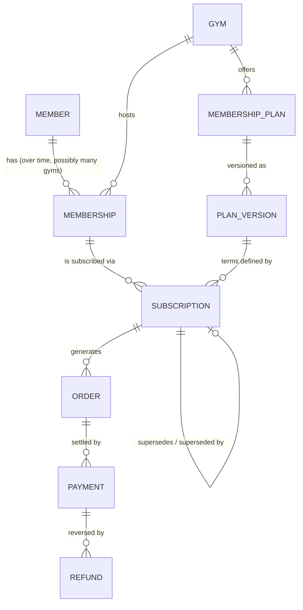
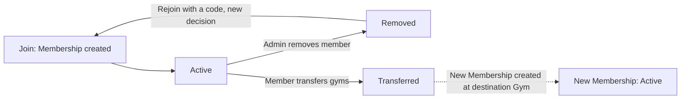
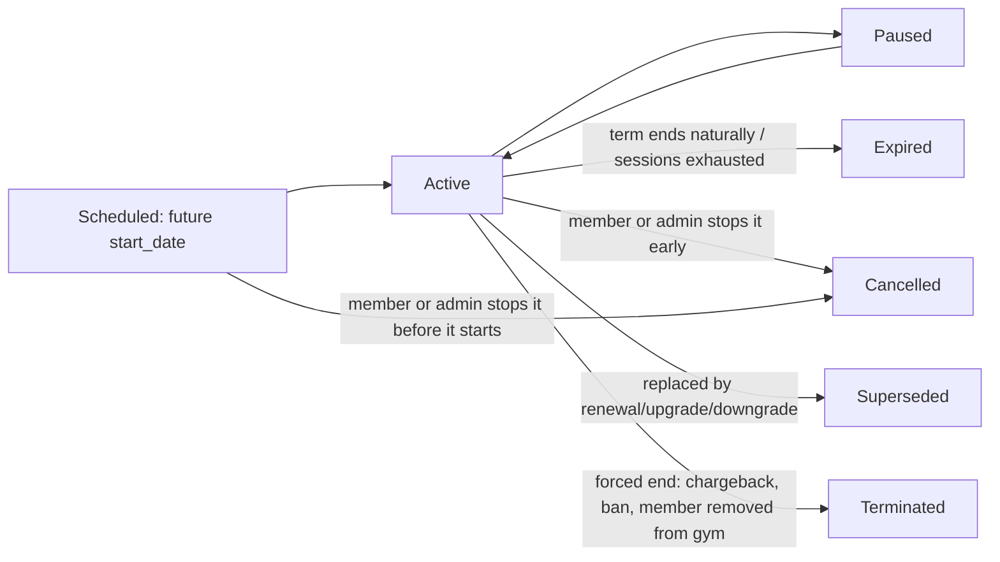
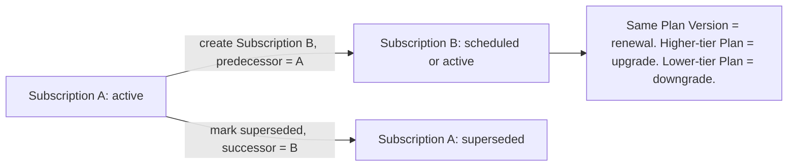

# Forge Member Domain Architecture

**Status:** Approved (Frozen)
**Version:** 1.0
**Approved:** 2026-07-24
**Last Reviewed:** 2026-07-24

This document is the canonical product specification for the Member Domain.

It defines the domain model, not the data model.

No SQL, no table names, no Supabase-specific mechanics appear in this document. Those belong to a later, separate data-model document, now that this specification is approved.

This document is written to remain correct for 5-10 years of platform growth, not for the current implementation.

Where the current implementation already matches a decision below, that is confirmation, not justification. Where it diverges, the divergence is called out explicitly. Nothing here is constrained by what exists today.

---

# 1. Purpose

Every gym-management platform eventually gets the Member Domain wrong in the same way: it conflates "who is this person," "what did they buy," and "can they walk through the door right now" into a single flat record. That conflation is cheap on day one and expensive forever after — it is the reason mature platforms eventually need a painful "membership v2" migration.

The purpose of this document is to define the Member Domain once, correctly, so Forge never needs that migration.

Concretely, this document must answer:

- What is a Member, independent of any gym, plan, or payment?
- What is a Membership, and is it a real entity or just a label?
- What is a Membership Plan, and how does it survive being changed?
- What is a Subscription, and how does it relate to a Membership and a Plan?
- Who owns business logic, and who is forbidden from owning it?
- What must be immutable, what must be historical, what may be freely edited?
- How do renewals, upgrades, downgrades, pauses, punch cards, unlimited plans, expirations, removals, and gym transfers each work, as explicit state transitions?
- How does the Member Domain hand off to the Financial Domain, and where exactly is that boundary?

---

# 2. Product Design Principles

These principles govern every decision in this document. Where a later section appears to contradict one of these, the principle wins and the section is wrong.

### 2.1 Identity outlives commerce

A person's existence as a Member must never depend on having an active Subscription, an active Membership, or even a gym. Commerce is something that happens *to* a Member. It is not what makes them a Member.

### 2.2 Status is derived, never trusted as stored fact

Whether something is "active," "expired," or "valid" must be a pure function of authoritative facts — dates, event history, counters — not a mutable flag that a background job promises to flip. Stored status fields are allowed only as read-optimizations of a derivation that is defined independently of them. If the stored flag and the derivation ever disagree, the derivation is correct and the flag is stale.

This principle is not theoretical. It is the single most expensive lesson of this platform's operational history: every serious Member-lifecycle bug found in production (stale onboarding state surviving a session boundary, a paywall shown to a member instead of a live-eviction redirect, a session token that looked valid locally but was dead server-side) was some variant of "we trusted stored state instead of deriving it from the authoritative fact." The Member Domain must not repeat that mistake at the architecture level.

### 2.3 Commercial history is a ledger, not a record you edit

A Subscription describes a specific commercial term: this Plan version, this price, this start, this end. Once created, it does not change. Renewing, upgrading, downgrading, or correcting a mistake all produce a *new* Subscription linked to the one it replaces. The system must always be able to answer "what was this Member's deal on March 3rd two years ago," exactly, forever.

### 2.4 Access rules and billing rules are orthogonal, not separate features

"Unlimited" and "punch card" are not different kinds of thing. They are two settings — access model and billing model — on the same kind of thing. A domain model that hard-codes "PunchCard" and "UnlimitedMembership" as separate entity types will need a third entity type the day a gym asks for "8 classes per month, resets monthly, auto-renews" (which is neither a punch card nor unlimited). Model the dimensions, not the combinations.

### 2.5 The platform owns business logic; clients own nothing

Restating the existing Forge Platform Engineering Standard for this specific domain: no client (Member Web, Admin Web, or any future client) may decide whether a Membership is valid, whether a transition is legal, or what a renewal produces. Clients call operations and render results.

### 2.6 Do not build for hypothetical scale; build for hypothetical *shape*

This document does not design family memberships, franchise multi-location access, or corporate bulk seats in full. It designs the Member/Membership/Subscription separation so that those features are *additive* later rather than requiring a rewrite. Scale is handled by not painting the model into a corner, not by pre-building unrequested features.

---

# 3. Core Domain Entities

| Entity | One-line definition |
|---|---|
| **Member** | A person's identity on the Forge platform, independent of any gym. |
| **Gym** | A tenant. Owns Plans, owns Memberships, owns its own commercial rules. (Unchanged from current architecture — included here only as a boundary marker.) |
| **Membership** | The relationship between one Member and one Gym. The anchor for everything gym-scoped: roster presence, booking eligibility, leaderboard participation, removal, transfer. |
| **Membership Plan** | A Gym's catalog offer: a named, versioned template describing price, billing model, access model, and eligibility rules. Not tied to any one Member. |
| **Plan Version** | An immutable snapshot of a Plan's terms at a point in time. Plans change by creating new Versions, never by rewriting old ones. |
| **Subscription** | An instance of a Membership being subscribed to one Plan Version, for one term, at one price. The commercial contract. Immutable once created; superseded, not edited. |
| **Entitlement** | The real-time, *derived* answer to "what can this Membership do right now." Never stored as the source of truth; always computed from the Membership's current Subscription(s). |
| **Order** | (Financial Domain, existing, unchanged) A billable event produced by a Subscription action (new/renewal/upgrade). |
| **Payment** | (Financial Domain, existing, unchanged) Money settling an Order. |
| **Refund** | (Financial Domain, existing, unchanged) Money reversing a Payment. |

### Why this list, and not a shorter one

The temptation is to collapse Membership and Subscription into one entity — "a member has a plan, done." That collapse is exactly what makes gym transfer, punch-card-on-top-of-unlimited, comped memberships with no billing, and multi-year member tenure all unnecessarily hard. Separating them costs one extra entity and one extra join. It buys correctness for every question this document was asked to answer.

### Why Entitlement is listed as an entity but is not a table

Entitlement is included explicitly so that no future engineer "discovers" a need for a stored `is_active` flag on Membership and wires it up as a second source of truth. Entitlement is a concept with a defined derivation (Section 7), not a row anyone writes to. If read-performance ever requires a materialized projection of Entitlement, that projection is a cache with a documented invalidation rule, not a competing authority.

---

# 4. Entity Responsibilities

### Member

- Owns personal identity: name, contact info, date of birth, gender (for leaderboard categorization), emergency contact, waiver acceptance, avatar, language/unit preferences.
- Owns authentication (one Member ↔ one login, in the base model — see Section 12 for managed/dependent Members).
- Does **not** know which Gym it belongs to. That knowledge lives in Membership.
- Does **not** know what it is subscribed to. That knowledge lives in Subscription.
- Survives every other entity in this document being deleted, ended, or transferred.

### Membership

- Owns the fact that a Member is affiliated with a Gym, and since when.
- Owns roster-visibility, booking eligibility (subject to Entitlement), and leaderboard participation for that Gym.
- Owns its own lifecycle: active, removed, transferred (Section 8).
- Does **not** own price, billing cadence, or access limits. Those belong to whichever Subscription is currently attached.
- Can exist with **zero** active Subscriptions (a Member who cancelled billing but wasn't removed from the roster; a Member between plans). This is a deliberate, load-bearing distinction: *on the roster* and *currently paying/entitled* are different facts, and conflating them is the single most common modeling mistake in this space (Section 2.2 applies here directly — "removed" must never be inferred from "no active subscription").

### Membership Plan / Plan Version

- Owns the commercial offer: name, price, currency, billing model (one-time vs. recurring), access model (unlimited vs. capped, and if capped, whether the cap resets per billing period or is consumed once), term length, auto-renew default, eligibility restrictions (e.g., new-members-only), and whether it is currently open to new signups.
- A Plan may be retired from new signups (`accepting_new_subscriptions = false`) while existing Subscribers keep their terms indefinitely — classic grandfathering. Retiring a Plan is not deleting it.
- Once any Subscription references a specific Plan Version, that Version is frozen. Changing price or terms creates a new Version; it does not alter the old one.

### Subscription

- Owns exactly one commercial term: which Plan Version, which Membership, start date, end date (or "until N sessions consumed"), price actually charged (which may differ from the Plan Version's list price due to a discount — the Subscription always records the *actual* agreed price, never just a pointer to "whatever the Plan says").
- Owns its own lifecycle (Section 8), including links to its predecessor and successor Subscription, if any.
- Triggers Financial Domain activity (an Order) on creation and on each renewal. Does not perform billing itself.
- Never mutates after creation except for the narrow, explicitly-modeled Pause/Resume transition (Section 7.2) and administrative correction flows that themselves produce an auditable event, not a silent field edit.

### Entitlement

- Computed, not stored: given a Membership, evaluate its current Subscription(s) against "now" and answer three questions — is access currently granted, what is the access model (unlimited / N sessions of M remaining), and when does it end (date, or "when sessions run out").
- If a Membership has multiple simultaneously-active Subscriptions (Section 9.1), Entitlement is evaluated independently per `access_scope` (Section 7.3): within a given scope, any one qualifying Subscription granting access in that scope is sufficient.

---

# 5. Relationships

Key cardinalities worth stating in prose, because a diagram alone hides the reasoning:

- **Member → Membership is one-to-many.** One person, potentially several gym relationships over a lifetime (sequentially, after a transfer; or, looking ahead, concurrently, at a multi-location franchise). The Member entity is what makes this possible without duplicating identity.
- **Membership → Subscription is one-to-many, and at any instant, zero-to-many-active.** A Membership accumulates a full commercial history. At any given moment it may have no active Subscription (lapsed but not removed), exactly one (the common case), or more than one (base plan plus an add-on punch card, Section 9.1).
- **Subscription → Plan Version is many-to-one, and permanent.** A Subscription's terms never silently follow a Plan's current definition. It is pinned to the Version it was created against.
- **Subscription → Subscription (self-referential) captures lineage.** Renewals, upgrades, and downgrades are all "new Subscription, `predecessor_id` set." This one relationship is what makes Section 2.3 (ledger, not edited record) actually true rather than aspirational.
- **Subscription → Order is one-to-many.** One Subscription, over its life, may generate several Orders (initial charge, each renewal charge). This is a Financial Domain concern; the Member Domain only guarantees that every commercial event that *should* cost money produces exactly one Order.

---

# 6. Lifecycle Diagrams

### 6.1 Membership lifecycle (a Member's relationship with one Gym)

A Membership never has a fourth terminal state. "Expired" is not a Membership state — it is a Subscription/Entitlement state. A Membership whose only Subscription expired is still `Active` on the roster; it simply has no current Entitlement. This is the direct, load-bearing consequence of Section 4's "roster presence ≠ current entitlement" rule.

### 6.2 Subscription lifecycle (one commercial term)

### 6.3 Renewal, upgrade, and downgrade, drawn as one mechanism

All three are the same operation with different inputs. This is deliberate (Section 2.3 and Section 2.4 combined): one mechanism, three product-facing names.

Whether Subscription B starts immediately or waits for Subscription A's natural end date is a **Plan-level policy** (`change_effect: immediate | end_of_current_period`), not a different mechanism. Immediate-effect changes set B's `start_date = now`, end A early (`superseded`, effective now). Deferred changes set B's `start_date = A.end_date` and leave A to expire naturally into `superseded` on that date. The state machine does not change; only a date does.

---

# 7. State Machines

### 7.1 Membership — states and transitions

| State | Meaning | Entered from | Exits to |
|---|---|---|---|
| `active` | Member is on this Gym's roster | Membership creation; rejoin | `removed`, `transferred` |
| `removed` | Admin ended the relationship | `active` | terminal for this Membership; a new Membership may be created on rejoin (never re-activated in place) |
| `transferred` | Member moved to a different Gym | `active` | terminal for this Membership; a new Membership exists elsewhere |

Removal and transfer both end all of this Membership's active Subscriptions (`terminated`, reason recorded), but the two are *not* the same event and must not share one reason code: removal is punitive/administrative-neutral ("this relationship ended"); transfer is continuity-preserving ("this relationship moved"). Reporting, win-back campaigns, and "member since" tenure logic all depend on being able to tell them apart.

### 7.2 Subscription — states and transitions

| State | Meaning | Entered from | Exits to |
|---|---|---|---|
| `scheduled` | Exists, not yet in effect (future-dated, or queued behind a currently-active term) | Purchase with a future start; renewal/upgrade queued behind current term | `active` (on start date), `cancelled` (stopped before it began) |
| `active` | Currently in effect and (subject to Entitlement derivation) granting access | `scheduled`; Membership creation with immediate start | `paused`, `expired`, `cancelled`, `superseded`, `terminated` |
| `paused` | Temporarily suspended; end date extends by the paused duration on resume | `active` | `active` (resume), `cancelled` (member cancels while paused) |
| `expired` | Term ended naturally (date reached, or sessions exhausted) | `active` | terminal |
| `cancelled` | Ended early by explicit member/admin choice, before natural end | `active`, `paused`, `scheduled` | terminal |
| `superseded` | Replaced by a renewal, upgrade, or downgrade | `active` | terminal (successor Subscription carries on) |
| `terminated` | Force-ended by the platform or Gym for a reason outside normal cancellation (non-payment, chargeback, membership removal/transfer, ban) | `active`, `paused`, `scheduled` | terminal |

`expired`, `cancelled`, `superseded`, and `terminated` are deliberately four different terminal states, not one "inactive" bucket. Every downstream consumer of this data — churn reporting, win-back targeting, refund-eligibility logic, "why did this member's access end" support tooling — needs to distinguish "the deal ran its course," "they chose to leave," "they upgraded," and "we ended it on them." Collapsing these into one status is the second most common modeling mistake in this space, after conflating Membership with Subscription.

### 7.3 Entitlement — derivation, not a state machine

Entitlement has no states of its own. Given a Membership, at time `now`:

1. Collect all Subscriptions on this Membership, grouped by `access_scope` (Section 9.1), where `state = active` or (`state = paused` and the Plan explicitly grants degraded access while paused — most do not).
2. If none: no entitlement (Membership is on the roster, but cannot currently book or check in).
3. Steps 2-3 are evaluated independently per `access_scope`, never pooled across scopes: within a given scope, entitlement is unlimited if any qualifying Subscription in that scope is unlimited; otherwise it is the sum of remaining sessions across qualifying capped Subscriptions in that scope; the effective end date is the latest end date among them in that scope. A Membership's overall Entitlement is therefore the set of these per-scope answers, not one pooled number.

This derivation is the formal answer to "how should membership expiration work": expiration is never a job that flips a flag. It is what you get, automatically, the instant `now` moves past an `end_date`, or the instant a session-count hits its cap, when this derivation is next evaluated. A background process may still exist to transition `active → expired` for the sake of query-able history and notifications ("your membership expired" push/email) — but that process is a *consequence* of the derivation, and if it lags or fails, the derivation (and therefore real access control) is still correct. This is Section 2.2 made concrete.

---

# 8. Business Rules

### 8.1 What must be immutable

- A Subscription's Plan Version reference, start date, originally-agreed price, and term type, once the Subscription is created.
- A Plan Version, once any Subscription references it.
- Order and Payment records (Financial Domain — already enforced, unchanged here).
- The historical fact and timestamp of any state transition (a Membership was removed on this date, a Subscription was superseded on this date) — the *fact* is permanent even though the *current state* field is, by definition, mutable.

### 8.2 What must be historical (append-only, never deleted)

- Subscription lineage (`predecessor_id` / `successor_id` chains).
- Membership status-change log (joined, removed, transferred — each with actor and reason).
- Plan Version history for every Plan.
- Pause/Resume events for every Subscription that was ever paused (start, end, and the resulting extension of the term).

### 8.3 What may be freely edited

- A Member's personal profile fields (name, contact info, DOB correction, avatar, language/unit preference). These describe the *person*, not a commercial agreement, and correcting a typo in someone's name is not a historical event worth an audit trail entry.
- A Plan Version that has never been referenced by any Subscription (a true draft). Once referenced, it is frozen (Section 8.1); before that, it is just a form.
- Non-authoritative operational metadata: internal admin notes, tags, flags that do not affect billing or access.

### 8.4 Renewals

A renewal creates a new Subscription referencing the same (or, if the Plan itself changed, the latest) Plan Version, with `predecessor_id` pointing at the expiring one, `start_date` equal to the predecessor's `end_date`. The predecessor transitions `active → superseded` at that moment (not before). Auto-renewal is a boolean on the Plan/Subscription (`auto_renews`); when true, the platform is responsible for creating the successor Subscription and the triggering Order automatically as the predecessor approaches its end date, not on the member's next login.

### 8.5 Upgrades and downgrades

Mechanically identical to a renewal (Section 6.3), except the successor references a *different* Plan (a different tier, not just a later Version of the same Plan). "Upgrade" vs. "downgrade" is a UI/reporting label derived from comparing the two Plans' price or access tier — it is not a different state or a different mechanism.

Leftover unused punch-card sessions at the moment of a downgrade are a **Gym-configurable policy** (forfeit, prorated refund, or carry-over to the new Subscription), decided at the Financial Domain boundary, not hard-coded here. The Member Domain's only obligation is to make the exact leftover count available at the moment of transition.

### 8.6 Punch cards and unlimited memberships

Both are a Plan with `billing_model = one-time` or `recurring`, and `access_model = unlimited` or `capped(N, reset_period)`. A punch card is simply `billing_model = one-time, access_model = capped(N, reset_period = never)`. "8 classes per month" is `billing_model = recurring, access_model = capped(8, reset_period = monthly)`. There is no separate entity for either. This directly implements Section 2.4.

### 8.7 Membership expiration

Not a distinct event to design — it is what Section 7.3's derivation produces automatically when `now` crosses an `end_date` or a session counter is exhausted. The only genuinely new design decision here is the **notification** trigger (warn a member their access is ending soon), which is a scheduled read of the derivation, not a change to it.

### 8.8 Member removal

Removal ends the **Membership** (Section 7.1), which cascades to terminating (not deleting) every active Subscription on it, with reason `membership_removed`. The Member's identity, cross-Gym history (if any), and all Financial Domain records are untouched — this formalizes and generalizes the existing P0-006 pattern, and the Member/Membership split makes the boundary of "what gets removed" unambiguous by construction: removal can only ever reach as far as the Membership, because nothing else has a foreign key back to a specific Gym.

### 8.9 Gym transfer

A transfer is **not** a special case — it is a `removed`-equivalent end of the origin Membership (reason `transferred`, distinct per Section 7.1), which cascades to terminating (not deleting) every active Subscription on it with that same reason, plus the creation of a brand-new Membership at the destination Gym. Subscriptions never move between Gyms, because a Plan (and therefore any Subscription against it) belongs to exactly one Gym's catalog; a Subscription for "CrossFit Tester's Unlimited Monthly" is meaningless at a different Gym. What *may* optionally move, as a product decision rather than an architectural constraint, is the Member's workout history and PRs (Section 12).

### 8.10 Payment history's relationship to Subscriptions

Every Subscription-creating action (new Membership sign-up, renewal, upgrade, downgrade with an immediate charge) produces exactly one Order in the Financial Domain. The Order references the Subscription that caused it; the Subscription never references the Order back as a required field (a Subscription can exist — comp, trial, staff — with no Order at all). Payments settle Orders; Refunds reverse Payments. The Member Domain never reads Payment/Refund internals; it only reacts to a small, well-defined set of Financial Domain outcomes (Section 9.5).

---

# 9. Edge Cases

### 9.1 Stacked concurrent Subscriptions

A Membership may have more than one simultaneously-active Subscription — a base Unlimited plan plus an add-on 10-pack of specialty coaching sessions. Entitlement (Section 7.3) is evaluated per `access_scope`, never pooled across scopes. Plans should carry an `access_scope` (general gym access vs. a specific bookable resource) so add-ons don't need to be modeled as a special case — they are just Subscriptions whose Plan has a narrower scope.

### 9.2 Cancellation timing

Whether cancelling mid-period ends access immediately or at the paid-through date is a Plan-level policy (`cancellation_effect: immediate | end_of_period`), matching the same pattern as Section 6.3's `change_effect`. The architecture supports either without change; only the resulting `end_date` differs.

### 9.3 A future (queued) Subscription, when the current one ends early

If a member already has a `scheduled` Subscription queued behind their current one, and the current one is cancelled or terminated early, the queued Subscription's `start_date` does **not** silently move earlier. It activates on its originally scheduled date unless an explicit, separate action changes it. No implicit magic across two different commercial decisions.

### 9.4 Trial and comped Memberships

Represented as an ordinary Subscription with price `0` and an explicit `subscription_type` (`trial`, `comp`, `paid`) — not a different entity, and not "a Membership with no Subscription" (that state already means something else: lapsed billing, Section 4). A trial is a real Subscription with a real, if free, term.

### 9.5 Financial Domain events reacting back into the Member Domain

A full refund on the Order that originated a brand-new Subscription should be able to void that Subscription (transition it to `cancelled`, reason `refunded`). A failed or declined recurring charge on the Order tied to a Subscription renewal must be exposed to the Member Domain through the same explicit inbound event contract as refunds. How the Member Domain reacts to that event (immediate termination, grace period, retry schedule, temporary suspension, etc.) is Gym-configurable product policy and intentionally outside the scope of this architecture. Refunds and failed-payment notifications are the only two places data flows from Financial Domain back into Member Domain, and each must remain an explicit, narrow event contract — not the Financial Domain reaching into Member Domain's state machine directly, and not the Member Domain polling Financial Domain for changes.

### 9.6 Timezone boundaries

"Expires end of day" means end of day in the **Gym's** local timezone, never the Member's device timezone and never bare UTC. A Plan's term boundaries are a property of the Gym's business operations, not of whichever city a Member happens to be logging in from.

### 9.7 Plan retirement vs. deletion

A Plan that a Gym no longer wants to sell is marked `accepting_new_subscriptions = false`, never deleted, and never has its existing Versions mutated. Existing Subscribers continue exactly as contracted (grandfathering) for as long as their Subscription lineage continues to renew against that Version.

---

# 10. Future Scalability

Every item below is possible **without** re-architecting this document, specifically because Member and Membership are already separate:

- **Multi-location / franchise access** — a Member can hold more than one concurrent Membership (one per location), or a single Membership Plan can be defined with an `access_scope` spanning multiple Gyms under one brand. Nothing about Section 3-8 needs to change; only a new Plan `access_scope` value is added.
- **Family / group / dependent memberships** — requires a `managed_by_member_id` on Member (a dependent with no login of their own, administered by a guardian Member) plus a `Household`-style grouping construct for shared billing. Additive, not disruptive — see Section 12.
- **Corporate / bulk seats** — a company purchases N seats of a Plan; each seat becomes a Membership once assigned to a Member. The Subscription model already supports "who pays" (the Order payer) being different from "who is entitled" (the Membership) with no change.
- **Cross-Gym Plan templates** — a platform-level library of starter Plans a new Gym can clone into its own catalog as real, Gym-owned Plan Versions. Purely additive to the catalog layer.
- **Metered / pay-per-use billing** — a Plan `access_model` of "billed per check-in" is a third access-model value alongside unlimited and capped; the Entitlement derivation and Subscription lifecycle are unaffected.
- **Loyalty / tenure tracking** ("member since 2019," streaks that survive a lapsed Subscription) — enabled precisely because Member identity is never deleted or reset by Subscription or even Membership churn. Tenure is computed from the Member's earliest Membership, not from any one Subscription.
- **Waitlists for capacity-constrained Plans** — a Plan-level capacity limit plus a waitlist queue is additive to the catalog layer and does not touch Subscription or Membership state machines.
- **Multi-currency / localization** — Plan Version already carries its own price and currency per Version; expanding to multiple simultaneous currencies per Gym is a Plan Version concern, not a Subscription or Membership concern.
- **Entitlement as a materialized read-model** — if per-request derivation ever becomes a real read-latency problem at scale (unlikely before very large per-Gym roster sizes), Entitlement can be projected into a cache with a documented invalidation rule, without changing what Entitlement *means* or promoting the cache to a second source of truth (Section 2.2, Section 3).

---

# 11. Decisions

Recorded as short ADRs. Each stands until explicitly revisited; none should be silently re-litigated by a future implementation detail.

**D1 — Member identity is decoupled from Gym affiliation.**
A new entity, Membership, represents "this Member, this Gym." Rationale: enables gym transfer, multi-location access, and Member tenure that survives any single Gym relationship ending. Alternative considered: keep a single `gym_id` on Member (today's implementation) — rejected because it makes transfer indistinguishable from "leave and rejoin as new," and blocks multi-location by construction. Consequence: every gym-scoped query (roster, leaderboard, bookings) now joins through Membership rather than reading a flat field on Member — an accepted, worthwhile cost.

**D2 — Membership is the answer to "should Membership exist as an entity," and it is not the billing record.**
Membership owns roster/relationship facts; Subscription owns commercial facts. A Membership can be `active` with zero active Subscriptions. Rationale: "on the roster" and "currently entitled" are genuinely different facts and conflating them was identified as the most common modeling failure in this product category.

**D3 — Plans are versioned and frozen once subscribed; catalog edits never rewrite history.**
Rationale: a Gym must always be able to answer, exactly, what a Subscriber agreed to on any past date. Alternative considered: a single mutable Plan row with an audit log on the side — rejected because it makes "what were the terms on date X" a reconstruction exercise instead of a direct read.

**D4 — Subscriptions are immutable once created; renewals, upgrades, and downgrades all create a new, linked Subscription rather than mutating one in place. Pause is the sole in-place exception.**
Rationale: one mechanism serves renewal, upgrade, downgrade, and both immediate- and deferred-effect policies (Section 6.3), and produces a perfect commercial ledger for free. Pause is excepted because nothing commercial actually changes during a pause — only time is suspended — so creating a new Subscription for it would be a false lineage entry.

**D5 — Status is computed from authoritative facts wherever possible; stored status fields are optimizations of that computation, never a competing authority.**
Rationale: this is the platform's own hardest-earned lesson (Section 2.2), now made an architectural law rather than a per-incident fix.

**D6 — Access model (unlimited/capped) and billing model (one-time/recurring) are orthogonal Plan configuration, not separate entity types.**
Rationale: prevents entity-type proliferation every time a Gym invents a new commercial combination. Alternative considered: distinct `PunchCard`, `UnlimitedMembership`, `RecurringCappedMembership` entities — rejected as already-known-inadequate the moment a fourth combination is requested.

**D7 — The Financial Domain remains a fully separate bounded context. The Member Domain requests financial actions (an Order) and reacts to a narrow set of financial outcomes (a refund voiding a Subscription); it never reads or writes Payment/Refund internals directly.**
Rationale: keeps each domain's invariants independently enforceable and matches the platform's existing Financial Domain, which is already complete and explicitly frozen.

**D8 — Member removal ends only the Membership. Identity, cross-Gym history, and financial records are untouched.**
Rationale: formalizes the existing, already-validated P0-006 pattern, and the Member/Membership split makes this the *only possible* outcome by construction rather than a rule that must be separately remembered and enforced.

**D9 — Phone number is global Member identity data, stored on `members`, not Gym-scoped data.**
Rationale: `members` already carries every other piece of identity data (`full_name`, `email`, `gender`, `birth_date`, `weight_unit`, `language`) as global, gym-independent fields, consistent with D1 — a phone number follows the same, already-decided pattern, not a new policy. `members` itself has no `gym_id` column at all (by construction, per D1), so there is no mechanism by which phone could be made Gym-scoped without contradicting the Member/Membership split this document already establishes. Consequence, named explicitly and not silently assumed: on a Gym Transfer, the destination Gym sees the same phone number the origin Gym had, exactly as it already sees the same name, email, and birth date today. Whether a Gym should re-confirm a carried-over phone number with the Member is a product/UX question, not an architecture one, and is not resolved here. Column: `members.phone text`, nullable — existing Members and any Member added without a phone remain valid; nothing requires backfill. No RLS change: phone is covered by the same `members_select_own_or_gym_mate`/`members_update_own` policies already governing every other identity field on this table.

---

# 12. Open Questions

These are deliberately left unresolved. Each requires a product-policy decision, not an architecture decision, and answering them prematurely would bake a business choice into a spec meant to outlive any one such choice.

- **Dependent / managed Members (family, kids' classes).** Does a dependent get its own Member identity with no login (`managed_by_member_id`), or is "household" purely a billing-grouping concept layered on top of independent Members? Needs its own design pass; flagged in Section 10 as additive, not designed here.
- **Does workout history / PRs move with a Member across a Gym transfer?** Architecturally trivial to keep at the Member level (platform-scoped) rather than the Membership level (Gym-scoped) — but whether a *new* Gym should grant leaderboard credit for work done at a *previous* Gym is a policy and competitive-fairness question, not an architecture one.
- **Waitlists for capacity-constrained Plans.** Listed as future-compatible (Section 10) but not designed: does a waitlist reserve a Subscription slot, or just a notification-when-available slot?
- **Proration math for mid-period upgrades/downgrades.** The architecture defines *where* this decision plugs in (Section 8.5, Financial Domain boundary) but not the formula. That belongs in Financial Domain policy, not here.
- **Should a platform-wide Member identity ever span unrelated Gyms (not just one franchise brand)?** Current lean is no — separate Gyms are separate businesses even on shared infrastructure, and an unrequested cross-tenant identity graph has real privacy and competitive implications. Recorded here so it is answered deliberately if ever raised, not accidentally implemented.
- **Exact notification cadence for expiring Entitlements** (Section 8.7) — a UX/lifecycle-marketing decision layered on top of a derivation that already exists, not an open architecture question.
