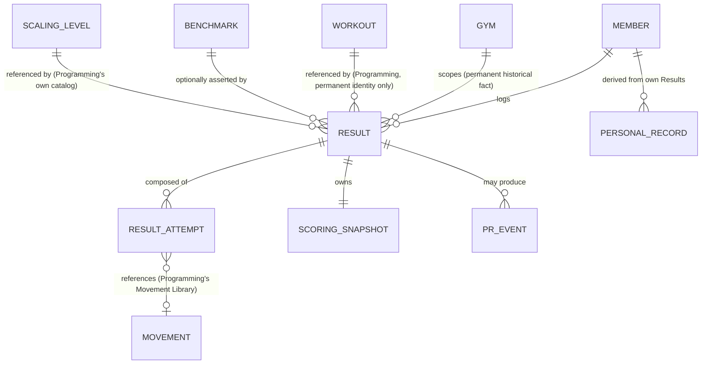

# Forge Results Domain Architecture

**Status:** Proposed for Freeze
**Version:** 1.0
**Prepared:** 2026-08-05

This document is the canonical product specification for the Results Domain. It defines the domain model, not the data model. No SQL, no table names, no Supabase-specific mechanics, no UI, no implementation plan appear in this document.

This document is written to remain correct for 5-10 years of platform growth, not for the current implementation. Where the current implementation already matches a decision below, that is confirmation, not justification. Where it diverges, the divergence is named explicitly, together with what must change and why.

This document builds on four prior, approved deliverables and treats each as immutable input, never re-litigated here: `PROGRAMMING_DOMAIN_ARCHITECTURE.md` v1.1, `FORGE_PROGRAMMING_COMPETITIVE_SYNTHESIS.md`, `RESULTS_DOMAIN_ASSESSMENT.md`, and `FORGE_RESULTS_COMPETITIVE_SYNTHESIS.md`. Programming remains independent from Results — every decision in this document was checked against that principle before being written down, not after.

---

# 1. Executive Summary

A gym's entire value proposition has two halves. Programming decides what a coach intends to teach. Results decides what actually happened when an athlete trained it. The two halves have opposite lifecycles — Programming content is authored once and consumed briefly; Results content is logged once and referenced *forever*, by the same athlete, for years, as the record of their own athletic life. A platform that treats these as one domain, or lets one silently reach into the other's lifecycle, eventually breaks the half that matters more to the person still using the product after the coach has moved on to a new gym: the athlete's own history.

Results is a single shared domain, consumed identically by three interfaces — the Forge PWA (the athlete's own logging and history surface), Forge Admin Web (the coach's and owner's correction and analytics surface), and a future Forge Dashboard (aggregated, cross-domain business and performance analytics) — and it exposes exactly one PR engine, one leaderboard engine, one benchmark engine, and one historical model to all three. No client computes a Personal Record, ranks a leaderboard, or decides what a stored score means independently; every client reads the same derivation.

The assessment that preceded this document found the domain's single most consequential defect in production today: deleting a Workout currently destroys every athlete's logged result against it, silently, as a side effect of a Programming-domain action. This document's central architectural commitment is that this becomes structurally impossible. Athlete history outlives Programming objects — not as a policy anyone has to remember to honor, but as a property of how a Result references what it was logged against.

Every other decision in this document — a unified Score model that replaces an overloaded scaling field, first-class Benchmark identity, automatic Personal Record detection, a Scaling Context that reuses Programming's own existing catalog rather than inventing a second one, canonical units that extend an asset Forge already has right — serves the same underlying goal: a Result, once logged, is a durable fact about a person's life, not a row that happens to still be readable today.

---

# 2. Design Principles

These principles govern every decision in this document. Where a later section appears to contradict one of these, the principle wins and the section is wrong.

### 2.1 A logged Result is a fact, not a projection of current Programming state

Once a Member logs a Result, what it means — what format it was scored in, what Scaling tier it was logged under, what Benchmark (if any) it represents — must remain correctly interpretable forever, independent of whatever Programming later does to the content it was logged against. This is not the same claim as "Results must never reference Programming" — a Result legitimately references a Workout's permanent identity for the rest of this domain's life. It is the narrower, load-bearing claim that *interpretation* — the meaning of the stored number — is frozen at the moment of logging, even when identity and content are not.

### 2.2 Athlete history outlives Programming objects

No Programming-domain action — editing a Workout, deleting a Workout, retiring a Benchmark, renaming a Movement, changing a Scaling Level — may destroy, silently corrupt, or silently reinterpret a Result that already exists. A Programming object may disappear from active use; the Results that were logged against it never do.

### 2.3 Automatic intelligence is the default, not a bonus feature

Every competitor examined in `FORGE_RESULTS_COMPETITIVE_SYNTHESIS.md` treats automatic PR detection and benchmark recognition as baseline product behavior, not a premium layer. Forge's own primary logging path has neither today. This document treats both as non-negotiable defaults for every eligible Result, not an opt-in enhancement layered on afterward.

### 2.4 Named identity is what makes a Result comparable

A Result logged against a recognized Benchmark is worth more than one logged against an arbitrary custom Workout — it can be ranked, trended, and compared across time and across athletes in a way an unnamed one-off cannot. This domain treats Benchmark identity as load-bearing infrastructure, not metadata, mirroring exactly how Programming already treats its own Benchmark Identity concept as first-class rather than disposable.

### 2.5 Structure exists where it must be compared, aggregated, or detected automatically; free text remains legitimate everywhere else

A Score that must be ranked on a leaderboard, summed into an analytic, or checked against a prior best must be structured. A note explaining how a Member felt that day does not. Neither "everything structured" nor "everything free text" is correct; the boundary is drawn by what a downstream computation actually needs to trust.

### 2.6 Status and derived values are computed, never trusted as stored fact

A Member's current Personal Record, a leaderboard's current ranking, and a Result's eligibility for PR detection are all pure functions of underlying, immutable facts — never a value some background process promises to keep in sync. A stored value is permitted only as a read-optimization of a derivation defined independently of it, exactly as the Member Domain already established for Entitlement and the Financial Domain already established for Order status. If a cached value and the derivation ever disagree, the derivation is correct and the cache is stale.

### 2.7 Units are canonical and structured, never free-text display hints

Every quantity that carries a unit of measure — a load, a distance — is stored once, in one canonical unit per dimension, with display conversion happening at read time from a Member's own stated preference. A free-text weight field that merely *hints* at a unit for a human to interpret is not an acceptable long-term representation for anything this domain intends to rank, sum, or compare.

### 2.8 One domain, three interfaces, zero duplicated logic

The PWA, Admin Web, and Dashboard render different surfaces of the same underlying facts. None of them owns a second implementation of PR detection, leaderboard ranking, benchmark recognition, or score validation. A bug fixed once is fixed everywhere; a rule changed once changes everywhere.

### 2.9 Minimal Core, Progressive Complexity

Borrowed deliberately, by name, from Programming's own governing philosophy: a Member must be able to log a complete, valid Result with almost no required structure — a Score and a Scaling Context. Movement-level detail, Benchmark assertion, and rich Attempt breakdowns are additive, never a precondition to saving.

---

# 3. Domain Boundaries

Results sits between two frozen domains that supply it context (Programming, Membership) and two frozen domains it deliberately does not touch (Classes, Attendance), with a future consumer (Dashboard) that reads it but never writes to it.

| Domain | Relationship to Results | Ownership |
|---|---|---|
| **Programming** (frozen v1.1) | Results references a Workout's and a Benchmark's permanent identity as *context* for a logged Score. Programming has zero awareness of Results and zero reverse dependency — this is verified, not assumed (`RESULTS_DOMAIN_ASSESSMENT.md`: zero FK from any Programming table to any Results table). | Programming owns authored content and its own lifecycle. Results owns what happened against that content, once. |
| **Classes** (frozen) | No relationship. A Class is identified by Gym, Date, and Time; a Result is never logged "into" a specific Class instance. Programming's own architecture already establishes that a Workout resolves to Classes only by Gym+Day lookup, never by ownership — Results inherits that same arm's-length relationship, and does not introduce a tighter one. | Classes owns scheduling. Results does not read or write anything Classes owns. |
| **Attendance** (frozen) | No structural relationship. Whether a Member attended a Class and whether they logged a Result that day are independent facts about independent domains. Any correlation between the two (Section 12) is computed by a downstream consumer reading both, never by either domain referencing the other. | Attendance owns who showed up. Results owns what they logged, if anything — the two are never joined at the domain layer. |
| **Membership / Member Domain** (frozen v1.0) | Results attaches to **Member** identity, not Membership. This mirrors the Financial Domain's own choice (Order references Member, never Membership) and the Member Domain's own governing principle, "identity outlives commerce" — extended here to "identity outlives commerce *and* outlives any single gym relationship." A Result additionally carries a permanent, immutable record of which Gym it was logged at (Section 8.4) — a historical fact about where something happened, never a mutable ownership pointer. Whether a Member's history should be *visible* across a gym transfer is the open product-policy question the Member Domain's own Section 12 already named and deliberately left unresolved; this document does not resolve it either — it only guarantees the underlying facts (who, where, what) are preserved permanently regardless of how that policy question is eventually answered. | Membership owns roster/entitlement. Results owns the athlete's permanent performance record, referencing Member identity for continuity and Gym identity for historical accuracy — two different, both-permanent facts, never conflated. |
| **Dashboard** (future) | Pure read consumer. Dashboard never owns a table, a PR rule, or a leaderboard rule of its own — it reads the same derivations every other client reads (Section 12, Section 13). | Dashboard owns aggregation and presentation of cross-domain analytics. It owns nothing this domain is itself responsible for computing. |
| **Financial Domain** (frozen) | No relationship, in either direction. A Result carries no price, no billing implication, and Financial Domain entities never reference a Result. Named here only for completeness, matching the symmetry both frozen domains already establish with each other. | N/A |

**What Results owns, unambiguously:** the fact that a Member logged a Score, under a Scaling Context, on a date, at a Gym, optionally against a Workout and/or a Benchmark and/or specific Movements — and everything derived from the accumulation of those facts (Personal Records, Movement Performance, Leaderboards, Analytics).

**What Results never owns:** authored training content (Programming), who is allowed to see it (Membership), when and where it happens (Classes), who showed up (Attendance), or how it is billed (Financial Domain).

---

# 4. Core Domain Model

### 4.1 Entity Summary

| Concept | True Entity or Derived View | One-line definition |
|---|---|---|
| **Result** | True entity | The atomic, durable fact that a Member logged a Score, under a Scaling Context, on a date. |
| **Result Attempt** | True entity (child of Result) | One individual recorded effort within a Result — a single set, rep, or interval — for Results richer than a single whole-Workout Score. |
| **Scoring Snapshot** | True entity (owned by Result) | The frozen, minimal record of *how to interpret* a Result's Score — its Score Model and Scaling Context — captured at logging time, immune to later Programming edits (Section 2.1, Section 5). |
| **Benchmark** | True entity | A named, curated, comparable workout identity (e.g., "Fran") a Result may assert it was logged against. |
| **Scaling Context** | True entity (reference) | A structured reference to exactly one Scaling Level, drawn from Programming's own existing, gym-extensible Scaling Level catalog — never a second, parallel vocabulary. |
| **Unit System** | Shared platform primitive, not owned by Results | The canonical set of measurement dimensions (mass, distance, duration, etc.) and their canonical storage units, referenced by Result and Personal Record. Treated the same way the Financial Domain treats Gym: a cross-domain boundary concept, owned by neither domain exclusively. |
| **Personal Record** | Derived view, with one narrow true-entity exception | The current best-known performance for a Member, per Movement/Benchmark/rep-scheme. Computed from Results by default; a narrow, explicit manual-attestation path (Section 8.5) exists for pre-Forge history with no corresponding Result. |
| **PR Event** | True entity (append-only) | The historical, permanent record that a specific Result achieved a Personal Record at the moment it was logged — a ledger entry, never rewritten (Section 8.6). |
| **Movement Performance** | Derived view | The aggregated history of a Member's recorded efforts for one Movement at one rep-scheme, drawn from Result Attempts that reference Programming's governed Movement Library. |
| **Leaderboard** | Derived view | A ranked ordering of Results for a given Workout or Benchmark, partitioned by Scaling Context, computed at read time — never stored. |

### 4.2 Why this list, and not a shorter one

The temptation is to collapse Result and Result Attempt into one entity, or to let Personal Record and Leaderboard be tables a process writes to on a schedule. Both collapses were considered and rejected. Collapsing Result/Result Attempt loses the ability to represent a multi-set strength Result (three sets at three different loads) without inventing an ad hoc side-array — which is in fact exactly what the current implementation's informal, unstructured `sets` data already gestures at doing, without a defined entity behind it. Storing Personal Record or Leaderboard as writable tables reintroduces the exact "stored status as competing authority" failure Section 2.6 exists to prevent — a materialized cache of either is a legitimate performance optimization (Section 16), but never the authoritative answer.

### 4.3 Relationships

**Result → Workout is a reference to permanent identity, never ownership.** Programming's own frozen architecture already guarantees a Workout's identity is permanent and that any downstream reference resolves to real content, a detectable revision, or an explicit "withdrawn" tombstone — never to nothing (`PROGRAMMING_DOMAIN_ARCHITECTURE.md` §3). Result depends on that guarantee directly rather than duplicating Workout content wholesale (Section 5).

**Result → Benchmark is optional and many-to-one.** Not every Result asserts a Benchmark; those that do gain richer PR and leaderboard behavior (Section 7, Section 8).

**Result → Scaling Context is mandatory and exactly one.** Every Result carries exactly one Scaling Context — this is the direct fix for the current implementation's overloaded scaling field (Section 9).

**Result → Result Attempt is one-to-many, and may be exactly one.** A simple whole-Workout metcon Score is a Result with a single implicit Attempt equal to itself — Section 2.9's "Minimal Core" applies here directly; a coach or athlete logging a simple time or rounds-and-reps score never has to think about "Attempts" as a separate concept.

**Result → Scoring Snapshot is one-to-one and permanent.** Every Result owns exactly one Scoring Snapshot, written once, at logging time, never updated afterward (Section 5).

---

# 5. Historical Permanence Model

This is the domain's central problem, named explicitly in the mission that produced this document: deleting a Workout today cascade-deletes every Result logged against it. This section defines, permanently, why that is wrong and what replaces it.

### 5.1 The chosen model: permanent identity reference, plus a narrow, frozen Scoring Snapshot

Four models were evaluated:

- **Live-linked** (a Result always reads the current Workout) — rejected. This is Wodify's model, and `FORGE_RESULTS_COMPETITIVE_SYNTHESIS.md` found direct, documented evidence of its cost: editing a scored component can retroactively reassign what a stored number *means*, and deleting one deletes the Results logged against it. Real gym owners report unusable historical data as a consequence. This is not a hypothetical risk being guarded against — it is a demonstrated one.
- **Full immutable Workout Snapshot** (Result copies the entire Workout's content at logging time) — rejected as the primary mechanism. It would duplicate Programming's own domain model wholesale inside Results, violating Section 2.8 and this document's mandate not to duplicate business logic. It is also unnecessary: Programming's own frozen architecture already promises permanent identity and detectable, non-silent revision. A second, independent copy of the same content is redundant with a guarantee Programming already makes.
- **Versioned Workouts** (Programming maintains an explicit version history Results pins to) — rejected as out of this document's authority. Programming is frozen; introducing formal versioning to it is a Programming-domain architectural change this document has no mandate to make. Programming's existing "detectable revision" contract is sufficient for Results' purposes without requiring Programming to change.
- **Hybrid: permanent identity reference + a narrow, Results-owned Scoring Snapshot** — **adopted.** A Result holds a permanent reference to Workout identity (relying on Programming's own existing guarantee), and separately owns a small, Results-authored Scoring Snapshot capturing only the facts whose *meaning* could otherwise silently shift under a stored number: the Score Model in effect at logging time, and the Scaling Context asserted at logging time. This is the minimum necessary to satisfy Section 2.1 without duplicating Programming's content wholesale.

The same hybrid pattern is applied identically to Benchmark (Section 7) and Scaling Level references (Section 9): permanent identity, versioned/retired rather than deleted, with the interpretation-critical facts frozen in the Scoring Snapshot at the moment of logging.

### 5.2 A direct, named correction to the current implementation

The current implementation's `wods → wod_logs`/`skill_logs` cascade-delete does not merely create a Results-domain risk — it violates a promise Programming's own already-frozen architecture already makes: that a downstream reference to a Workout "must resolve to 'this content used to exist and has been withdrawn,' never to nothing at all." A cascade delete resolves to nothing at all. This is not a new rule this document invents; it is an existing Programming Domain commitment that the current Results implementation happens to violate. Section 14 names the required correction explicitly.

### 5.3 How history survives each of the five named scenarios

**Workout edits.** Programming's content-stability contract guarantees any edit after a Workout has been referenced produces a detectable revision, never a silent one. A Result's own Scoring Snapshot additionally guarantees that even if the *format* a Section is scored in changes later, the Result's already-logged Score remains correctly interpretable under the format that was in effect when it was logged — the specific failure mode documented for Wodify (a Reps→Rounds change reassigning stored meaning) cannot occur here, because the Scoring Snapshot, not the live Workout, governs interpretation.

**Workout deletion.** A Result's reference to Workout identity resolves to a tombstone — "this content existed and was withdrawn" — never to a broken reference and never to the Result itself disappearing. The Result, its Score, and its Scoring Snapshot remain fully intact and fully readable; only the ability to re-view the original authored content is lost, which is the correct, honest consequence of the coach withdrawing it.

**Benchmark changes.** Benchmark follows the identical permanent-identity, never-deleted, explicitly-retired lifecycle as Workout (Section 7.4). A later correction to a Benchmark's own definition does not retroactively alter what a historical Result against it meant, because the Result's Scoring Snapshot already froze the interpretation-critical facts at logging time.

**Movement renames.** Movement Performance aggregates by a Movement's permanent identity in Programming's governed Movement Library, never by a copied display name. A rename is safe by construction. For a Result Attempt logged against free-text movement content (no structured Movement reference), a later rename is simply inapplicable — that Result's text is never retroactively rewritten, and it correctly remains outside Movement Performance aggregation, exactly as it is outside it today.

**Scaling changes.** A Scaling Context references a specific Scaling Level's permanent identity in Programming's existing catalog, not a copied label. Renaming a Scaling Level updates its display everywhere, including in old Results, which is correct and desired (a label, unlike a Score's meaning, has no historical interpretation risk). Removing a Scaling Level from a gym's currently-offered set only stops it from being offered for *new* logging — it does not affect any Result that already references it.

---

# 6. Score Architecture

### 6.1 Score Model is inherited from Programming, not reinvented

Programming already defines the complete vocabulary of formats a Workout Section can be authored in (its Format catalog). Results does not define a second, parallel scoring vocabulary — it defines how a value in that same vocabulary is captured, validated, and compared. This is a direct, deliberate application of Section 2.8: duplicating a 22-and-growing format catalog inside Results would be exactly the kind of duplicated business logic this document exists to prevent.

A Score Model must be usable in two contexts: attached to a Workout Section (the common case) and standalone, for a freestanding Result not tied to any Workout at all (a one-off strength test, a benchmark re-attempted outside programmed class time). Both contexts draw from the same shared Score Model vocabulary; a freestanding Result simply has no Workout reference to inherit a Score Model from, and selects one directly.

### 6.2 Score composition

Every required score type (time, rounds, reps, rounds+reps, load, distance, calories, completion, max effort, interval formats, custom formats) is expressed as a composition of a small set of primitive measures, never as a growing enum of unrelated score "types":

- **Duration** — a length of time. Comparison direction: lower is better.
- **Count** — a whole number (reps, rounds, calories treated as a count, a distance treated as a count of units). Comparison direction: higher is better.
- **Load** — a weight, always stored in the canonical unit for the mass dimension (Section 10). Comparison direction: higher is better.
- **Distance** — always stored in the canonical unit for the distance dimension (Section 10). Comparison direction: higher is better (or lower, for a fixed-distance-for-time variant — see Interval below).
- **Completion** — a boolean: did the Member complete the prescribed work. Not independently rankable; used as a qualifier alongside another measure (e.g., "completed as Rx" alongside a Duration).
- **Composite (Rounds + Reps)** — an ordered pair of two Count measures, compared lexicographically (more rounds always outranks any number of additional reps in a lower round). This is a distinct comparison rule, not a special case bolted onto Count.
- **Interval** — a repeated sequence of any of the above measures, one per interval (an EMOM's per-minute loads, a Tabata's per-round reps). An Interval Score's overall ranking is a defined aggregation (e.g., lowest single interval, or total) declared per Score Model, not assumed.
- **Max Effort** — not a distinct primitive; a Score Model flag indicating that among several Result Attempts, only the single best qualifies as the Result's Score. Applies to whichever primitive measure the Movement is actually tested in (typically Load, sometimes Duration or Distance).

**Custom formats** are supported without a model change: any new Score Model is a new named composition of the primitives above, plus a declared comparison rule. Adding one is an additive extension to Programming's Format catalog (Section 16), not an architectural change to Results.

### 6.3 What this fixes

The current implementation's `variant_level` field is overloaded to mean different things depending on the logging flow — sometimes a scaling tier, sometimes a free-text score-type hint. Score Model (this section) and Scaling Context (Section 9) are now two fully independent fields on Result, each with exactly one meaning, permanently. This is the direct architectural resolution of the mission's explicit requirement to avoid the current overloading.

---

# 7. Benchmark Architecture

### 7.1 Identity

A Benchmark is a named, curated workout identity a Result may assert it was logged against — "this is Fran," in Programming's own language for the equivalent authoring-time concept. Benchmark in Results and Benchmark Identity in Programming are the same underlying concept viewed from two domains: Programming asserts it at authoring time (a coach marking a Workout as "Fran"); Results inherits that assertion when a Result is logged against a Workout carrying it, and additionally allows a Member to assert a Benchmark directly on a freestanding Result with no Workout reference at all.

### 7.2 Ownership: a two-tier catalog, mirroring Programming's own Movement Library

- **Platform Benchmarks** — Forge-maintained, visible to every gym: the Girls, the Heroes, the Open workouts, and other broadly recognized named workouts. Eventually seeded from the already-researched, approved-as-foundation Forge CrossFit Knowledge Base (`docs/fckb/`), which exists precisely to become this data source.
- **Gym Benchmarks** — created by an individual gym for a workout genuinely specific to how it trains (a signature annual test, a local competition workout). Private to the gym that created it, never automatically promoted to the Platform tier, exactly matching the governance already established for Programming's Movement Library — the same pattern is deliberately reused rather than reinvented.

### 7.3 What is explicitly not a Benchmark

The current implementation's member-private custom named workouts are, on inspection, not a shared Benchmark concept at all — they are a Member's own private label for a freestanding logged workout, scoped to that Member alone, with no gym-wide comparability or curation. Promoting them to shared Benchmark status would misrepresent private, uncurated data as comparable, curated identity. This document's decision: that capability is preserved, but reclassified — as an optional, private display name a Member may attach to a Result, never as a Benchmark. Section 14 names the required migration treatment.

### 7.4 Versioning and retirement

A Benchmark's identity is permanent once created, its content may still be corrected (a wrong rep scheme entered at creation), and any such correction is a detectable revision — the identical lifecycle contract Programming already uses for Workout, applied here for the same reason. A Benchmark that a gym no longer wants offered for new logging is retired (marked unavailable for new assertion), never deleted — mirroring the Member Domain's own Plan retirement pattern (`accepting_new_subscriptions = false`) and Programming's own gym-extension governance. Existing Results referencing a retired Benchmark are completely unaffected; they simply can no longer gain new company.

### 7.5 History

A Benchmark's own leaderboard (Section 11) is the accumulation of every Result across every Workout instance that ever carried it — this is what makes Benchmark identity valuable beyond a single day's leaderboard, and is the direct mechanism that answers "show me my Fran history" or "who in the gym has the best Fran time," which no unnamed one-off Workout can ever support.

---

# 8. Personal Record Architecture

### 8.1 Automatic by default

Every Result eligible for PR comparison (Section 8.2) is checked automatically at the moment it is logged, extending — not replacing — the confirm-step pattern the current implementation already proves works for Skill Work. No client re-implements this check; it lives in the shared PR engine (Section 13) invoked identically by the PWA and Admin Web.

### 8.2 Three PR categories, not four

- **Movement PR** — the best recorded value for one Movement at one rep-scheme, drawn from Result Attempts that reference Programming's governed Movement Library (Section 5.3). Only computable to the granularity a Result actually provides structured Movement references — a Result logged with free-text movement content correctly does not participate.
- **Benchmark PR** — the best Score for a specific Benchmark identity, computed *within* one Scaling Context at a time. An RX time for a named workout and a Scaled time for the same named workout are two separate bests, never compared against each other — mirroring the universal industry convention `FORGE_RESULTS_COMPETITIVE_SYNTHESIS.md` found (Rx/Scaled as the near-universal leaderboard partition).
- **Derived PR** (a rolling estimate, e.g. an estimated 1-rep-max computed from a higher-rep Load Result) — an optional, explicitly-labeled *estimate*, never presented interchangeably with a directly-tested Movement PR. This category exists to accommodate the richest pattern found in competitive research (TeamBuildr's live rolling-max estimate) without overstating its confidence.

A fourth category, "Workout PR" for an arbitrary non-benchmark daily WOD, is **deliberately not modeled**. CrossFit athletes do not typically re-attempt an arbitrary Tuesday's programming for score comparison, and Programming's own Duplicate-to-date workflow creates a fully independent new Workout identity with no tracked lineage back to the original — meaning two instances of "the same" WOD, re-programmed weeks apart via duplication, have no structural way to be recognized as comparable *unless* the coach asserts Benchmark identity on both. This is not a gap: it is the correct, existing mechanism (Programming's own Benchmark Identity) already solving exactly this problem. A custom WOD without Benchmark identity correctly gets Movement-level PR tracking (if its movements are structured) but not workout-level recurring comparison — matching what a coach has actually told the system by choosing not to assert Benchmark identity.

### 8.3 Recalculation and correction rules

Personal Record (the "what is my PR right now" answer) is a pure derivation (Section 2.6) — there is no separate "recalculate" operation for the derivation itself. Where a materialized cache of it exists for read performance (Section 16), it is recomputed whenever a Result that could affect it is logged, edited, or deleted, and whenever a Benchmark or Scaling Level it depends on changes retirement state. It is never recomputed merely because the Workout a Result referenced was edited (Section 5.1's Scoring Snapshot already insulates PR computation from that).

### 8.4 Editing and its consequences

A Member may edit their own already-logged Result (Section 4's mutable-at-the-raw-log-level decision, matching universal industry practice). An edit that changes a Score is treated, for PR purposes, identically to a brand-new eligible Result being logged — it triggers the same recalculation trigger named in Section 8.3, nothing special.

### 8.5 The manual-attestation exception

A Member may directly record a Personal Record with no corresponding Result — pre-Forge history, a max tested outside any logged training session. This is the one true-entity exception named in Section 4.1: a small, explicit, narrow record, never a second competing source of truth for a Movement/Benchmark that *does* have a corresponding, automatically-detected Result. Where both exist for the same Movement, the higher value governs the derived "current PR" answer, and both remain visible in the Member's own history — nothing is silently hidden or overwritten.

### 8.6 Historical integrity: PR Events are a ledger, not a fact you edit

The moment-in-time fact "on this date, this Member achieved a new PR" is recorded once, permanently, and never rewritten — mirroring the Financial Domain's own ledger discipline (Section 3.1 of that document) applied here to athletic milestones instead of money. This is distinct from, and does not contradict, Section 8.3's derivation rule: "what is my PR right now" is always a fresh, current-state answer; "when did I hit each PR milestone along the way" is a permanent, append-only history. A later correction to a Result that would have changed whether it counted as a PR changes the *current* derivation going forward — it does not retroactively delete the historical fact that a celebration happened on that date.

---

# 9. Scaling Architecture

### 9.1 Scaling Context replaces the overloaded field entirely

Every Result carries exactly one Scaling Context: a structured reference to a Scaling Level. Scaling Context has exactly one job — recording which tier a Result was logged under — and carries no other meaning. This directly resolves the current implementation's `variant_level` overload (Section 6.3).

### 9.2 One catalog, not two

Programming already defines a Scaling Level catalog — platform-seeded (RX, Intermediate, Beginner, On-Ramp) and gym-extensible with custom levels — used today for authoring Scaling Variants of a Workout. Results' Scaling Context references this exact same catalog. Inventing a second, Results-owned scaling vocabulary was considered and rejected: it would immediately risk drifting out of sync with Programming's own catalog, and would contradict Section 2.8 outright. A gym that adds a custom Scaling Level for authoring purposes automatically gains the ability to log Results under it — one gym action, one consistent effect across both domains.

### 9.3 Closing a named gap

The current implementation's Skill Work logging path has no scaling concept at all, while the main WOD logging path does (inconsistently). Every Result, regardless of which kind of training it records, carries a Scaling Context under this architecture — this gap is closed uniformly, not patched per logging flow.

### 9.4 Future Track integration

Track — multiple parallel programs per gym — is, per Programming's own architecture, Deferred by Architectural Boundary: not a live concept until a resolution mechanism is jointly designed with Classes. Scaling Context does not need to change shape if and when Track eventually arrives: a Scaling Level is gym-scoped today, and would simply become available per-Track rather than gym-wide, an additive change to which Scaling Levels a Track exposes, not to what a Scaling Context is or how a Result references it.

---

# 10. Unit Architecture

### 10.1 Preserving an asset Forge already has right

`RESULTS_DOMAIN_ASSESSMENT.md` and `FORGE_RESULTS_COMPETITIVE_SYNTHESIS.md` both independently found that the current implementation's Personal Record data is already unit-structured and correctly converted — genuinely ahead of most competitors researched, none of whom could be confirmed to handle this cleanly (and one, Wodify, has a documented, live defect from not handling it). This architecture's unit decision is to *extend* that already-correct pattern everywhere a Score carries a Load or Distance measure, not to invent a new one.

### 10.2 Canonical storage, per-Member display

Every Load and Distance value is stored once, in a single canonical unit per dimension, platform-wide — never per gym, never per entry. Display conversion happens at read time, driven by a Member's own existing display-unit preference, already established as global, gym-independent identity data by the Member Domain. This is not a new concept Results has to invent; it is the same primitive Personal Record already uses today, applied consistently everywhere else a unit appears.

### 10.3 What this eliminates

Because storage is always canonical, "mixed-unit history" in the sense of an ambiguous, unrecoverable stored value cannot occur — the specific, documented Wodify defect (a leaderboard displaying different, unnormalized units per entry because the underlying storage itself was ambiguous) is structurally prevented, not merely guarded against by convention. Two Members viewing the same Benchmark leaderboard in their own respective preferred units is expected and correct; it is a display-time choice layered over one unambiguous stored fact, never two different stored facts.

### 10.4 Historical conversion behavior

A Result's stored Load or Distance value never changes. If a Member later changes their display preference, every past Result they logged re-renders correctly in the new unit immediately, with no data migration required — a direct consequence of canonical storage, not a feature that had to be separately built.

### 10.5 Migration behavior

The current implementation's `wod_logs`/`skill_logs` weight fields are free text, display-hints only, with nothing stored or converted — the opposite of Personal Record's own correct pattern. Bringing them to the same standard requires a real backfill/parsing pass over existing free-text values, named explicitly and not hand-waved in Section 14; ambiguous values that cannot be confidently parsed are preserved alongside a best-effort structured interpretation, never silently discarded or guessed away.

---

# 11. Leaderboard Architecture

### 11.1 Computed, never stored

A Leaderboard is a read-time derivation over Results — ranked, partitioned, and filtered on demand — never a materialized table any process writes rows into as the primary source of truth. This matches the universal pattern `FORGE_RESULTS_COMPETITIVE_SYNTHESIS.md` found across every platform researched, including the one confirmed exception (btwb stepping one *derived* metric, not its raw leaderboard, to a batch recompute at scale) — noted here as the trigger condition under which a materialized cache, not a change of model, becomes warranted (Section 16).

### 11.2 Workout, Benchmark, and Gym leaderboards are the same mechanism, different filters

- **Workout leaderboard** — every Result referencing one specific Workout identity, gym-scoped.
- **Benchmark leaderboard** — every Result asserting one specific Benchmark identity, across every Workout instance that ever carried it, gym-scoped, optionally filtered by date range. This is the richer, higher-value view Benchmark identity exists to unlock (Section 7.5).
- **"Gym leaderboard"**, in the aggregate-engagement sense (most consistent, most PRs this month), is not a third ranking mechanism — it is an Analytics-domain concept (Section 12), computed from the same underlying Results but never a rank-a-single-Score operation. Naming it as a Leaderboard variant would duplicate Analytics' own responsibility; this document keeps the two cleanly separated.

### 11.3 Partitioning and comparison

Every leaderboard is first partitioned by Scaling Context — RX, Scaled, and any gym-custom tier are never ranked against each other in one list, matching the near-universal industry convention — then ordered by the comparison direction the Result's Score Model declares (Section 6.2). Historical leaderboards use the identical derivation, parameterized by a past date or date range; no separate historical storage is required.

### 11.4 Tie handling

Ties share the better rank, with the next distinct rank skipping accordingly (standard competition ranking: 1, 1, 3) — the convention most consistent with how CrossFit leaderboards are already read and understood, chosen explicitly rather than left to whichever ordering a query happens to produce.

### 11.5 Pagination and realtime

Pagination is an efficiency concern of the derivation's implementation, not an architectural entity, and is out of scope for this document beyond noting that Section 15's indexing invariant exists specifically to keep it cheap at "hundreds of gyms" scale. Leaderboards update live as new Results are logged, extending Forge's own already-proven, platform-wide Live Sync capability (already covering Members, Subscriptions, and Plans) rather than building new realtime infrastructure specific to Results.

---

# 12. Analytics Architecture

This section defines the underlying analytical model each audience's future dashboard will read from. It does not design a single widget, chart, or screen.

### 12.1 Athlete

Progress, consistency, frequency, benchmark trends, PR trends, and movement trends are all aggregations over one Member's own Results and PR Events, windowed by time: a trend is a time-ordered series of Scores for one Movement or Benchmark; consistency and frequency are counts and gaps in logging activity over a window; PR trends read directly from the PR Event ledger (Section 8.6), never recomputed by re-scanning raw Results for each view.

### 12.2 Coach

Benchmark participation (which and how many athletes have logged a given Benchmark) and athlete progress (the Section 12.1 metrics, scoped to a coach's own roster) are direct reads over the same underlying aggregations, gated by the coach's own gym scope.

**Class performance** is named explicitly here as a real boundary decision, not an oversight: today, a Result has no structural relationship to a specific Class instance at all (Section 3 — confirmed independently by both the Assessment and Programming's own architecture, which states the same nonexistence). This document does **not** introduce a new Result-to-Attendance reference to close that gap — doing so would violate the Section 3 boundary this document just established with Attendance, and would duplicate what Programming already resolved for its own purposes via Gym+Day lookup rather than a stored link. The recommended near-term approximation is Day-level correlation: Results logged on the same Gym+Day a given Class occurred, using the identical axis Programming already resolves Classes against. A precise, per-class-instance Result link is named as a future, jointly-designed capability (Section 16), not something this document builds a shortcut around.

### 12.3 Owner

Engagement, retention indicators, and community health are cross-domain aggregations, computed by the Dashboard layer reading Results, Attendance, and Membership Domain facts together — never by Results reaching into either of those domains itself. This preserves the Section 3 boundary exactly: Results and Attendance remain structurally independent of each other; only a downstream, read-only consumer is permitted to correlate them.

**Attendance-performance correlation** — the one capability every competitor in `FORGE_RESULTS_COMPETITIVE_SYNTHESIS.md` either siloed away entirely or only marketed without verifiable proof of shipping — is architecturally realized here, concretely, for the first time: a Dashboard-owned view joining Attendance's check-in facts and Results' logging-frequency/PR-trend facts, both keyed by Member, Gym, and time window. Neither Attendance nor Results needs to know the other exists for this to work; the correlation lives entirely in the one layer this document already designates as the cross-domain reader (Section 3, Section 13). This is the concrete mechanism behind the competitive synthesis's claim that Forge is structurally better positioned than any competitor researched to build this for real.

---

# 13. Cross-Interface Contract

Results is one domain with one set of engines — Score validation, PR detection, Benchmark recognition, Leaderboard ranking, Analytics aggregation — invoked identically by every client. No client computes any of these independently; each renders what the shared engines return.

| Interface | Owns | Explicitly does not own |
|---|---|---|
| **Forge PWA** (Athlete) | Logging a Result (including Movement Attempts, Scaling Context, and optional Benchmark assertion); viewing own history, own Personal Records, own Benchmarks, and Leaderboards; editing or deleting own Results. | Any PR/leaderboard/benchmark computation of its own; editing another Member's Result. |
| **Forge Admin Web** (Coach/Owner) | Editing/correcting a Member's Result (a new capability relative to today, deliberately scoped to admin/coach authorization — editing someone else's logged history is a higher-trust operation than logging your own, the same attestation-style reasoning the Financial Domain already applies to its own higher-risk write operations); managing Benchmarks (Platform tier remains Forge-authored; Gym tier is authored here, matching Programming's own coach-first authoring pattern); Coach-level analytics (Section 12.2). | Athlete-only conveniences (nothing in this document requires Admin to duplicate PWA logging UX); any independent PR/leaderboard logic. |
| **Forge Dashboard** (future) | Aggregated, cross-domain analytics only (Section 12.3) — read-only by architecture, not by convention. | Any write path whatsoever. No client, including Dashboard, ever computes a Personal Record, a leaderboard rank, or Score validity independently — every client reads the same derivation, with no exception carved out for aggregate reporting. |

---

# 14. Migration Strategy

This section describes strategy, sequencing, and preservation guarantees. It defines no SQL, no schema, and no execution plan — those belong to a future implementation phase built against this document.

### 14.1 What is preserved

Every Member-authored fact currently captured — who logged it, when, what free-text result and notes they entered, which Workout (if any) it was against, the existing multi-set data already informally present in both current logging tables — is preserved without loss. Where a clean, confident structured mapping is not possible (an ambiguous free-text score, an inconsistent scaling value), the original text is preserved *alongside* a best-effort structured interpretation, never discarded — a migration-time application of the same ledger discipline (never silently lose a signal) this document applies everywhere else.

### 14.2 What is transformed

- The current two-table split (one table for main WOD logs, a separate table for Skill Work logs) unifies conceptually into Result plus Result Attempt, formalizing the informal multi-set structure both tables already gesture at today (Section 4.2).
- The overloaded scaling field is backfilled into a structured Scaling Context reference against Programming's existing catalog (Section 9) — a real, disclosed one-time data-cleaning pass, since today's values are acknowledged to be inconsistent across logging flows.
- Free-text weight fields are backfilled into canonical, unit-structured values (Section 10.5) wherever confidently parseable.
- Member-private custom named workouts are reclassified from a Benchmark-adjacent concept into an optional private display name on a Result (Section 7.3) — existing rows' private read access is preserved, not orphaned.

### 14.3 What is deprecated

The current implementation's ad hoc, client-side-only PR detection, leaderboard sorting, and benchmark recognition logic (living today entirely inside PWA application code) is retired once the shared engines (Section 13) are proven equivalent or better — never removed before that proof exists, and never duplicated into Admin Web in the meantime as a stopgap, which would itself violate Section 2.8.

### 14.4 The one correction that must happen as part of this migration, not after it

The current cascade-delete relationship between a Workout and its logged Results is corrected to the permanent-identity, tombstone-preserving pattern this document defines (Section 5), using the same non-destructive, non-cascading approach already proven in the current implementation's own recent Programming-to-Results linking work. This is named here again, a third time in this document, deliberately — it is the single highest-priority correction the evidence gathered across the Assessment and the Competitive Synthesis both point to, and it must land with the new Result entity's introduction, not as a separate, later cleanup.

### 14.5 Sequencing, at the level of strategy only

1. Introduce the new domain's additive structures (Result, Result Attempt, Scoring Snapshot, Benchmark, the PR Event ledger) alongside the existing tables, without modifying them — zero risk to current production behavior.
2. Backfill existing rows into the new structures, preserving originals per Section 14.1, flagging ambiguous rows for human review rather than guessing silently.
3. Correct the Workout-reference lifecycle (Section 14.4) as part of this same phase, since the new Result entity — not the old logging tables — is what the corrected reference behavior actually protects.
4. Cut every client over to the shared engines (Section 13), retiring client-side-only logic only once proven equivalent (Section 14.3).
5. Retiring the original four tables entirely is explicitly out of scope for this document — a decision for whoever executes this migration, made only once the new model has run with real confidence, not assumed here.

---

# 15. Non-Negotiable Invariants

1. **No Programming-domain action may destroy, silently corrupt, or silently reinterpret an already-logged Result.** (Section 5)
2. **Automatic PR detection and Benchmark recognition are available to every eligible Result, not confined to one logging flow.** (Section 7, Section 8)
3. **A Result carries exactly one Score Model and exactly one Scaling Context, and the two are never conflated into a single overloaded field.** (Section 6, Section 9)
4. **A Scaling Context always references Programming's own existing Scaling Level catalog — Results never maintains a second, parallel scaling vocabulary.** (Section 9.2)
5. **Every Load and Distance value is stored once, in one canonical unit per dimension; display conversion happens at read time from the Member's own preference.** (Section 10)
6. **A Result's interpretation-critical facts — its Score Model and Scaling Context at the moment of logging — are frozen in its own Scoring Snapshot and never re-derived from a later state of Programming.** (Section 5.1, Section 2.1)
7. **Personal Record, Movement Performance, and Leaderboard are derived, not authored — any materialized form of them is a cache with a documented invalidation rule, never a competing authority.** (Section 2.6, Section 8.3, Section 11.1)
8. **A PR Event, once recorded, is never rewritten — it is a permanent ledger entry, distinct from the always-current "what is my PR right now" derivation.** (Section 8.6)
9. **Results and Attendance never structurally reference each other; any correlation between them is computed by a downstream, read-only consumer.** (Section 3, Section 12.3)
10. **A Result references Member identity, and separately, permanently records the Gym it was logged at as a historical fact — neither is ever silently reassigned.** (Section 3)
11. **No client computes a PR, a leaderboard rank, a benchmark recognition, or Score validity independently — every client, including a future Dashboard, reads the same shared derivation.** (Section 2.8, Section 13)
12. **Leaderboard, Analytics, and PR-detection queries must run on properly indexed, gym-scoped data from the first migration onward — this is not deferred as acceptable at small scale.** (Section 11.5, informed by even btwb needing a batch path for one derived metric at real scale)

---

# 16. Future Evolution

Named only, not designed here:

- **Track integration for Scaling Context** — additive once Programming's own Track resolution mechanism exists (Section 9.4); no re-architecture of Scaling Context required.
- **FCKB-driven Benchmark and Movement seeding** — the already-completed, approved-as-foundation Forge CrossFit Knowledge Base becomes the real data source for Platform-tier Benchmarks (Section 7.2) and canonicalized Movement identity (Section 5.3), closing the same free-text-matching weakness on the Results side that FCKB's own review already found on the Programming side.
- **A precise, per-class-instance Result-to-Attendance link** for exact Coach-level class performance analytics (Section 12.2) — deliberately deferred as a jointly-designed, cross-domain exercise, not built around with a shortcut in this document.
- **A materialized Leaderboard/PR cache** — warranted only if real read-latency at scale demands it, following the exact precedent btwb itself set for one derived metric, never pre-built speculatively.
- **A cross-gym, opt-in "World" Benchmark leaderboard** — the one legitimate cross-tenant comparison pattern found in the competitive research (btwb), naturally reachable once Benchmark identity (Section 7) is first-class, and clearly marked opt-in to respect the gym-scoped-by-default invariant (Section 15, item 9's spirit extended to Section 11.3's partitioning).
- **Richer, group-average comparative reporting** (TeamBuildr's pattern) once the shared Analytics model (Section 12) and proper indexing (Section 15, item 12) exist to support it efficiently.

---

# 17. Final Architectural Verdict

Reviewed as a Principal Architect would review a domain proposal intended to anchor the next decade of the product:

Every entity defined in Section 4 is internally consistent and resolves cleanly against the two frozen domains it must coexist with: Result references Programming's Workout and Benchmark only by permanent identity, never by ownership or duplicated content, and Programming remains completely unaware Results exists — verified, not merely asserted, against the live boundary the Assessment already confirmed. The historical permanence model (Section 5) directly, explicitly repairs the one defect this entire research effort was launched to find, and does so by relying on a guarantee Programming's own frozen architecture already makes, rather than inventing a new one — the correction is smaller and more durable for reusing an existing commitment instead of adding a second, parallel one.

Three decisions in this document reuse an existing Programming or Member Domain primitive rather than inventing a competing one: Scaling Context reuses Programming's own Scaling Level catalog, Score Model reuses Programming's own Format catalog, and canonical unit display reuses the Member Domain's own display-unit preference. Each reuse was chosen deliberately over the alternative of a Results-owned equivalent, specifically because Section 2.8's "zero duplicated logic" principle is not satisfied by writing the rule once inside Results if Programming or Member Domain already had to write the same rule first — reuse here is the architecture keeping its own promise, not a convenience.

Two capabilities were deliberately *not* designed to their conclusion in this document: precise per-class-instance analytics (Section 12.2) and a materialized performance cache for Leaderboard/PR reads at very large scale (Section 16). Both are named with an explicit trigger condition for when they become warranted, matching the same discipline Programming's own architecture already used for Track — a real gap named honestly is stronger than a shortcut built to avoid admitting one exists.

This is the correct shape for a domain architecture meant to outlive any one implementation of it: a Result that is a durable fact once logged, a domain boundary that neither Programming nor Attendance can be quietly pulled into, and a single set of shared engines that every current and future client is required to read from rather than reimplement.

**Recommended for freeze**, scoped to the concepts and decisions defined within this document's own authority. The migration itself (Section 14) is strategy, not execution, and remains a distinct, future implementation exercise this document deliberately does not authorize on its own.
